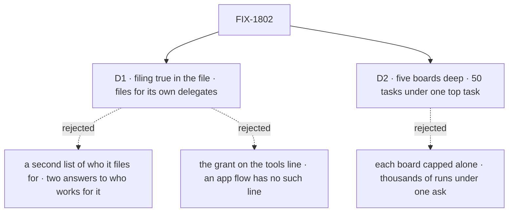

# FIX-1802 · Decisions

[Spec](SPEC.md) · **Decisions** · [Rules](BUSINESS-RULES.md) · [Plan](PLAN.md) · [Docs](DOCS.md) · [Evolution](EVOLUTION.md)

Two decisions are the sign-off surface. The direction (filing is a grant, opt-in per worker, and
the split ships in the MVP) is the product owner's, the epic's
[D8](../../epics/FIX-1786/DECISIONS.md#d8), not reopened here. The split's mechanism is FIX-1794's,
carried as written ([EVOLUTION.md](EVOLUTION.md)).

## The tree

Solid edges are what you're signing. Dashed edges lost, and the label says why.

## D1 · A worker's file grants filing with `filing: true`, and the worker files for its own delegates: FIX-1791's list, now on any worker that files

| | |
|---|---|
| **Instead of** | (a) A second list of the workers this worker may file for, beside a coordinator's delegates · (b) the grant spelled as the filing tools on the worker's `tools:` line |
| **Because** | One answer to "who works for this worker": the delegate list, read the same way for a post and a task, through FIX-1791's one roster check and its four actions. A second list could disagree with it. (b) `tools:` is the built-in flows' own fencing setting; an app flow such as `em` has no such line. A key in the worker contract reaches every flow that composes it |
| **Locks in** | `filing` and `delegates` are keys any worker's file may carry. `delegates:` is who works for this worker; a capability, not a kind, gives it a use: a flow that routes posts (the coordinator, epic D8) posts to them, and the grant files for them. With neither, the file is refused. A delegate takes a post or a task, so FIX-1791's check widens to "either". Every filer says so, coordinators included. **Cross-spec edit:** FIX-1792's conversions give `filing: true` to every coordinator that keeps a board, the members that file and the EM; the chief of staff's is S7 here |

![D1: who files, and for whom. A grant in the worker's file, filing for its own delegates, chosen, beside a second list of who it files for. Decides it: one answer to who works for this worker, where two lists can disagree. The price: FIX-1791's check widens to a delegate that takes posts or tasks. A tie: Bob's worker is refused either way. Locks in two keys any worker file may carry, and every filer says so, coordinators included. Flips if a worker must file for workers it should never be handed a post by](figures/d1-grant.svg)

It comes down to one list: two lists of who works for a worker drift apart.

**What would change my mind:** a routing worker that must file for workers it should never post
to. Then the delegate record gains a "tasks only" mark, still one list. Deferred: no worker in the
set needs it.

## D2 · A chain stops at five boards deep, and at 50 tasks under one top task; a filing past either is refused, naming the limit

| | |
|---|---|
| **Instead of** | FIX-1794's breadth answer: five boards deep, with each board's existing caps (`maxTotalTasks`, `maxEnqueuedTasks`, per partition) as the only bound on width |
| **Because** | Depth bounds a loop, not a fan-out. With each board capped alone, a worker that splits at every level multiplies: at ten pieces a board, a five-board chain holds 11,110 tasks under one top task (FIX-1794's review finding). A count per chain stops it at 50, enough for a feature split across a team. It is stored, not derived: deriving it reads every board in the chain, across partitions. One record per chain, keyed by the top board's partition and the top task, so two sessions never share a budget and the task board doesn't change |
| **Locks in** | Two public limits, named in the refusal. Raising either is cheap; lowering breaks chains. The limit is per chain, not per owner: a coordinator posting again starts a fresh chain, which each board's caps still bound |

It comes down to a worker that splits at every level: capped per board, it reaches thousands.

**What would change my mind:** a real chain that needs more than 50 pieces. Then the limit rises,
and the docs state the cost per piece.

## Decided, not asked

- **Filing ships as `createTaskFilingCapability()`, built by FIX-1794** (the coordinator's call,
  2026-10-06; FIX-1794 amended on this PR). It returns a capability for the worker's model block
  (the tools and context) and the entries the flow spreads into its own maps. Capabilities compose
  into blocks, not flows, so no core change. The `agent` and coordinator flows do this; an app
  flow does it itself, keeping its name (FIX-1792 BR-12, `flow: em`). A grant on a flow without
  it is refused at load.
- **The board is the session the worker runs in**: a talk session, a delegate's session (a
  workstream lead's included), or a task session. One board per session, in the partition named
  by that session's incarnation (epic D6). Never another session's board.
- **The grant is read per run, server-side**, from the session's linked worker (FIX-1788), never
  from input.
- **Filing from a delegate's session doesn't hold its answer** (FIX-1794: a post is answered, a
  task is worked). The tasks it filed report to that session.
- **The split is FIX-1794's S8, as written**: park with a server-written parent binding, and a
  settle-owed marker only the parent's settle clears.
- **Depth and the chain's top are server-written at each task session's birth**: its parent's
  depth plus one, and its parent's top task. A session that isn't a task session starts a chain.
  A post adds no depth; FIX-1791's round limit bounds posts.
- **No Layer 1 change.** The task board, the engine and core are untouched. The parent's settle
  resolves the row above through D6's partitioned ref, with the partition from the binding, and
  writes with the board's existing fenced settle of a parked row. One flow can both file and work
  its own rows ([POC](poc/split-on-one-flow/README.md) O1 to P3).

## Considered and dropped

| Alternative | Why not |
|---|---|
| Keep filing in the coordinator flow, and let only a coordinator's task session split | D8 rejects it. It also moves the EM off `flow: em` |
| Hold a delegate's answer to a post until the work it filed ends | Breaks FIX-1791's one answer per round and its round deadline; work that must come back is filed |
| Settle a split parent mechanically at the last piece's gate, with no turn | FIX-1794 kept the turn so the worker can reassign a failed piece first; the settle-owed marker already covers a failed turn |
| A chain count derived from the rows, or kept on the top task's row | Both read or write rows in other sessions' partitions, which a task session can't reach without a task-board change |

## Settled

- **One flow can keep a board and work its rows, through a per-task target to itself** —
  **CONFIRMED** ([POC](poc/split-on-one-flow/README.md) O1).
- **A parked row settles in a later request of another session, through a stored claim ticket,
  on today's board** — **CONFIRMED**: `recorded`; a replay after it is declined `lost-claim`;
  a forged ticket is declined while the genuine one records (P2, P3).

## How it got here

- **Draft** — framed as the epic's D8: filing is a grant any worker carries, on any worker flow,
  through a capability; who it files for is FIX-1791's delegate list; the board is the session the
  worker runs in; FIX-1794's split, parent binding and settle-owed marker carried as written; a
  chain bounded at five deep and 50 tasks. No Layer 1 change, on a POC. Three PRs on FIX-1794.
- **Review round 1** (#2839) — the capability's two halves, since a flow takes no `uses`;
  FIX-1794 amended to ship it and the board per session; the chain count made crash-safe and
  namespaced; `delegates:` given a use by capability; the task-session refusal lifted with the
  split; a stuck chain replayed from any board above it; the coordinator lookup key renamed.

**Open: none.**
