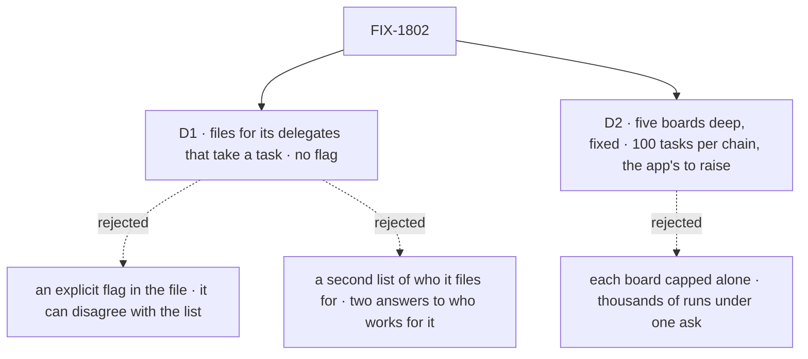

# FIX-1802 · Decisions

[Spec](SPEC.md) · **Decisions** · [Rules](BUSINESS-RULES.md) · [Plan](PLAN.md) · [Docs](DOCS.md) · [Evolution](EVOLUTION.md)

Two decisions were the sign-off surface, and the product owner answered both on 2026-10-07. The
direction (any worker can file, and the split ships in the MVP) is the epic's
[D8](../../epics/FIX-1786/DECISIONS.md#d8), not reopened here. The split's mechanism is
FIX-1794's, carried as written ([EVOLUTION.md](EVOLUTION.md)).

## The tree

Solid edges are what was signed. Dashed edges lost, and the label says why.

## D1 · answered · A worker files for its own delegates that take a task, and that is the whole grant

**The product owner's call, 2026-10-07.** No `filing` key: a worker gets the task tools when at
least one of its `delegates:` takes a task.

| | |
|---|---|
| **Instead of** | (a) An explicit `filing: true` in the worker's file, beside its delegates · (b) a second list of the workers this worker may file for |
| **Because** | One answer to "who works for this worker", and it already says whether the worker files: the delegate list, read the same way for a post and a task, through FIX-1791's one roster check and its four actions. A flag beside it could disagree with it, and so could a second list. A routing coordinator whose delegates only take posts gets no task tools; a worker with no delegates gets none. Nothing is refused at load: a file whose delegates nothing uses has nothing to grant |
| **Locks in** | A worker can't list task-taking delegates and be barred from filing. A later "no filing" mark would cover that if a case ever appears. `delegates` is a key any worker's file may carry; a flow that routes posts posts to them, and a delegate that takes a task gets filed for. A delegate takes a post or a task, so FIX-1791's check widens to "either". **Cross-spec edit:** FIX-1792's conversions list task-taking delegates on each worker that files (the members that file and the EM); no flag to add |

![D1: who files, and for whom. Chosen: a worker files for its delegates that take a task, with no flag. Instead of: an explicit filing flag in the file, or a second list of who it files for. Decides it: one answer to who works for this worker, and whether it files, where a flag or a second list can disagree. The price: FIX-1791's check widens to a delegate that takes posts or tasks. A tie: Bob's worker is refused either way. Locks in: a worker that lists task-taking delegates files, and a later no-filing mark would cover an exception. Flips if a worker must list task-taking delegates and never file](figures/d1-grant.svg)

It comes down to one list: a flag or a second list beside it can disagree.

**What would change my mind:** a worker that must list task-taking delegates and never file.
Then a "no filing" mark goes on the file. Deferred: no worker in the set needs it.

## D2 · answered · A chain stops at five boards deep, fixed, and at 100 tasks under one top task by default, which the app can raise

**The product owner's call, 2026-10-07.** The depth stays fixed at five. The chain cap is 100 by
default, set by an option on the app's Workforce setup (`hireWorkforce`; the implementer names
it).

| | |
|---|---|
| **Instead of** | FIX-1794's breadth answer: five boards deep, with each board's existing caps (`maxTotalTasks`, `maxEnqueuedTasks`, per partition) as the only bound on width |
| **Because** | Depth bounds a loop, not a fan-out. With each board capped alone, a worker that splits at every level multiplies: at ten pieces a board, a five-board chain holds 11,110 tasks under one top task (FIX-1794's review finding). A count per chain stops it at 100, enough for a feature split across a team, and an app whose jobs are bigger raises it. It is stored, not derived: deriving it, or checking it against the rows, reads every board in the chain, across partitions. A reservation whose add never landed lapses after a lease instead. One record per chain, keyed by the top board's partition and the top task, so two sessions never share a budget and the task board doesn't change |
| **Locks in** | A fixed depth of five and an app-set chain cap, defaulting to 100. A filing past either is refused as a full board is: the tools' existing lifetime-cap answer, `total_task_cap_exceeded`. Raising the cap is cheap; lowering it breaks chains. The cap is per chain, not per owner: a coordinator posting again starts a fresh chain, which each board's caps still bound |

It comes down to a worker that splits at every level: capped per board, it reaches thousands.

**What would change my mind:** most real chains needing more than 100 pieces. Then the default
rises, and the docs state the cost per piece.

## Decided, not asked

- **The tools are Orchestration's existing eight, wired by FIX-1794** (the product owner's
  direction, 2026-10-07; FIX-1794 amended on this PR): `createTaskToolsCapability(resolver,
  roster)` on the worker's model block and `taskToolActions` in the flow's actions. The resolver
  is the running session's own board (its D6 partition); the roster is the session's delegates
  that take a task. The `agent` and coordinator flows compose them; an app flow does it itself,
  keeping its name (FIX-1792 BR-12, `flow: em`). No new tool, and no filing capability.
- **The board is the session the worker runs in**: a talk session, a delegate's session (a
  workstream lead's included), or a task session. One board per session, in the partition named
  by that session's incarnation (epic D6). Never another session's board.
- **The grant is read per run, server-side**, from the session's linked worker's file (FIX-1788),
  never from input. With none, the model gets no task tools and the resolver gives no board, so
  the app's actions answer the tools' existing `no_delegation_board`.
- **Filing from a delegate's session doesn't hold its answer** (FIX-1794: a post is answered, a
  task is worked). The tasks it filed report to that session.
- **The split is FIX-1794's S8, as written**: park with a server-written parent binding, and a
  settle-owed marker only the parent's settle clears.
- **Depth and the chain's top are server-written at each task session's birth**: its parent's
  depth plus one, and its parent's top: the top board's partition and the top task. A session
  that isn't a task session starts a chain. A post adds no depth; FIX-1791's round limit bounds
  posts.
- **Both limits refuse through the board, not the tools.** The ref Workforce's resolver returns
  throws the existing `TaskCapExceededError` for a sixth board or a task past the chain cap, and
  the tools already answer it as `total_task_cap_exceeded`, the lifetime ceiling a model is told
  to stop at. No task-tool change for either.
- **No Layer 1 change here.** The task board, the task tools, the engine and core are untouched
  by this issue. The parent's settle resolves the row above through D6's partitioned ref, with
  the partition from the binding, and writes with the board's existing fenced settle of a parked
  row. One flow can both file and work its own rows ([POC](poc/split-on-one-flow/README.md) O1
  to P3). The tools' one extension, a roster read per call and on `taskToolActions`, is
  FIX-1794's, and the epic records it (ER-22).

## Considered and dropped

| Alternative | Why not |
|---|---|
| Keep filing in the coordinator flow, and let only a coordinator's task session split | D8 rejects it. It also moves the EM off `flow: em` |
| Hold a delegate's answer to a post until the work it filed ends | Breaks FIX-1791's one answer per round and its round deadline; work that must come back is filed |
| Settle a split parent mechanically at the last piece's gate, with no turn | FIX-1794 kept the turn so the worker can reassign a failed piece first; the settle-owed marker already covers a failed turn |
| A chain count derived from the rows, or kept on the top task's row | Both read or write rows in other sessions' partitions, which a task session can't reach without a task-board change |
| A filing capability of its own, `createTaskFilingCapability()`, with `fileTask`, `listTasks`, `reassignTask` and `cancelTask` | A second set of task tools beside Orchestration's eight. The product owner, 2026-10-07: build on the existing ones |
| Load errors for a grant without delegates, delegates without a grant, or a grant on a flow without the tools | They existed only for the flag. With no flag, a file has nothing to contradict |
| A refusal of its own naming each limit | A change to the task tools for a wording; the existing lifetime-cap answer already tells a model to stop |

## Settled

- **One flow can keep a board and work its rows, through a per-task target to itself** —
  **CONFIRMED** ([POC](poc/split-on-one-flow/README.md) O1).
- **A parked row settles in a later request of another session, through a stored claim ticket,
  on today's board** — **CONFIRMED**: `recorded`; a replay after it is declined `lost-claim`;
  a forged ticket is declined while the genuine one records (P2, P3).

## How it got here

- **Draft** — framed as the epic's D8: filing is a grant any worker carries, on any worker flow,
  through a capability; who it files for is FIX-1791's delegate list; the board is the session the
  worker runs in; FIX-1794's split, parent binding and settle-owed marker carried as written; a
  chain bounded at five deep and 50 tasks. No Layer 1 change, on a POC. Three PRs on FIX-1794.
- **Review round 1** (#2839) — the capability's two halves, since a flow takes no `uses`;
  FIX-1794 amended to ship it and the board per session; the chain count made crash-safe and
  namespaced; `delegates:` given a use by capability; the task-session refusal lifted with the
  split; a stuck chain replayed from any board above it; the coordinator lookup key renamed.
- **Review round 2** (#2839) — the chain record reads no other board: an id is *reserved*, then
  marked *added* by its filer, and a reservation lapses after a lease; the lookup key named once,
  in FIX-1791, so no rename here; the replay and the birth data spelled out; FIX-1794's split
  leftovers removed.
- **The product owner's sign-off** (2026-10-07) — D1: no `filing` flag; a worker files for its
  delegates that take a task, and the flag's load errors go. Build on Orchestration's eight task
  tools, not new ones: `createTaskFilingCapability()` and its four names are gone, and FIX-1794's
  amendment wires the existing tools. D2: depth fixed at five; the chain cap 100 by default,
  raised by the app. No backwards support anywhere while there are no consumers.

**Open: none.**
