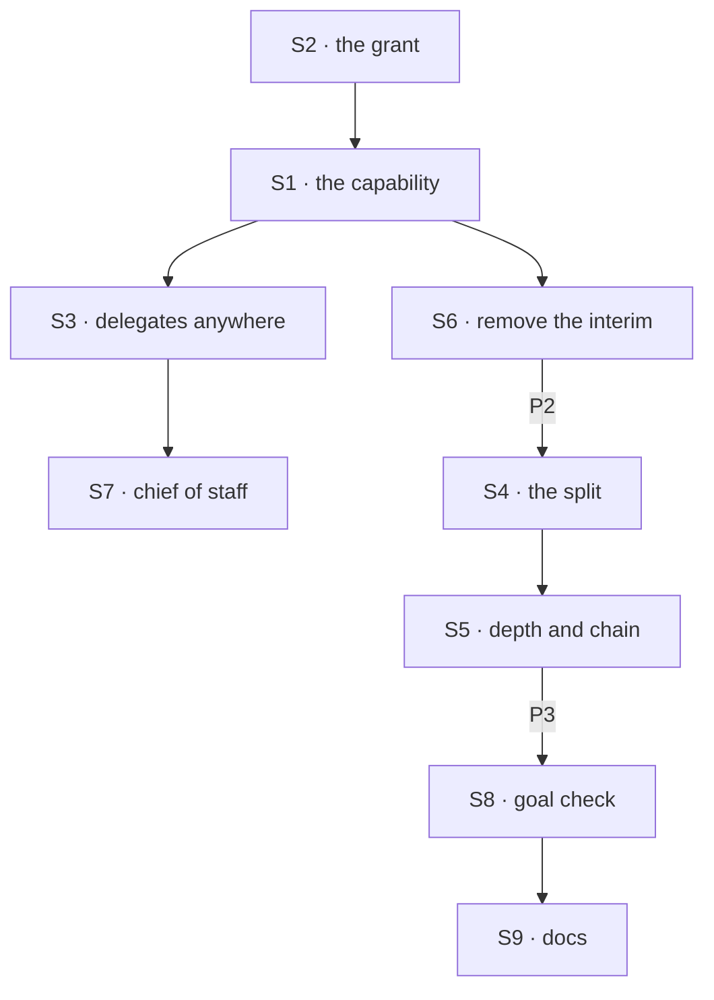

# FIX-1802 · Plan

[Spec](SPEC.md) · [Decisions](DECISIONS.md) · [Rules](BUSINESS-RULES.md) · **Plan** · [Docs](DOCS.md) · [Evolution](EVOLUTION.md)

Written for the implementing agent. IDs cross-reference [BUSINESS-RULES.md](BUSINESS-RULES.md)
(BR-n) and [DECISIONS.md](DECISIONS.md). `tdd`. Three PRs, a GitHub stack (epic ER-26), on top of
FIX-1794's three. P1 starts after FIX-1794 merges, and FIX-1788, FIX-1789 and FIX-1791 with it
(epic D8: after FIX-1794, before FIX-1792's P2 and P3 and the closure).

## Surfaces

| ID | Package · role | Change | Rules |
|---|---|---|---|
| S1 | `workforce` · the capability | `createTaskFilingCapability()`: FIX-1794's per-session board (its S3), the filing module and four tools (S4), the start on add (S5) and the notice entry (S7), packaged so any worker flow takes them with `uses`. The built-in `agent` and coordinator flows carry it. What the flow must still declare itself (an internal entry, `work`) comes from the same factory, so an app flow adds two lines. The board's partition is the running session's incarnation, whatever kind of session | BR-1 BR-11 BR-13 |
| S2 | `workforce` · the grant | `filing` and `delegates` join `workerConfigSchema()` (FIX-1789's contract), so every flow that composes it reads them; the coordinator's own `delegates` key moves there. FIX-1794's one question, "may this session file", is answered from the session's linked worker's file, read per run, server-side. The tools are offered and the actions accepted only on a yes. Load checks: a grant on a flow without the capability; `delegates:` without the grant off the coordinator | BR-1–BR-6 |
| S3 | `workforce` · delegates on any granted worker | FIX-1791's delegate module (its S2: records, copy on first read, versioned writes, the one check) composed by S1, not the coordinator alone. Its four delegate actions work on any granted worker's session (FIX-1791 BR-1a widens). Its check widens: the delegate's flow takes a delegated post **or** a task; posting skips one that takes no post, filing refuses one that takes no task | BR-7–BR-10 |
| S4 | `workforce` · the split | FIX-1794's S8 as written: park with the server-written parent binding, no notice for the park, the settle-owed marker written with the last piece's ending, the settle through the binding fenced by its ticket after the turn, replay on any touch, never inside a turn. The binding's partition resolves through FIX-1794's partitioned ref | BR-14–BR-19 |
| S5 | `workforce` · depth and the chain | FIX-1794's S10 (depth, the parent's plus one, at birth) and the chain's top task, both server-written at each task session's birth. A chain count: one row per top task at the owner's user scope, raised by a versioned write before each add below the top, refused past 50; a failed add gives it back | BR-20–BR-22 |
| S6 | `workforce` · **removed** | FIX-1794's interim "a coordinator conversation, not a task session" answer and its refusal of a task session's filing; its "only a coordinator conversation keeps a board" wiring | BR-1 BR-14 |
| S7 | `shift-manager` | The chief of staff's file gains `filing: true`. Nothing else: FIX-1792 converts the labs that file | BR-1 |
| S8 | `goals/workers/files-and-splits-down-the-chain/` | The goal check and its two controls, per [SPEC.md](SPEC.md#the-goal-and-how-well-know-its-met) | goal |
| S9 | Docs | [DOCS.md](DOCS.md); the `workforce` README; a `minor` changeset for `workforce` | — |

## Sequence · the PR plan

| PR | Delivers | Depends on |
|---|---|---|
| P1 · any worker files | S1, S2, S3, S6, S7; proved on a goal-local tree with an `agent` worker and an app flow | FIX-1794 P3 merged |
| P2 · the split and its limits | S4, S5 | P1 |
| P3 · the goal and the docs | S8, S9, VG | P2 |



## Checks

| ID | Runs after | Passes when |
|---|---|---|
| V1 | S2 | BR-1–BR-6 on `agent`, the coordinator and a fixture app flow: the tool list with and without the grant; the app action refused without it; both load refusals; the grant removed mid-session (BR-5); a forged grant on input or create |
| V2 | S1 S3 | BR-7–BR-13: an `agent` worker files for an `agent` delegate (same flow, POC O1's per-task target); a delegate that takes tasks but no post is added and filed for, and skipped by a post; two sessions of one worker; a workstream session files and its notice stays there |
| V3 | S4 | BR-14–BR-19 with one piece completed and one errored; a reassign in the woken turn keeps the parent open; a restart between park and the last notice; the woken turn fails and the next touch settles once; a kill after the settle and before the clear settles nothing twice; a cancel from above |
| V4 | S5 | BR-20 at the sixth board with a forged depth on input ignored; BR-21 at the 51st task across three depths; BR-22 with two concurrent filings at 49; a failed add gives its count back |
| V5 | S6 | Nothing refuses a task session's filing by kind any more; no "is this a coordinator" check remains on the filing path |
| VG | P3 | [The goal](SPEC.md#the-goal-and-how-well-know-its-met): `goals/workers/files-and-splits-down-the-chain/run.mts` PASSES, after the same run FAILED leg c under `no-grant-check`, leg a under `no-parent-settle`, and every leg on today's `main` |

One check per decision: D1 by V1, V2 and VG legs b and c; D2 by V4 and VG leg d. The second path
(BP-035): the off state of the grant (V1), a lost grant (V1), a failed settling turn and a crash
(V3), concurrent filings (V4), two users (VG), the two controls.

## Pinned names

| Where | Name | Why pinned |
|---|---|---|
| The capability | `createTaskFilingCapability()` | Public; FIX-1792 and an app flow write it |
| Worker file keys | `filing: true`, `delegates:` | Public; FIX-1792 converts files to them |
| Tools and actions | `fileTask`, `listTasks`, `reassignTask`, `cancelTask` | FIX-1794's, unchanged; FIX-1792 and FIX-1797 cite them |
| Limits | 5 boards deep, 50 tasks under one top task | Public (D2) |
| Controls | `GOAL_CONTROL=no-grant-check`, `GOAL_CONTROL=no-parent-settle` | The goal check |

Everything else is yours, in the new terms.

## Guardrails

| Rule | Because |
|---|---|
| The grant, the depth and the chain come from the worker's file or server-written birth data, never input (BP-031, ER-17) | Each decides whether, and how far, work multiplies |
| Every filing path, app or tool, on every flow, asks the same one question and the same one delegate check (tenet 5) | A grant checked on the tool alone is open through the app |
| Every board operation, including the parent's settle, goes through D6's partitioned ref | A settle that reaches the row any other way is the cross-session write D6 rules out |
| Every owed settle is a marker on the row, written with the ending that owes it (FIX-1794's guardrail) | A failed turn otherwise strands a parent with nobody told |
| No Layer 1 change: no task-board, engine or core edit (ER-22) | The POC shows today's board carries the split; if a change turns out to be needed, stop and take it to the epic |
| No worker or delegate name in orchestration | The capability is Workforce's; the board stays generic |

## Docs

Reconcile and publish [DOCS.md](DOCS.md) in P3, after V1 to V5 pass, against the shipped refusal
wording. It takes over the split section FIX-1794's draft deferred.

## Sketch · pseudocode, illustrative, react to the shape

```
on any filing (tool or app) in session S:
    worker ← S's linked worker; grant ← its file's filing, read now      ← never input
    no grant → refuse
    check assignee against S's delegates (FIX-1791's one check, takes a task)
    depth ← S's depth + 1; top ← S's top, or this task if S is no task session
    depth > 5 → refuse; raise top's count, > 50 → refuse
    add to S's board (S's partition), wake-owed; dispatch "run my board" into S   ← FIX-1794 S5
in a task session T, when its turn ends with open pieces:
    park T's row above; binding ← (that row's partition, its claim ticket)      ← server-written
on a piece's ending, in T:  the ending's write also writes settle-owed if it was the last open one
after the turn it woke (or any later touch of T's board):
    settle T's row above through the binding, fenced by the ticket; clear the marker
```

**POC:** [`poc/split-on-one-flow/`](poc/split-on-one-flow/README.md), one run, four legs, on
today's `main`. One flow kept a board and worked its own rows through a per-task target (O1); a
task session filed two pieces on its own board and parked its row above (P1); in a later request
the parked row settled through a stored claim ticket and the conversation heard once (P2); a
replay and a forged ticket were both declined while the genuine ticket recorded (P3). The premise
held: no task-board change. Two ledgers stood in for D6's partitions, which aren't built.

## At implement time

- Take FIX-1794's shipped names for the board, the filing module, the notice entry, the
  partitioned ref and the binding; FIX-1791's for the delegate module; FIX-1789's contract shape.
  If any differ, change them there, once.
- The task session's lookup key is FIX-1791's `coordinatorSessionId`, set to the filing
  session's incarnation whatever its flow. Its name now reads narrow; renaming it is FIX-1796's
  call, not this issue's.
- FIX-1793's run placement walks a run's parent sessions up to its workstream session. With the
  split, that is up to five task sessions deep; check the walk goes all the way.
- The POC's settle found a piece's notice can arrive before its ending's write. FIX-1794's S6
  writes the ending first; keep that order, or the last piece's notice can't see itself ended.

## Follow-ups

- A sweeper for boards nobody touches stays FIX-1794's follow-up; an owed parent settle waits for
  the next touch, as an owed notice does.
- A "tasks only" mark on a delegate record, if a worker must file for workers it should never be
  posted to (D1's *what would change my mind*).
