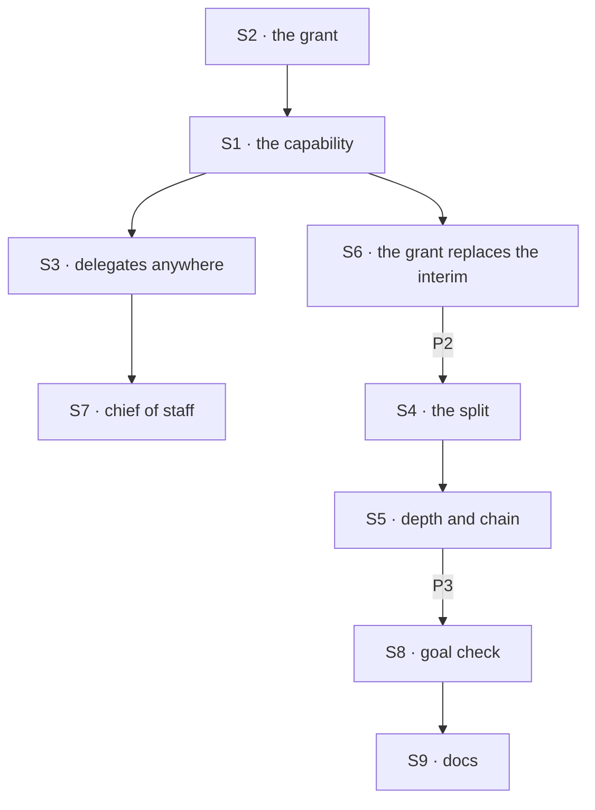

# FIX-1802 · Plan

[Spec](SPEC.md) · [Decisions](DECISIONS.md) · [Rules](BUSINESS-RULES.md) · **Plan** · [Docs](DOCS.md) · [Evolution](EVOLUTION.md)

Written for the implementing agent. IDs cross-reference [BUSINESS-RULES.md](BUSINESS-RULES.md)
(BR-n) and [DECISIONS.md](DECISIONS.md). `tdd`. Three PRs, a GitHub stack (epic ER-26), on top of
FIX-1794's. P1 starts after FIX-1794, FIX-1788, FIX-1789 and FIX-1791 merge (epic D8).

## Surfaces

| ID | Package · role | Change | Rules |
|---|---|---|---|
| S1 | `workforce` · the capability on any flow | FIX-1794's `createTaskFilingCapability()`: a capability for the model's block (tools, context) plus the entries a flow spreads into its `actions`, `internal` and `task` maps. The `agent` flow takes both halves, as the coordinator flow does; so does an app flow. No core change | BR-1 BR-11 BR-13 |
| S2 | `workforce` · the grant | `filing` and `delegates` join `workerConfigSchema()` (FIX-1789's contract), so every flow that composes it reads them; the coordinator's `delegates` key moves there. FIX-1794's question, "may this session file", is answered from the linked worker's file, per run, server-side; tools and actions only on a yes. Load checks: a grant on a flow without the capability; `delegates:` with no use (no flow that routes posts, no grant) | BR-1–BR-6 |
| S3 | `workforce` · delegates on any granted worker | FIX-1791's delegate module (its S2) composed by S1; its four actions work on any granted worker's session (FIX-1791 BR-1a). Its check widens to a post **or** a task; posting skips one that takes no post, filing refuses one that takes no task. The module and its actions lose "coordinator" from their names | BR-7–BR-10 |
| S4 | `workforce` · the split | FIX-1794's S8 as written: park with the server-written binding, no notice for it, settle-owed written with the last piece's ending, the settle fenced by the ticket after the turn, never inside it, through the partitioned ref. A touch of any board replays owed settles down the chain: it dispatches "run my board" into each parked row's task session, which replays its own board's markers. Each session reads only its own partition, never a child's board from above | BR-14–BR-19 |
| S5 | `workforce` · depth and the chain | FIX-1794's S10 (depth, the parent's plus one) and the chain's top (the top board's partition and the top task id), both server-written at each task session's birth. One versioned chain record at the owner's user scope, keyed by the top board's server-written partition and the top task id: the id of every piece filed under it, any state, each *reserved* or *added*, with the time it was reserved. A filing reserves its id before the add, idempotent by id, so nothing is given back; once its add commits, the filer marks it *added* in its own request. At 50, drop *reserved* ids older than the lease, then check again. Never read rows on another board. The lease is the implementer's choice, at least one minute and comfortably longer than one add (a few minutes). Deleted when the top task ends | BR-20–BR-22a |
| S6 | `workforce` · the grant replaces FIX-1794's interim answer | P1: talk and delegate sessions file on the grant; a task session is still refused. P2 lifts that refusal with S4, so a task never completes before its pieces | BR-1 BR-14 |
| S7 | `shift-manager` | The chief of staff's file gains `filing: true`. Nothing else: FIX-1792 converts the labs that file | BR-1 |
| S8 | `goals/workers/files-and-splits-down-the-chain/` | The goal check and its two controls, per [SPEC.md](SPEC.md#the-goal-and-how-well-know-its-met) | goal |
| S9 | Docs | [DOCS.md](DOCS.md); the `workforce` README; a `minor` changeset for `workforce` | — |

## Sequence · the PR plan

| PR | Delivers | Depends on |
|---|---|---|
| P1 · any worker files | S1, S2, S3, S6 (task sessions still refused), S7; proved on a goal-local tree with an `agent` worker and an app flow | FIX-1794 P3 merged |
| P2 · the split and its limits | S4, S5, and S6's lift of the task-session refusal | P1 |
| P3 · the goal and the docs | S8, S9, VG | P2 |



## Checks

| ID | Runs after | Passes when |
|---|---|---|
| V1 | S2 | BR-1–BR-6 on `agent`, the coordinator and a fixture app flow: tools with and without the grant; the app action refused without it; each load refusal; the grant removed mid-session; a forged grant |
| V2 | S1 S3 | BR-7–BR-13: an `agent` worker files for an `agent` delegate; a tasks-only delegate is filed for and skipped by a post; two sessions of one worker; a workstream session files and hears |
| V3 | S4 | BR-14–BR-19: one piece completed, one errored; a reassign in the woken turn keeps the parent open; a restart between park and the last notice; a kill between settle and clear settles once; a settling turn fails two boards down, and a `listTasks` at the top settles each board once; a cancel from above |
| V4 | S5 | BR-20 at the sixth board with a forged depth on input ignored; BR-21 at the 51st task across three depths, finished pieces counted; BR-22: two concurrent filings at 49, one accepted, one refused, 50 recorded; a crash after the reservation and before the add, then the 50th filing refused within the lease and accepted after it, with no read of another board's rows; BR-22a, one top task id in two sessions; the record gone after the top task ends |
| V5 | S6 | P1: no "is this a coordinator" check on the filing path, and a task session's filing still refused. P2: that refusal gone, in the PR that delivers S4 |
| VG | P3 | [The goal](SPEC.md#the-goal-and-how-well-know-its-met): `goals/workers/files-and-splits-down-the-chain/run.mts` PASSES, after the same run FAILED leg c under `no-grant-check`, leg a under `no-parent-settle`, and every leg on today's `main` |

One check per decision: D1 by V1, V2, VG legs b and c; D2 by V4, VG leg d. Second path (BP-035):
the grant off and lost (V1), a failed turn and a crash (V3, V4), concurrent filings (V4), two
users (VG), the controls.

## Pinned names

| Where | Name | Why pinned |
|---|---|---|
| The capability | `createTaskFilingCapability()` | Public; FIX-1792 and an app flow write it |
| Worker file keys | `filing: true`, `delegates:` | Public; FIX-1792 converts files to them |
| Tools and actions | `fileTask`, `listTasks`, `reassignTask`, `cancelTask` | FIX-1794's, unchanged; FIX-1792 and FIX-1797 cite them |
| Limits | 5 boards deep, 50 tasks under one top task | Public (D2) |
| Controls | `GOAL_CONTROL=no-grant-check`, `GOAL_CONTROL=no-parent-settle` | The goal check |

Everything else is yours, in the new terms.

## Guardrails

| Rule | Because |
|---|---|
| The grant, the depth and the chain come from the worker's file or server-written birth data, never input (BP-031, ER-17) | Each decides whether, and how far, work multiplies |
| Every filing path, app or tool, on every flow, asks the same one question and the same one delegate check (tenet 5) | A grant checked on the tool alone is open through the app |
| Every board operation, the parent's settle included, goes through D6's partitioned ref | Any other way is the cross-session write D6 rules out |
| Every owed settle is a marker on the row, written with the ending that owes it | A failed turn otherwise strands a parent |
| No Layer 1 change: no task-board, engine or core edit (ER-22) | The POC shows today's board carries the split; if one is needed, stop and take it to the epic |
| No worker or delegate name in orchestration | The capability is Workforce's; the board stays generic |

**Filing kit.** A worker files with all four: `filing: true`, the capability on its model block,
the entries spread into its flow, and `delegates:`. One load error names whichever is missing (BR-3).

## Docs

Reconcile and publish [DOCS.md](DOCS.md) in P3, after V1 to V5 pass, against the shipped wording.

## Sketch · pseudocode, illustrative, react to the shape

```
on any filing (tool or app) in session S:
    worker ← S's linked worker; grant ← its file's filing, read now      ← never input
    no grant → refuse
    check assignee against S's delegates (FIX-1791's one check, takes a task)
    depth ← S's depth + 1; top ← S's top (board partition, task id), or (S's partition, this task) if S is no task session
    depth > 5 → refuse; reserve this id in the chain record (idempotent); > 50 → drop reserved ids past the lease and re-check, else refuse
    add to S's board (S's partition), wake-owed; mark the id added; dispatch "run my board" into S   ← FIX-1794 S5
in a task session T, when its turn ends with open pieces:
    park T's row above; binding ← (that row's partition, its claim ticket)      ← server-written
on a piece's ending, in T:  the ending's write also writes settle-owed if it was the last open one
after the turn it woke (or any later touch of T's board, or of a board above it, which dispatches "run my board" into T):
    settle T's row above through the binding, fenced by the ticket; clear the marker
```

**POC:** [`poc/split-on-one-flow/`](poc/split-on-one-flow/README.md), four legs on `main`: one
flow kept a board and worked its own rows (O1); a task session filed pieces and parked its row
(P1); the parked row settled later through a stored ticket (P2); a replay and a forged ticket
were declined (P3). No task-board change. Two ledgers stood in for D6's partitions.

## At implement time

- Take FIX-1794's, FIX-1791's and FIX-1789's shipped names and shapes. If any differ, change
  them there, once.
- The task session's lookup key is FIX-1791's, which it names for the filing session (amended on
  this PR), set to the filing session's incarnation whatever its flow. FIX-1796's list doesn't carry it.
- A crash between the add and its *added* mark leaves a landed id *reserved*. Mark it again in the
  run that clears the row's pending-wake marker (FIX-1794 S5), the filer's own request, so the
  lease never drops it.
- Don't copy the POC's `settledStep` (`list()` plus a `heard` scan) to find the last piece; use
  the settle-owed marker and bounded open-piece tracking (BR-17).
- Contention on one chain record near 50 is expected: refusals and versioned-write retries, not a
  regression.
- The POC's settle found a piece's notice can arrive before its ending's write. FIX-1794's S6
  writes the ending first; keep that order, or the last piece's notice can't see itself ended.

## Notes from review

- "FIX-1793's run placement must walk up through as many as five task sessions. It may be simpler to read the chain's top task, which is written at birth, and then that task's filing session. Leave the choice to the implementer." — head of engineering ([review](https://github.com/fixpoint-labs/flow-state-dev/pull/2839#pullrequestreview-5435933693))

## Follow-ups

- A sweeper for boards nobody touches stays FIX-1794's follow-up; an owed parent settle waits for
  the next touch of its board or any board above it.
- Deferred: a "tasks only" mark on a delegate record (D1's *what would change my mind*). A flow
  that routes no posts already uses its delegates for tasks only.
