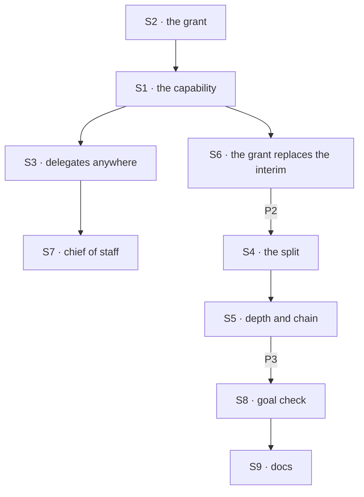

# FIX-1802 · Plan

[Spec](SPEC.md) · [Decisions](DECISIONS.md) · [Rules](BUSINESS-RULES.md) · **Plan** · [Docs](DOCS.md) · [Evolution](EVOLUTION.md)

Written for the implementing agent. IDs cross-reference [BUSINESS-RULES.md](BUSINESS-RULES.md)
(BR-n) and [DECISIONS.md](DECISIONS.md). `tdd`. Three PRs, a GitHub stack (epic ER-26), on top of
FIX-1794's. P1 starts after FIX-1794, FIX-1788, FIX-1789, FIX-1791 and FIX-1814 merge (epic D8,
[D10](../../epics/FIX-1786/DECISIONS.md#d10)).

## Surfaces

| ID | Package · role | Change | Rules |
|---|---|---|---|
| S1 | `workforce` · the task tools on any flow | Orchestration's eight task tools as FIX-1794 wires them (amended on this PR): `createTaskToolsCapability(resolver, roster)` on the model's block and `taskToolActions(<board id>, resolver, roster)` in the flow's actions, with the board's entries (its run, its task entry, its notice entry). The resolver is the session's own board, its D6 partition; the roster is the session's delegates that take a task. *Amended after merge (epic [D10](../../epics/FIX-1786/DECISIONS.md#d10)):* the `agent` flow composes them through the built-in agent's shared worker turn (`agentWorkerTurn`, FIX-1791's S8), the turn the coordinator runs and where FIX-1794's P2 puts them for it. One capability instance per turn, never a second beside it (epic [ER-32](../../epics/FIX-1786/BUSINESS-RULES.md#what-no-child-may-do)). FIX-1814 has removed the skills library's own copy first, so a loaded skill adds none. An app flow composes them once, on its own model block. No new tool, no core change | BR-1 BR-11 BR-13 |
| S2 | `workforce` · the grant | `delegates` is defined in `workerConfigSchema()` (FIX-1789's contract), so every flow that composes it reads it; there is no `filing` key. FIX-1794's question, "may this session file", is answered per call, server-side, from the same live list the assignee check reads (FIX-1794 T1): the session's current delegates that take a task, which start as a copy of the file's `delegates:` (FIX-1791 BR-1). Yes when that list isn't empty: an `addDelegate` mid-conversation shows the tools, and removing the last task-taking delegate hides them. On a no, the model's block gets no task tools (a `uses` entry read per call) and the resolver gives no board, so the actions answer `no_delegation_board`. One list, so the grant and the assignee check can't disagree (D1). No load check for the grant | BR-1–BR-6 |
| S3 | `workforce` · delegates on any worker | FIX-1791's delegate module (its S2), and the roster S1 reads from it; its four actions work on any worker's session whose file lists `delegates:` (FIX-1791 BR-1a). Its check widens to a post **or** a task; posting skips one that takes no post, filing refuses one that takes no task. The module and its actions lose "coordinator" from their names. FIX-1791 BR-11's load refusal reaches every standard worker that lists `delegates:` (BR-10a), and every flow that carries delegate state declares it server-only through FIX-1788 S1, so a create that seeds it is refused with a 400 naming the field (BR-6) | BR-6 BR-7–BR-10a |
| S4 | `workforce` · the split | FIX-1794's S8 as written: park with the server-written binding, no notice for it, settle-owed written with the last piece's ending, the settle fenced by the ticket after the turn, never inside it, through the partitioned ref. A touch of any board replays owed settles down the chain: it dispatches "run my board" into each parked row's task session, which replays its own board's markers. Each session reads only its own partition, never a child's board from above | BR-14–BR-19 |
| S5 | `workforce` · depth and the chain | FIX-1794's S10 (depth, the parent's plus one) and the chain's top (the top board's partition and the top task id), both server-written at each task session's birth. Both limits refuse in the ref the resolver returns, by throwing the existing `TaskCapExceededError`, which the tools answer as `total_task_cap_exceeded`: no task-tool change. Depth is fixed at 5. The chain cap is 100 unless the app sets an option on `hireWorkforce` (the implementer names it). One versioned chain record at the owner's user scope, keyed by the top board's server-written partition and the top task id: the id of every piece filed under it, any state, each *reserved* or *added*, with the time it was reserved. A filing reserves its id before the add, idempotent by id, so nothing is given back; once its add commits, the filer marks it *added* in its own request. At the cap, drop *reserved* ids older than the lease, then check again. Never read rows on another board. The lease is the implementer's choice, at least one minute and comfortably longer than one add (a few minutes). Deleted when the top task ends | BR-20–BR-22a |
| S6 | `workforce` · the grant replaces FIX-1794's interim answer | P1: talk and delegate sessions file on the delegate rule; a task session is still refused. P2 lifts that refusal with S4, so a task never completes before its pieces | BR-1 BR-14 |
| S7 | `shift-manager` | No file change: the chief of staff's `agent` delegates take tasks, so it keeps the tools FIX-1794 S11 gives it under the delegate rule. FIX-1792 converts the labs that file | BR-1 |
| S8 | `goals/workers/files-and-splits-down-the-chain/` | The goal check and its two controls, per [SPEC.md](SPEC.md#the-goal-and-how-well-know-its-met) | goal |
| S9 | Docs | [DOCS.md](DOCS.md); the `workforce` README; a `minor` changeset for `workforce` | — |

## Sequence · the PR plan

| PR | Delivers | Depends on |
|---|---|---|
| P1 · any worker files | S1, S2, S3, S6 (task sessions still refused), S7; proved on a goal-local tree with an `agent` worker, an app flow and a routing coordinator | FIX-1794 P3 merged |
| P2 · the split and its limits | S4, S5, and S6's lift of the task-session refusal | P1 |
| P3 · the goal and the docs | S8, S9, VG | P2 |



## Checks

| ID | Runs after | Passes when |
|---|---|---|
| V1 | S2 | BR-1–BR-6 on `agent`, the coordinator and a fixture app flow: tools with a task-taking delegate, and with none (posts-only delegates; no delegates); the app action answering `no_delegation_board` without one; a file with unused delegates and a flow without the tools both load; a task-taking delegate added mid-session (the tools appear on the next call) and the last one removed (they go); a create seeding delegates answered 400 naming the field; a forged delegate list on input. **Must-test** (the engineering lead and the cycle PM; epic ER-32): on `agent` and on the coordinator, a worker with task-taking delegates, with a skill loaded and without, carries each of the eight task tools exactly once on its turn, and `runBoard` at most once (none, since FIX-1814 removed the skills library's). A control that adds a second `createTaskToolsCapability` instance to the same turn must throw core's duplicate-name refusal ("has two tools named") |
| V2 | S1 S3 | BR-7–BR-13, with BR-10a on a standard worker naming a non-standard delegate: an `agent` worker files for an `agent` delegate; a tasks-only delegate is filed for and skipped by a post; two sessions of one worker; a workstream session files and hears |
| V3 | S4 | BR-14–BR-19: one piece completed, one errored; a reassign in the woken turn keeps the parent open; a restart between park and the last notice; a kill between settle and clear settles once; a settling turn fails two boards down, and a `listTasks` at the top settles each board once; a cancel from above |
| V4 | S5 | BR-20 at the sixth board with a forged depth on input ignored; BR-21 at the 101st task across three depths, finished pieces counted, under the default; BR-21a: the app's cap set to 3, refused at the 4th; BR-22: two concurrent filings at 99, one accepted, one refused, 100 recorded; a crash after the reservation and before the add, then the 100th filing refused within the lease and accepted after it, with no read of another board's rows; BR-22a, one top task id in two sessions; the record gone after the top task ends; every refusal answers `total_task_cap_exceeded` |
| V5 | S6 | P1: no "is this a coordinator" check on the filing path, and a task session's filing still refused. P2: that refusal gone, in the PR that delivers S4 |
| VG | P3 | [The goal](SPEC.md#the-goal-and-how-well-know-its-met): `goals/workers/files-and-splits-down-the-chain/run.mts` PASSES, after the same run FAILED leg c under `no-delegate-check`, leg a under `no-parent-settle`, and every leg on today's `main` |

One check per decision: D1 by V1, V2, VG legs b and c; D2 by V4, VG leg d. Second path (BP-035):
the grant off and lost (V1), a failed turn and a crash (V3, V4), concurrent filings (V4), two
users (VG), the controls.

## Pinned names

| Where | Name | Why pinned |
|---|---|---|
| Tools | Orchestration's existing eight: `addTask`, `assignTask`, `completeTask`, `failTask`, `blockTask`, `cancelTask`, `updateTask`, `listTasks` | Existing public names, unchanged; FIX-1794 wires them and FIX-1792 cites them |
| Actions | The same eight from `taskToolActions`, named `<tool>_<board>` by its rule (`addTask_tasks` for FIX-1794's draft board id) | Existing rule; FIX-1794 P1 fixes the board id |
| Worker file key | `delegates:`, and no other | Public; FIX-1792 converts files to it |
| Limits | 5 boards deep, fixed; 100 tasks under one top task by default, an option on `hireWorkforce` (the implementer names it) | Public (D2) |
| Controls | `GOAL_CONTROL=no-delegate-check`, `GOAL_CONTROL=no-parent-settle` | The goal check |

Everything else is yours, in the new terms.

## Guardrails

| Rule | Because |
|---|---|
| The grant, the depth and the chain come from the session's server-written delegate list or birth data, never input (BP-031, ER-17) | Each decides whether, and how far, work multiplies |
| Every filing path, app or tool, on every flow, asks the same one question and the same one delegate check (tenet 5) | A grant checked on the tool alone is open through the app |
| The task tools go on a turn once: through the shared worker turn on `agent` and the coordinator, once on an app flow's model block (epic ER-32) | Core refuses two tools of one name, so a second instance fails every turn of that worker |
| Every board operation, the parent's settle included, goes through D6's partitioned ref | Any other way is the cross-session write D6 rules out |
| Every owed settle is a marker on the row, written with the ending that owes it | A failed turn otherwise strands a parent |
| No Layer 1 change here: no task-board, task-tool, engine or core edit beyond FIX-1794's roster extension (ER-22) | The POC shows today's board carries the split; if one is needed, stop and take it to the epic |
| No worker or delegate name in orchestration | The resolver and the roster are Workforce's; the board and the tools stay generic |
| No backwards support: no alias, legacy key, dual read or migration step | Nothing has shipped and there are no consumers (the product owner, 2026-10-07) |

**Filing kit.** A worker files with three: a delegate that takes a task in its `delegates:`, the
task tools on its model block, and their actions and the board's entries on its flow. The `agent`
and coordinator flows carry the last two. Nothing about the grant refuses a file at load (BR-3,
BR-4); a standard worker naming a non-standard delegate is refused, as FIX-1791's coordinator is
(BR-10a).

## Docs

Reconcile and publish [DOCS.md](DOCS.md) in P3, after V1 to V5 pass, against the shipped wording.

## Sketch · pseudocode, illustrative, react to the shape

```
on any addTask (tool or app action) in session S:
    resolver: grant ← one of S's current delegates takes a task, read now (the list the roster reads)   ← never input
              no grant → no board → the tools answer no_delegation_board
    roster:   S's delegates that take a task (FIX-1791's one check) → else unknown_assignee     ← the tools' own check
    the ref:  depth ← S's depth + 1; top ← S's top (board partition, task id), or (S's partition, this task) if S is no task session
              depth > 5 → throw TaskCapExceededError; reserve this id in the chain record (idempotent);
              > cap (100, or the app's) → drop reserved ids past the lease and re-check, else throw it  ← total_task_cap_exceeded
              add to S's board (S's partition), wake-owed; mark the id added; dispatch "run my board" into S   ← FIX-1794 S5
in a task session T, when its turn ends with open pieces:
    park T's row above; binding ← (that row's partition, its claim ticket)      ← server-written
on a piece's ending, in T:  the ending's write also writes settle-owed if it was the last open one
after the turn it woke (or any later touch of T's board, or of a board above it, which dispatches "run my board" into T):
    settle T's row above through the binding, fenced by the ticket; clear the marker
```

**POC:** [`poc/split-on-one-flow/`](poc/split-on-one-flow/README.md), four legs on `main`: one
flow kept a board and worked its own rows (O1); a task session filed pieces and parked its row
(P1); the parked row settled later through a stored ticket (P2); a replay and a forged ticket
were declined (P3). No task-board change. Two ledgers stood in for D6's partitions.

## At implement time

- Take FIX-1794's, FIX-1791's and FIX-1789's shipped names and shapes. If any differ, change
  them there, once.
- The task session's lookup key is FIX-1791's, which it names for the filing session (amended on
  this PR), set to the filing session's incarnation whatever its flow. FIX-1796's list doesn't carry it.
- A crash between the add and its *added* mark leaves a landed id *reserved*. Mark it again in the
  run that clears the row's pending-wake marker (FIX-1794 S5), the filer's own request, so the
  lease never drops it.
- Don't copy the POC's `settledStep` (`list()` plus a `heard` scan) to find the last piece; use
  the settle-owed marker and bounded open-piece tracking (BR-17).
- BR-19's cascade lives in the ref Workforce's resolver returns, as the limits do; the decline
  and the fence are the board's own. The task tools stay as they are.
- Contention on one chain record near the cap is expected: refusals and versioned-write retries, not a
  regression.
- The POC's settle found a piece's notice can arrive before its ending's write. FIX-1794's S6
  writes the ending first; keep that order, or the last piece's notice can't see itself ended.

## Notes from review

- "FIX-1793's run placement must walk up through as many as five task sessions. It may be simpler to read the chain's top task, which is written at birth, and then that task's filing session. Leave the choice to the implementer." — head of engineering ([review](https://github.com/fixpoint-labs/flow-state-dev/pull/2839#pullrequestreview-5435933693))

## Follow-ups

- A sweeper for boards nobody touches stays FIX-1794's follow-up; an owed parent settle waits for
  the next touch of its board or any board above it.
- Deferred: a "no filing" mark on a worker's file (D1's *what would change my mind*), if a worker
  ever must list task-taking delegates and never file.
