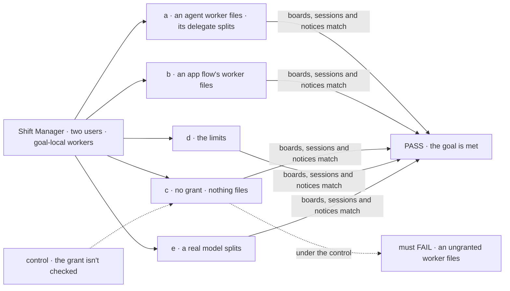
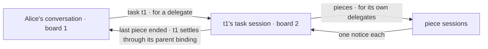

# FIX-1802 · Any worker can file work, and a filed task can be split down the chain

**Spec** · [Decisions](DECISIONS.md) · [Rules](BUSINESS-RULES.md) · [Plan](PLAN.md) · [Docs](DOCS.md) · [Evolution](EVOLUTION.md)

## Six people, before and after

| Someone who… | Today | After |
|---|---|---|
| **wants one of their workers, not a coordinator, to hand out work** | Only a coordinator's conversation files tasks ([FIX-1794](../FIX-1794/SPEC.md)) | They add `filing: true` and a `delegates:` list to that worker's file. It files tasks onto its own conversation's board, for those delegates, on whatever flow it runs |
| **gives a worker a big task** | The worker does it all itself: a task session that tries to file is refused | It splits the task: files the pieces on its own task session's board, waits, and its task finishes with what the pieces returned. Up to five boards deep |
| **leaves a worker's file without the grant** | n/a | That worker gets no filing tools, and the app can't file on its conversations. Naming delegates that nothing uses is refused when the app loads |
| **runs a worker on their own app flow** (the DevTeam's EM, `flow: em`) | Filing is built into the coordinator flow only | The flow puts the filing capability on its model's block and spreads the filing entries, and the worker keeps the flow it names |
| **hands a post to a delegate that then files work** | n/a | The delegate's answer comes back as today. The work it filed reports to the delegate's own session, not to the post |
| **builds a worker that keeps splitting** | n/a | It stops at five boards deep, or at 50 tasks under one top task, whichever comes first. The refusal names the limit |

The epic's [D8](../../epics/FIX-1786/DECISIONS.md#d8): filing is a tool any worker can be granted,
and the split is in the MVP. Built on FIX-1794's board kept per conversation
([epic D6](../../epics/FIX-1786/DECISIONS.md#d6)) and FIX-1791's delegates.

## The goal, and how we'll know it's met

**Any worker its owner grants filing, on any worker flow, files work for its own delegates onto
its own session's board, and a worker given a task can split it the same way. Every session in
the chain is the owner's, the chain is bounded, and each task's result comes back up, board by
board, to the session that filed the top task.**

| Is it the right goal? | |
|---|---|
| **The real need** | The product owner, 2026-10-06 ([epic D8](../../epics/FIX-1786/DECISIONS.md#d8)): filing is a grant, opt-in per worker; multi-level delegation is in the MVP. FIX-1792 needs it twice: the DevTeam's EM leads storefront's feature workstream as an ordinary worker that files, and lab members that filed on boards file themselves (its BR-13a). Carried from [FIX-1794](../FIX-1794/DECISIONS.md#q): its leg b, D2, BR-7, BR-30 to BR-32 |
| **Smaller, and rejected** | "A coordinator's task session can file one more level." It keeps filing as what makes a coordinator, which D8 rejects, and leaves the EM on a flow it can't keep |
| **Bigger, and not this issue's** | Converting the lab files that file (FIX-1792) · the coordinator's routing policies (FIX-1791, amended on the epic) · a sweeper for boards nobody touches (FIX-1794's follow-up) · stopping a running task (FIX-1659) |
| **Not done if** | Only `agent` workers file · a worker without the grant still files, by tool or app · a split task ends before its pieces · a failed settling turn strands a parent · a chain passes five boards or 50 tasks · a filing lands on another session's board · a session in the chain isn't the owner's · Bob's worker is an assignee anywhere |



The check files through the app and the tools, then only reads boards, sessions and notices.
Under the dashed control every worker gets the tools, and leg c must fail.

| How we verify | |
|---|---|
| **Goal check** | `goals/workers/files-and-splits-down-the-chain/` · scripted workers for legs a to d, a real model for leg e · Shift Manager over HTTP, two users · run by the implementer at completion · verdict in the last implementation PR |
| **Signal** | **a**: Alice's `agent` worker (not a coordinator, granted filing) files a task for its delegate; the delegate, also granted, splits it into two pieces for two delegates; four sessions, all hers; each row on its own session's board; the top task completes within 120 s, after both pieces; Alice's conversation gets one `completed` notice. **b**: a worker on a goal-local app flow carrying the capability files for an `agent` delegate; the task completes. **c**: a worker without the grant has no filing tool, the app's `fileTask` on its conversation is refused, and a file naming delegates without the grant is refused at load. **d**: a chain scripted to split at every level is refused at the sixth board; one scripted to fan out is refused at the 51st task; both name the limit. **e**: asked for a two-part job, a real model granted filing files at least one piece for a delegate, and its conversation hears the ending |
| **Input** | Two users through sign-in; a goal-local tree with scripted workers on `agent`, one on a goal-local app flow, and Bob's worker of the same name. Asks held out at run time |
| **Anti-game** | No row, session or notice written by a fixture; no drain from the check. Counts read again after 5 s. Leg c asks the session's tool list, not the prompt |
| **Control that must fail** | `GOAL_CONTROL=no-grant-check`: leg c FAILS on *a worker without the grant files nothing*. `GOAL_CONTROL=no-parent-settle`: leg a FAILS on *the top task completes after both pieces*. Today's `main`: every leg FAILS |

## What changes


On the left, filing is a kind of worker. On the right, it is a line in a worker's file.

**What a worker's file says** (the DevTeam's EM, which FIX-1792 converts):

```diff
  # teams/eng/workers/em/WORKER.md
  ---
  description: Leads the feature. Files the work, never does it.
  flow: em
  document: engineering-handbook
+ filing: true
+ delegates: [eng.coder, eng.reviewer]
  ---
```

**And what an app flow adds** to carry the tools (the built-in `agent` and coordinator flows
already do). A capability composes into a block, not a flow, so the factory returns both halves:

```diff
+ const filing = createTaskFilingCapability()
  const em = defineFlow({
    kind: "em",
    configSchema: workerConfigSchema().extend({ document: z.string() }),
+   actions: { ...filing.actions, … },
+   internal: { actions: { ...filing.internal } },
+   task: { actions: { ...filing.task } },
    …
  })
+ // and on the EM's generator block: uses: [filing.capability]
```

The tools are FIX-1794's: `fileTask`, `listTasks`, `reassignTask`, `cancelTask`. So are the app's
actions of the same names, on any session of a granted worker.

## How a piece's result comes back up



A task that filed pieces waits, parked, on the board above, and settles there from the pieces'
results through a binding the server wrote when it parked.

## What stays as it is

- FIX-1794's board per session, its `createTaskFilingCapability()`, notices, reassign, cancel and
  lookup. This issue swaps FIX-1794's answer to "may this session file?" for the grant, says for
  whom, and adds the wait.
- FIX-1791's delegate records and roster check. A coordinator still routes posts.
- The task board: no Layer 1 change ([POC](poc/split-on-one-flow/README.md)).
- A post is answered and a task is worked.

## Sign off

**[The goal](#the-goal-and-how-well-know-its-met), at that size:** filing by grant on any worker
flow, the split, results back up, and a bounded chain. If wrong: the EM moves flow to file, or a
split runs away before anyone looks.

1. **[D1](DECISIONS.md#d1) · A worker's file grants filing with `filing: true`, and the worker
   files for its own delegates, FIX-1791's list, now on any worker that files.** If wrong: two
   answers to "who works for this worker", or a grant some flows can't read. **The one to weigh.**
2. **[D2](DECISIONS.md#d2) · A chain stops at five boards deep, and at 50 tasks under one top
   task.** If wrong: a real job refused at its 51st piece, or a runaway split that spends
   thousands of runs.

**Open: none.** Reasoning and what lost: [DECISIONS.md](DECISIONS.md). The cases:
[BUSINESS-RULES.md](BUSINESS-RULES.md).

Feature · `workforce`, `shift-manager` · large · 3 PRs, stacked on FIX-1794 · epic [FIX-1786](../../epics/FIX-1786/SPEC.md)
