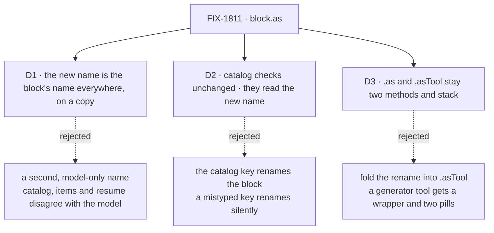

# FIX-1811 · Decisions

[Spec](SPEC.md) · **Decisions** · [Rules](BUSINESS-RULES.md) · [Plan](PLAN.md) · [Docs](DOCS.md)

What was considered, what was chosen, why, and what each choice locks in. The issue raised three
questions; each is one card. Everything else here is context for them.

## The tree

Solid edges are what you're signing. Dashed edges lost, and the label says why.

## D1 · `.as({ name })` changes the block's name everywhere, on a copy; the original is untouched

| | |
|---|---|
| **Instead of** | A second, model-facing name that only the generator's tool compiler reads, while the block keeps its own name for items, traces, resume and catalog checks |
| **Because** | In FSD a block's name already *is* the name the model calls: the generator advertises it, a worker's `tools:` line authorizes it, and Workforce refuses a catalog entry whose key disagrees with it, for exactly that reason. A second name would make what the model called and what the transcript, the trace and the catalog say disagree. It would also leave the catalog refusing the very entry FIX-1812 needs (D2). One name is tenet 1's coherence and tenet 2's "refine the primitive": `.as()` is one more rebuild beside `.connectInput()` and `.rescue()`, not a new concept |
| **Locks in** | A renamed copy's trace, items and stored resume points carry only the new name. Someone reading a trace learns which block a tool came from by reading the code, not the trace. The persisted-name risk the issue raised is bounded: the original block keeps its name, so nothing already stored under it moves. Adopting `.as()` at a call site is the same act as renaming a block there, and at today's wrapper sites the new name equals the wrapper's name, so the tool's own items and resume points don't change at all |

It comes down to what a person reads next to what the model called: one name, or two that disagree.

**What would change my mind:** evidence that people debugging a renamed tool need the source
block's name in the trace more than they need one name. Then the trace row gets an "as" note,
added on top of this; the name stays.

## D2 · Workforce's catalog checks stay as they are and read the new name; a catalog key never renames a block

| | |
|---|---|
| **Instead of** | Let Workforce rename a block to its catalog key, so `hire: blocks.hire` works with no `.as()` |
| **Because** | The rule that key, file name and block name agree exists to catch a mistake: a key that doesn't match its block would advertise one tool and authorize another. A key that silently renames turns every typo into a working, wrongly named tool. And the key can't carry a description, so the devteam host would still need `.as()`. With D1, the existing checks read `.name`, which is the new name, and pass with no Workforce change. Renaming is a core block feature; Workforce needs no word for it (the layer rule) |
| **Locks in** | Authors spell the name twice in a catalog entry, in the key and in `.as({ name })`, and a mismatch is still refused at startup, naming both spellings |

It comes down to a mistyped key: refused at startup today, a silently working tool otherwise.

**What would change my mind:** a second Workforce site that must rename many blocks to
generated keys. Then a helper that writes `.as({ name: key })` for each entry earns its place,
built on this.

## D3 · `.as()` and `.asTool()` stay two methods and stack; `.as()` first names the tool pill

| | |
|---|---|
| **Instead of** | One method: give `.asTool()` `name` and `description` options and drop `.as()` |
| **Because** | They answer different needs. `.asTool()` wraps a block so a *sequencer step* shows a tool pill; it adds a wrapper and emits a `tool_output`. A generator already emits that pill for its tools, so a rename through `.asTool()` would put a wrapper and a second pill on every renamed generator tool. `.as()` adds nothing at run time. They stack: `block.as({ name: "fetchPrices" }).asTool()` shows a pill named `fetchPrices` |
| **Locks in** | Two similarly named methods to tell apart, so the docs say which is which in one line each. Order matters: `.asTool().as({ name })` renames only the wrapper, and the pill keeps the original name, which the docs state |

It comes down to a renamed generator tool: `.as()` adds nothing; a rename through `.asTool()` adds a wrapper and a second pill.

## Decided, not asked

- **`.as()` returns a plain block definition**, as `.connectInput()` and `.rescue()` do. A
  sequencer's `.step()` and friends are not on the copy; finish building, then rename.
- **Both options are optional.** An omitted `description` keeps the original's; an omitted
  `name` keeps the original's name, so two copies with only new descriptions still collide in one
  tool list, as two uses of one block do today. `.as({})` is a plain copy. A description can't be
  cleared, only replaced.
- **The name rules are today's.** A blank name is refused at build, as `handler({ name: "" })`
  is; the model-facing alias is sanitized as for any block name.
- **Every builder reads its own name at run time, not from its construction.** Generator,
  router, evaluator and sequencer each capture the authored name inside their run today (a
  generator's default `agentName`, a router's route-selection record, error messages). A copy
  that reported the old name there would break D1 quietly. They read the name from the running
  definition, which the shared run path hands them; not from `ctx._blockIdentity`, which a block
  run without its own scope inherits from its caller. The plan lists the sites and why.
- **`.as()` composes with every other rebuild** (`.connectInput()`, `.mapModelOutput()`,
  `.rescue()`, `.asTool()`), in either order; everything the original carried rides the copy.
  The rebuilds that keep a block's kind share one internal rebuild, so what they forward is
  written once.
- **No Workforce change.** FIX-1786 (coordinators replacing mailboxes) is reshaping Workforce's
  agent flow through FIX-1788, FIX-1791 and FIX-1794. None of them touches the catalog checks
  (the open FIX-1791 PR, #2865, adds an entry beside them), and D2 needs no edit there, so the two
  don't collide.

## Considered and dropped

| Alternative | Why not |
|---|---|
| Keep the wrapper sequencers (do nothing) | The product owner asked for them gone. Each copies its block's schemas and adds a trace row with no behavior |
| A `name` / `description` override on the generator's `tools` entry (`tools: [{ block, name }]`) | Works for a generator only; the catalog is a map of blocks and would need its own spelling. Two places to learn instead of one method |
| A standalone helper, `rename(block, { name })` | The same rebuild with a worse home. Every other rebuild is a method on the block; this one should be too (tenet 8, match the codebase) |
| Each builder owns its rebuild (re-run the factory with the authored config and the new name) | Also correct by construction, but it repeats capability resolution and construction checks per copy and changes four builders instead of one run path. Reading the running definition gets the same result at one point |
| Read the name from `ctx._blockIdentity` | Wrong when a block runs without its own scope: the block inside `.asTool()` would read the wrapper's name |
| Keep the source block's name on the trace row as an extra field | Not asked for; D1's *what would change my mind* names when it would be |

## How it got here

- **Draft** — framed as "rename a block, not wrap it"; a rebuild that changes the block's one
  name, which Workforce's existing check already reads; one PR in core with a Workforce test.
- **Review round 1** — a builder's run-time name now comes from the running definition, not
  `ctx._blockIdentity`, because that identity is the caller's when a block runs without its own
  scope (`.asTool()`'s inner block); and the rebuilds share one internal rebuild, because their
  hand-copied forwarding lists had already drifted once.

**Open: none.**
