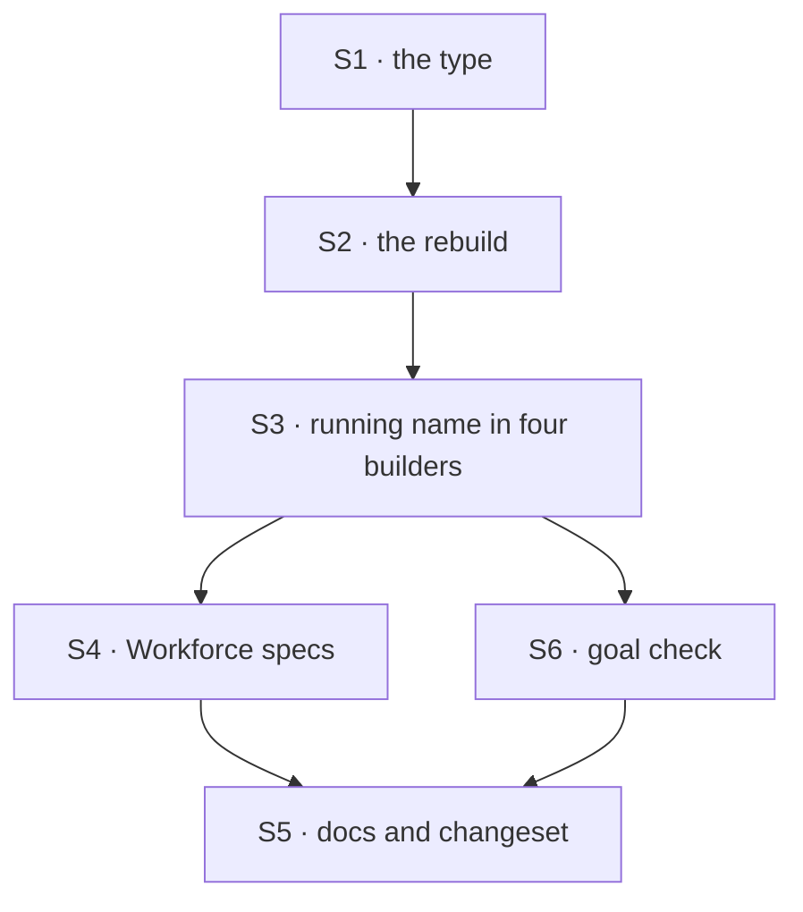

# FIX-1811 · Plan

[Spec](SPEC.md) · [Decisions](DECISIONS.md) · [Rules](BUSINESS-RULES.md) · **Plan** · [Docs](DOCS.md)

Written for the implementing agent. IDs cross-reference [BUSINESS-RULES.md](BUSINESS-RULES.md)
(BR-n) and [DECISIONS.md](DECISIONS.md) (Dn). `tdd`. One PR.

## Surfaces

| ID | Package · role | Change | Rules |
|---|---|---|---|
| S1 | `core` · the block definition type (`types/block.ts`, beside `asTool`) | Add `as(options: { name?: string; description?: string })`, returning a `BlockDefinition` with the same schema generics. Doc comment says how it differs from `.asTool()` (D3) | BR-1–3 BR-6 |
| S2 | `core` · the shared rebuild (`buildBlock`) | **Refactor while there:** extract one internal rebuild-with-overrides inside `buildBlock` that carries the forwarded set once (resources, own resources, capabilities, children, static tools, dispatch address read off the built definition, model-output mapper). `.connectInput`, `.mapModelOutput`, `.rescue` and `.connectOutput` move onto it and each state only what they change; no behavior change for them. Then add `.as()` on it: new name and description, nothing else. Re-apply a sequencer's informational output schema, which the sequencer stamps on the built block after `buildBlock` and a plain rebuild drops (D1) | BR-1–6 BR-13 BR-14 |
| S3 | `core` · the shared run path, and the builders that read their own name while running: generator, router, evaluator, sequencer | The shared run path hands the builder's execute the definition that is running. The builders read their name from it, not from the authored config captured at construction. Known sites at [At implement time](#at-implement-time). See [Where a running block's name comes from](#where-a-running-blocks-name-comes-from) (D1) | BR-7 BR-11 |
| S4 | `workforce` · tests only | A spec that defines the agent worker flow with a renamed catalog entry, and one with a mismatched key. **No source change** (D2) | BR-17 BR-18 BR-20 |
| S5 | Docs and release | [DOCS.md](DOCS.md)'s three operations; a `minor` changeset for `@flow-state-dev/core` | — |
| S6 | `goals/block-as/presents-a-block-under-a-new-name/` | The goal check, two legs, `GOAL_CONTROL=no-as` | BR-1 BR-7 BR-9 BR-17 |

Nothing is removed in this issue. The wrapper sites are FIX-1812's.

## Sequence



## Checks

| ID | Runs after | Passes when |
|---|---|---|
| V1 | S2 | A renamed handler as a generator tool (mock model): the compiled tool has the new name and description and the original's schema (BR-1–3); two copies make two tools (BR-4); a duplicate is refused (BR-5); a blank name is refused (BR-6) |
| V2 | S2 | Property fidelity: for each property in BR-13, the copy carries it. A sequencer copy still reports its output schema. Chained rebuilds in both orders agree (BR-14) |
| V3 | S3 | **Totality (BR-7).** For each of the five kinds, build a block with a distinctive name, run its `.as()` copy as a generator tool and as a sequencer step, collect every item, trace capture, status line, observer call and the error of a failing variant, and assert the original name appears in **none**. **Negative control:** run the same check on a copy made by overwriting only `name` on the definition object (no rebuild); it must fail for at least the generator and the router. Show that failure in the PR |
| V4 | S3 | Suspension (BR-9, BR-10, BR-11): a renamed tool that calls `ctx.suspend()` resumes under the new name with its side effect counted once from a real counter; a deny reaches the model; a renamed router whose branch suspends resumes on its recorded route |
| V5 | S2 | `.asTool()` in both orders (BR-15, BR-16); `ctx.wasRescued` and route lookups by the copy (BR-12); the original beside its copy keeps its own name (BR-8) |
| V6 | S4 | Workforce: `defineAgentWorkerFlow` with catalog `{ hire: <the real Workforce hire block>.as({ name: "hire", … }) }` passes the one-name check under the new name and is offered to a worker naming it, with the new description (BR-17). Control: the same catalog with the block passed without `.as()` must be refused; a mismatched key is refused with today's message (BR-18); a capability and the catalog giving different copies under one key are refused (BR-20) |
| VG | S6 | [The goal](SPEC.md#the-goal-and-how-well-know-its-met): both legs PASS on `openai/gpt-5.4-mini`, after both FAILED under `GOAL_CONTROL=no-as`. Verdict log rows for both runs |

S2's extraction is proved by the existing `connectInput` / `mapModelOutput` / `rescue` /
`connectOutput` suite passing unchanged, plus V2 and BR-14.

The second path (BP-035) is V4's resume and V5's original-beside-copy: a rename that only works
on a first, unsuspended call, or only when the original is absent, fails there.

## Pinned names

| Where | Name | Why pinned |
|---|---|---|
| Block method | `.as({ name?, description? })` | The product owner chose it on #2866 |
| Goal check | `goals/block-as/presents-a-block-under-a-new-name/`, control `GOAL_CONTROL=no-as` | Cited by `SPEC.md` |

Everything else is yours to name.

## Guardrails

| Rule | Because |
|---|---|
| `.as()` is a rebuild through the one shared path, never a spread copy of the definition object | A spread keeps the old name inside every closure that captured it, which is the half-rename V3's control plants (tenet 5: one convergence point for a block's identity) |
| A rebuild states only what it changes; the forwarded set lives in one place | Each rebuild copies the forwarded list by hand today, and the file already records drift (a rebuild from construction options once stopped being a dispatcher). A fifth copy for `.as()` is a fifth place to drift (tenet 5) |
| Every reading of a block's own name at run time comes from the running definition, never from `ctx._blockIdentity` and never from a construction closure | D1 promises one name; a builder that quotes another name breaks it in one item nobody looks at. Why not `_blockIdentity`: next section |
| No Workforce source change. If S4 fails without one, stop and surface it | D2 rests on the existing check reading `.name`; needing an edit means D1 was built wrong, not that Workforce should learn about renames (layer rule) |
| The original block is never mutated | BR-8, and the issue's persisted-name concern: nothing stored under the original may move |

## Where a running block's name comes from

Chosen: **the shared run path passes the running definition to execute**, and a builder reads its
name there. A copy's run passes the copy, so the name is right on every path by construction,
with or without an engine scope, on a first call and on resume.

- **Not `ctx._blockIdentity.blockName`.** It is the copy's name only when the block runs in its
  own execution scope. A block run without one inherits its caller's identity: the inner block of
  `.asTool()` runs in the wrapper's scope, so it would read `<name>__as_tool`, and a unit harness
  sees its parent's identity or none. A fallback to the construction closure when it is absent is
  the half-rename V3 exists to catch.
- **Not each builder owning its rebuild** (re-invoking the factory with the authored config). It
  also fixes future name reads by construction, but it re-runs capability resolution and
  construction checks per copy, needs every builder to keep its authored config, and needs the
  sequencer to reuse its operations list, in four builders instead of one run path. A later
  builder that captures `config.name` in a closure is still caught by V3, which stays.

## Docs

Reconcile [DOCS.md](DOCS.md) with the shipped behavior after V6, then publish its three operations
in the same PR. No new page.

## Sketch · pseudocode, illustrative, react to the shape

```
on every block definition:
    as(options):
        rebuild through the shared path with
            config  = this block's config, name ← options.name ?? name,
                      description ← options.description ?? description
            and every forwarded field the other rebuilds carry
        if this block reported an output schema of its own: carry it   ← sequencer only

every rebuild (.as, .connectInput, .mapModelOutput, .rescue, .connectOutput):
    rebuild with overrides  ← the forwarded set is carried once, here

the shared run path:
    execute(input, ctx, the definition that is running)

inside a builder's run:
    my name = the running definition's name    ← not the one captured when it was built
```

**POC:** none. The premise that downstream reads `block.name` was checked by reading the tool
compiler, the tool executor, the resume reconstruction and Workforce's three one-name checks; V3
proves it on the real path.

## At implement time

- **Name sites captured at construction** (S3), found on `main` at the time of writing; re-grep,
  there may be more: the generator's run-time `blockName` (default `agentName`, tool attribution,
  errors); the router's route-selection record and `RouteUnavailableError`; the evaluator's
  `blockName`; the sequencer's output validation, `/connect-input` step name and `.validate()`
  error. Build-time messages (before any copy exists) may keep the authored name.
- `.connectOutput`'s execute wraps the original; it must forward the running definition too.
- If the S2 extraction proves too big, `.as()` must at least use the same shape, and V2 is the
  guard. Say so in the PR.
- FIX-1791's PR #2865 edits Workforce's agent flow near the catalog code. Rebase on whatever has
  merged; S4 adds tests only.
- FIX-1812 (spec PR #2873) is blocked by this and starts after merge. It owns the devteam host and the Workforce pages and README that teach the wrapper; don't touch them here.

## Notes from review

From the round-1 review (#2874), for the implementer to weigh against real code:

- **Same-name copy in a router.** `router.ts` rejects two *different* definitions that share a
  route name. A description-only copy, `block.as({ description })`, has the same name but is not
  reference-equal, so a router listing both the original and the copy now throws. BR-2 says "name
  unchanged" without mentioning this. Add a line to DOCS.md or BR-12 so it isn't a surprise.
- **BR-20 is a footgun.** Two `.as()` calls make two non-identical objects, so a capability and an
  app catalog that each write `blocks.hire.as({ name: "hire" })` get refused, and the rule is
  "reuse one copy value". DOCS.md should show the shared-const pattern, since the error will read
  as a mystery.
- **Goal leg b on a real model** (S6) mostly re-proves V6. Leg a carries the weight. If runtime or
  cost matters, leg b could assert the load plus the roster row with a mock model. The control
  still needs to fail on "the flow loads".
- **Size.** Nine spec files for a method plus a four-builder fix is a lot of paper. Not a blocker.

## Follow-ups

- FIX-1812 · replace the one-step rename wrappers with `.as()` (filed, blocked by this).
