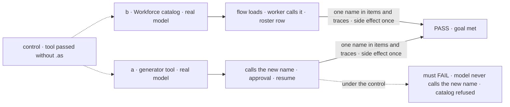
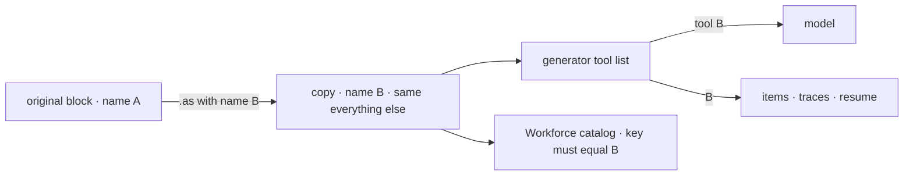

# FIX-1811 · Rename a block for the model with block.as({ name, description })

**Spec** · [Decisions](DECISIONS.md) · [Rules](BUSINESS-RULES.md) · [Plan](PLAN.md) · [Docs](DOCS.md)

## Five people, before and after

| Someone who… | Today | After |
|---|---|---|
| **gives a generator someone else's block as a tool, under a name that fits their flow** | Writes a one-step sequencer that exists only to carry the new name and description, copies the block's input and output schemas onto it, and gets one more row in every trace | Writes `block.as({ name, description })` in the `tools` array. The model sees the new name and description; the trace shows one row for the tool |
| **puts a framework block in Workforce's tool catalog under the name a worker's `tools:` line spells** (the devteam host's `hire`, `fire`, `setWorkstreams`) | `hire: blocks.hire` is refused at startup, because a catalog key must equal its block's name. So: the same wrapper sequencer | `hire: blocks.hire.as({ name: "hire", description: "…" })`. Accepted, because the block's name now is `hire` |
| **reads a transcript, a trace or a tool pill for a renamed tool** | Sees the wrapper's name on the tool and the wrapped block's name one level down | Sees one name: the one the model called |
| **renames a tool that asks a person before it runs** | The approval lives inside the wrapper; it suspends and resumes under the wrapper's name | Suspends and resumes under the new name, exactly as an unrenamed tool does |
| **already uses the original block anywhere else** | n/a | Nothing changes for them. `.as()` returns a copy; the original keeps its name, its traces and anything stored under it |

The product owner's call, in review of [#2866](https://github.com/fixpoint-labs/flow-state-dev/pull/2866#discussion_r4221874530):
*"why is this a sequencer if its just one step? It can be just the step itself."* The method
shape, `.as({ name?, description? })`, was agreed on the same thread. Replacing today's wrapper
sites is [FIX-1812](https://linear.app/fixpoint-labs/issue/FIX-1812), blocked by this.

## The goal, and how we'll know it's met

**An author shows any block to a model under a name and description of their choosing, with no
wrapper, and the renamed tool is called, suspends, resumes and shows up in traces under that
one name, in a generator and in Workforce's tool catalog alike.**

| Is it the right goal? | |
|---|---|
| **The real need** | Delete the one-step rename wrappers ([#2866 review](https://github.com/fixpoint-labs/flow-state-dev/pull/2866#discussion_r4221874530)). FIX-1812 can do that only if a renamed block is a drop-in for the wrapper, in the catalog too |
| **Smaller, and rejected** | "The model is offered the new name." Hittable with a field only the tool compiler reads, while the catalog still refuses the entry and traces show a name the model never used. FIX-1812 could not delete a single wrapper |
| **Bigger, and not this issue's** | Replacing the wrapper sites (FIX-1812) · renaming a wrapper that carries an approval step (FIX-1812 keeps those) |
| **Not done if** | The goal check ran only on a handler, never on a tool that suspends · the catalog entry loads but the worker's model can't call it · any item, trace row or error from a renamed copy still names the original block · the original block's name changed |



The check reads the item stream and a real side effect, never the compiled tool list. The dashed
path is the same run with the block passed as it is, which is today.

| How we verify | |
|---|---|
| **Goal check** | `goals/block-as/presents-a-block-under-a-new-name/` · `openai/gpt-5.4-mini` · run by the implementer at completion · verdict in the implementation PR |
| **Signal** | **a**: asked to save a note, the model calls `saveNote` (a renamed `notes.write` handler that asks for approval); the run suspends; after Approve it resumes and the note is written exactly once; every `tool_output` and trace row for the call names `saveNote`, none `notes.write`. **b**: a goal-local app's agent worker flow with catalog `{ hire: <Workforce's hire block>.as({ name: "hire", … }) }` loads; its worker, whose `tools:` says `hire`, asked to hire, calls `hire` and one roster row appears |
| **Input** | Asks held out at run time. A different note text or worker id must pass too |
| **Anti-game** | Don't assert on the compiled tool list or on `block.name`: both pass while the catalog still refuses or the trace still names the original. Count the side effect from the store, not from items |
| **Control that must fail** | `GOAL_CONTROL=no-as` (pass the block without `.as()`): **a** FAILS on *the model calls `saveNote`*; **b** FAILS on *the flow loads*. Today's `main` fails both the same way |

## What changes


Same tool, same model, same `tools:` line. The left column is the wrapper FIX-1812 deletes; the
right column is all it takes after this.

**A generator tool, as an author writes it:**

```diff
  const agent = generator({
    name: "assistant",
-   tools: [saveNoteTool],            // a one-step sequencer that only renames
+   tools: [notes.write.as({ name: "saveNote", description: "Save a note for the person." })],
  });
- const saveNoteTool = sequencer({
-   name: "saveNote",
-   description: "Save a note for the person.",
-   inputSchema: notes.write.inputSchema,
-   outputSchema: notes.write.outputSchema,
- }).step(notes.write);
```

**A Workforce catalog entry** (the shape FIX-1812 will write in the devteam host):

```diff
  catalog: {
-   hire: sequencer({ name: "hire", description: "Hire a worker…",
-     inputSchema: blocks.hire.inputSchema, outputSchema: blocks.hire.outputSchema }).step(blocks.hire),
+   hire: blocks.hire.as({ name: "hire", description: "Hire a worker…" }),
  },
```

## How the name reaches the model



`.as()` is a rebuild, like `.connectInput()` and `.rescue()` already are: the copy has a new name
and description and keeps the rest. Everything downstream already reads the block's name, so
nothing downstream changes ([D1](DECISIONS.md#d1)).

## What stays as it is

- The original block, and anything stored or traced under its name.
- Workforce's catalog checks, word for word: the key must equal the block's name ([D2](DECISIONS.md#d2)).
- `.asTool()`, which still wraps a block so a sequencer step shows a tool pill ([D3](DECISIONS.md#d3)).
- The wrapper sites themselves. FIX-1812 replaces them.

## Sign off

**[The goal](#the-goal-and-how-well-know-its-met), at that size:** one name everywhere, in a
generator and in the catalog, proved on a tool that suspends. If wrong: we ship a rename the
catalog still refuses, and FIX-1812 can't delete the wrappers it was filed for.

1. **[D1](DECISIONS.md#d1) · `.as({ name })` changes the block's name everywhere, on a copy: the
   model, items, traces and resume all see the new name; the original is untouched.** If wrong: a
   renamed copy's trace no longer shows which block it came from.
2. **[D2](DECISIONS.md#d2) · Workforce's catalog checks stay as they are and read the new name; a
   catalog key never renames a block.** If wrong: authors write the name twice, in the key and in
   `.as()`.
3. **[D3](DECISIONS.md#d3) · `.as()` and `.asTool()` stay two methods and stack; `.as()` first names
   the tool pill.** If wrong: two close names an author has to learn apart.

**Open: none.** D1 is the one to weigh. The reasoning and what lost: [DECISIONS.md](DECISIONS.md).
The cases: [BUSINESS-RULES.md](BUSINESS-RULES.md).

Feature · `core` (+ a Workforce test, no Workforce change) · small: 6 surfaces, 7 checks, 3 doc surfaces · 1 PR · no epic. FIX-1786 (coordinators replacing mailboxes) reshapes Workforce's agent flow but not its catalog checks, and needs nothing from this
