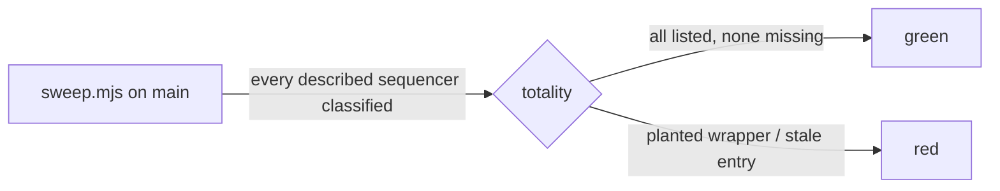

# FIX-1812 · Replace one-step rename wrappers with block.as()

**Spec** · [Decisions](DECISIONS.md) · [Rules](BUSINESS-RULES.md) · [Plan](PLAN.md) · [Docs](DOCS.md)

| Someone who… | Today | After |
| --- | --- | --- |
| reads the devteam host | `hire` and `setWorkstreams` are sequencers that copy the inner block's schemas only to carry a name and a description | each is the Workforce block with `.as({ name, description })` |
| copies the hire or project-tools example from the docs or the Workforce README | copies a wrapper sequencer, the pattern this issue retires | copies `.as()` |
| reads a trace of a `hire` or `setWorkstreams` call | sees a wrapper layer with no behaviour above the real block | sees the block itself |
| keeps an approval before a write (`fire`, `createProject`, `setRepository`) | a sequencer with a `.tap` or `.tapIf` | the same sequencer, unchanged |

## The goal, and how we'll know it's met

**Every wrapper whose only job is to show a block to the model under another name or
description is gone, replaced by `.as()`. Every wrapper with real behaviour stays. The
model sees the same tool names and descriptions as before.**

- **Smaller, and rejected:** change only `packages/shift-manager/teams/devteam/host.mts`. The
  docs pages and the Workforce README teach the same wrapper, and they are what new authors copy.
- **Bigger, and not this issue's:** remove every one-step sequencer. Most of them (893 found) have
  no `description` and are never shown to a model: they are action roots and test harnesses.
  `.as()` does nothing for them ([D1](DECISIONS.md#d1)).
- **Not done if:** a site the sweep lists as `rename` still wraps; a `kept` site lost its tap;
  the model sees a different tool name or description for any replaced tool.



**How we verify:** `node specs/issues/FIX-1812/poc/sweep/sweep.mjs` classifies every
`sequencer({...})` in tracked sources and docs code fences, and fails if any site with a
`description` is missing from its list or a listed site is gone. `--control` plants an unlisted
wrapper and a stale entry and passes only when both are reported (`CONTROL PASS`). It was also run by hand once with a
wrapper planted in `packages/testing`. After the
change, the checker's expected list flips the `rename` sites to "gone", and the shift-manager
tests that read the chief of staff's tool set stay green.

## What changes

```diff
 // packages/shift-manager/teams/devteam/host.mts  (shape only)
-    setWorkstreams: sequencer({
-      name: "setWorkstreams",
-      description: "Replace a project's workstreams with …",
-      inputSchema: setWorkstreamsInputSchema,
-      outputSchema: setWorkstreamsOutputSchema,
-    }).step(blocks.setWorkstreams),
+    setWorkstreams: blocks.setWorkstreams.as({
+      name: "setWorkstreams",
+      description: "Replace a project's workstreams with …",
+    }),
```

The same change applies to `hire` in the same file, to the `createProject`, `setWorkstreams`
and `hire` examples in `apps/docs/docs/workforce/projects.md` and `chief-of-staff.md`, and to
`hire` in `packages/workforce/README.md`. The kitchen-sink mailbox control builds its inner
block in place, so it gets the name and description directly and needs no `.as()`. The full
list, with a reason for each kept site, is in [PLAN → Sites](PLAN.md#sites).

## What stays as it is

Every wrapper with a tap, connector, branch, rescue or more than one step. `.as()` itself is
FIX-1811's. Nothing is persisted under the replaced wrappers' names: `hire` and
`setWorkstreams` never suspend, so no in-flight run resumes into a wrapper that is gone.

## Sign off

**Approve to merge.** The one call is where the line sits: only wrappers the model reads
([D1](DECISIONS.md#d1)). *If wrong:* a few action-root wrappers stay; a later sweep can remove
them with no change to `.as()`.

**Open: none.** Blocked by FIX-1811. Its spec (#2874) has `.as()` give the block its new name
everywhere, so it passes the Workforce catalog's key-equals-name check with no Workforce change.

Improvement · `shift-manager`, `workforce` README, `apps/docs` · small · 1 PR · blocked by
[FIX-1811](https://linear.app/fixpoint-labs/issue/FIX-1811)
