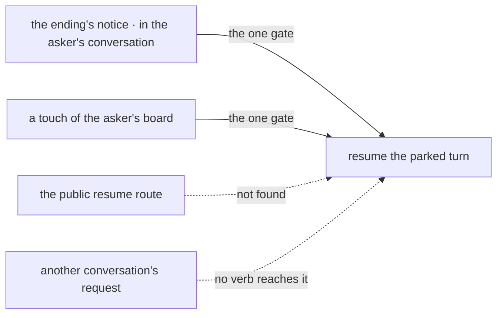

# FIX-1816 · Business rules

[Spec](SPEC.md) · [Decisions](DECISIONS.md) · **Rules** · [Plan](PLAN.md) · [Docs](DOCS.md) · [Evolution](EVOLUTION.md)

The cases, written as rules. Each says what a worker, a person or the system does and what
happens. The *proved by* column is the check the plan runs. Epic rules are cited as ER-n
([FIX-1815](../../epics/FIX-1815/BUSINESS-RULES.md)).

## Asking

| # | When | Then | Proved by |
|---|---|---|---|
| BR-1 | A worker's turn calls `addTask` with `waitForResponse: true` for an assignee it may file for | One row is filed on its conversation's board, marked asked; the turn parks; the row runs as any filed task does | CI · goal |
| BR-2 | The asked row completes | The parked turn resumes and the call returns the row's output as the answer, in the same request | CI · goal |
| BR-3 | The asked row fails for good, or is cancelled | The call returns an error naming the ending. The model reads it like any failed tool | CI |
| BR-4 | The assignee is not one the worker may file for | Refused before anything is stored, exactly as `addTask` refuses it (FIX-1802 D1). Nothing parks | CI |
| BR-4a | `waitForResponse` is set together with `followUpOf` on one call | Allowed. BR-4's assignee check runs against the root task's worker. FIX-1817's refusals, its BR-21 (the named task hasn't finished) and its BR-25 (that task's session is busy), happen before anything is filed, so nothing parks | CI |
| BR-5 | The runtime has no durable execution or no durability sweeper | `addTask` has no `waitForResponse` option on the turn; plain `addTask` is unchanged | CI |
| BR-5a | A task turn sets `waitForResponse`: a turn the gate serves, the single test [FIX-1817](https://linear.app/fixpoint-labs/issue/FIX-1817)'s S1 owns, not defined again here | Refused before anything is filed, as `wait_unavailable`. So an ask is never asked from inside an ask: depth is one, and the epic's depth cap (ER-4) holds by construction | CI |
| BR-5b | The task turn working an asked row would park on a question | It can't: in v1 an asked row's turn has no `parkOnQuestion`, by epic ER-22 ([#2904](https://github.com/fixpoint-labs/flow-state-dev/pull/2904), owned by [FIX-1817](https://linear.app/fixpoint-labs/issue/FIX-1817)). FIX-1817's matching carve-out in its S1 and S7 follows in its own alignment PR, after its spec merges. The colleague answers with what it has, or fails, and the ask ends with that answer (BR-2) or that error (BR-3), so no answered question re-claims the row mid-ask. This is a product-shape rule, not a correctness one: the gate's fence (BR-12) holds without it | CI |
| BR-6 | `addTask` is called without `waitForResponse` | Unchanged: it files and returns at once (ER-5) | Existing suite |
| BR-7 | The asked row has already ended when the turn reaches its park | The call returns the answer without parking, and clears the row's resume-owed marker in the same write. A touch that finds a marker whose gate was never created leaves it for this replay to clear | CI, the row ended between filing and park |
| BR-8 | One step sets `waitForResponse` on a second `addTask` | Refused before anything is filed, as `wait_already_pending`. The first ask is unaffected; the model may ask again on a later step | CI |

## Across a restart, once

| # | When | Then | Proved by |
|---|---|---|---|
| BR-9 | The process dies at any point while the turn is parked | The parked turn and the row survive. The ask completes after the restart | CI · goal |
| BR-10 | The resumed turn replays and reaches the waiting `addTask` again | The call does not file again: one row per call (ER-1) | CI · goal control `no-run-once` |
| BR-11 | The process dies after the row's ending is written and before the turn resumes | The row keeps a resume-owed marker. The next touch of the board resumes the turn once and clears it | CI, killed in that window · goal control `no-waker` |
| BR-12 | The ending's notice arrives twice, or a touch replays the marker after the turn resumed | Nothing resumes twice. The gate fences on the row's identity and its terminal ending, not on a per-attempt claim ticket: the board's claim ticket already stops a stale attempt from settling the row (ER-6), so the gate needs only "this row ended". It does not depend on BR-5b. The row's single terminal ending and the parked turn's single pending gate each admit one answer | CI |
| BR-12a | The asked row's attempt fails, and the board retries it | The asker resumes once, with the ending of the attempt that settles the row. An intermediate failure that was retried never resumes it | CI, a row failed once then completed: one resume, the final answer |
| BR-13 | Anyone calls the public resume route for an asking turn | Not found, as today. Only the asker's own conversation resumes it | CI |

Left of the line is the asker's own conversation. Two paths cross at its one gate; BR-13 is the
two that stop. The mermaid below is the same paths by name.

## Bounded

| # | When | Then | Proved by |
|---|---|---|---|
| BR-14 | An ask is still open ten minutes after it was filed | The next durability sweep resumes the turn with `wait_timed_out`, so within twenty minutes, and the resumed call cancels the row. A later ending of that row is dropped | CI, a real sweep tick |
| BR-16 | The person cancels the asking turn | The asked row is cancelled, and its later ending is dropped. A run already under way is not stopped ([FIX-1659](https://linear.app/fixpoint-labs/issue/FIX-1659)'s) | CI |

BR-15, BR-17 and BR-18 were cut before the gate, with nested asks and the per-call timeout
([why](DECISIONS.md#cut-before-the-gate)).

## Failure taxonomy

A refused filing (BR-4, BR-5a, BR-8) is the call's error and parks nothing. On a `followUpOf` call,
FIX-1817's BR-21 and BR-25 refusals are refused filings too, before anything parks (BR-4a). A failed,
cancelled or timed-out ask is the call's error and resumes the turn: the model decides what to do.
A lost resume is never an error: the resume-owed marker holds it until the next touch. Nothing
retries the asked work except the board's own attempts.

## Acceptance criteria this issue owns

[The goal](SPEC.md#the-goal-and-how-well-know-its-met) passes on SQLite with the server a real
process, and each control fails. ER-1, ER-4 and ER-5 are this issue's; the closure
FIX-1820 runs them again as its leg a.
