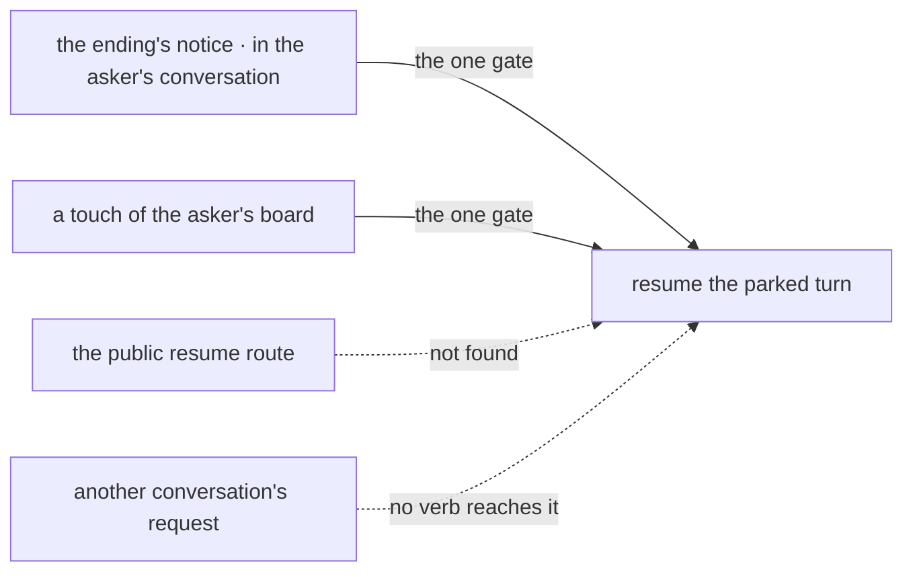

# FIX-1816 · Business rules

[Spec](SPEC.md) · [Decisions](DECISIONS.md) · **Rules** · [Plan](PLAN.md) · [Docs](DOCS.md) · [Evolution](EVOLUTION.md)

The cases, written as rules. Each says what a worker, a person or the system does and what
happens. The *proved by* column is the check the plan runs. Epic rules are cited as ER-n
([FIX-1815](../../epics/FIX-1815/BUSINESS-RULES.md)).

## Asking

| # | When | Then | Proved by |
|---|---|---|---|
| BR-1 | A worker's turn calls `askTask` for an assignee it may file for | One row is filed on its conversation's board, marked asked; the turn parks; the row runs as any filed task does | CI · goal leg 1 |
| BR-2 | The asked row completes | The parked turn resumes and the call returns the row's output as the answer, in the same request | CI · goal leg 1 |
| BR-3 | The asked row fails for good, or is cancelled | The call returns an error naming the ending. The model reads it like any failed tool | CI |
| BR-4 | The assignee is not one the worker may file for | Refused before anything is stored, exactly as `addTask` refuses it (FIX-1802 D1). Nothing parks | CI |
| BR-5 | The runtime has no durable execution | `askTask` is not on the turn. `addTask` still is | CI |
| BR-6 | `addTask` is called | Unchanged: it files and returns at once (ER-5) | Existing suite |
| BR-7 | The asked row has already ended when the turn reaches its park | The call returns the answer without parking | CI |
| BR-8 | One step calls `askTask` twice | Both rows are filed. The turn resumes on each in turn and gets both answers. No answer is lost or given twice | CI |

## Across a restart, once

| # | When | Then | Proved by |
|---|---|---|---|
| BR-9 | The process dies at any point while the turn is parked | The parked turn and the row survive. The ask completes after the restart | CI · goal leg 1 |
| BR-10 | The resumed turn replays and reaches `askTask` again | The call does not file again: one row per call (ER-1) | CI · goal control `no-run-once` |
| BR-11 | The process dies after the row's ending is written and before the turn resumes | The row keeps a resume-owed marker. The next touch of the board resumes the turn once and clears it | CI, killed in that window · goal control `no-waker` |
| BR-12 | The ending's notice arrives twice, or a touch replays the marker after the turn resumed | Nothing resumes twice. The row's claim ticket and the parked turn's single pending gate each admit one answer (ER-6) | CI |
| BR-13 | Anyone calls the public resume route for an asking turn | Not found, as today. Only the asker's own conversation resumes it | CI |

Left of the line is the asker's own conversation. Two paths cross at its one gate; BR-13 is the
two that stop. The mermaid below is the same paths by name.

## Bounded

| # | When | Then | Proved by |
|---|---|---|---|
| BR-14 | An ask waits longer than its timeout | The turn resumes with a timeout error, and the row is cancelled. A later ending of that row is dropped | CI |
| BR-15 | A asks B and B, to answer, asks A | Each ask files one board deeper. Both end at their timeout, and the chain is refused at the sixth board like any filing (ER-4) | CI · a mutual ask, run |
| BR-16 | The person cancels the asking turn | The asked row is cancelled. If its run is under way, its lease stops renewing and its ending is dropped | CI |
| BR-17 | The asker is itself running a task row | Its own row parks, so its lease cannot lapse into a second claim. The filer gets no notice for that park. The row resumes when the ask ends (ER-4, L6) | CI |
| BR-18 | A timeout over twenty-four hours is asked for | Refused at the call, naming the limit | CI |

## Failure taxonomy

A refused filing (BR-4, BR-15's sixth board) is the call's error and parks nothing. A failed,
cancelled or timed-out ask is the call's error and resumes the turn: the model decides what to do.
A lost resume is never an error: the resume-owed marker holds it until the next touch. Nothing
retries the asked work except the board's own attempts.

## Acceptance criteria this issue owns

[The goal](SPEC.md#the-goal-and-how-well-know-its-met): leg 1 and leg 2 pass on SQLite with the
server a real process, and each control fails. ER-1, ER-4 and ER-5 are this issue's; the closure
FIX-1820 runs them again as its leg a.
