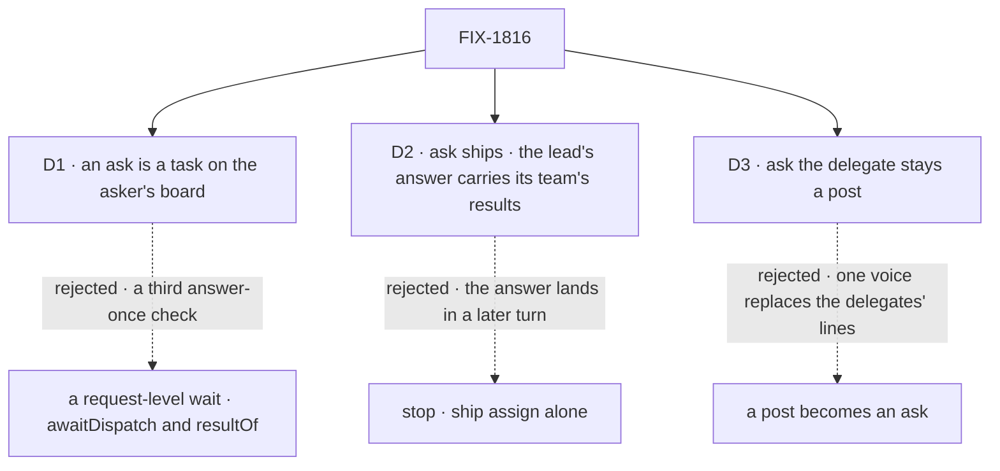

# FIX-1816 · Decisions

[Spec](SPEC.md) · **Decisions** · [Rules](BUSINESS-RULES.md) · [Plan](PLAN.md) · [Docs](DOCS.md) · [Evolution](EVOLUTION.md)

Three decisions are the sign-off surface. The epic's notes for this spec, given as answers on
2026-10-08, are applied here and not reopened: the L5 check (D1), the test runtime (PLAN), the
seam's shape to `fix-1786-pm` (PLAN), the kill line (D2), and FIX-1537 with "ask the delegate" (D3).

## The tree

Solid edges are what you are signing. Dashed edges lost, and the label says why.

## D1 · An ask is a task on the asker's own board, and its turn parks on that row

| | |
|---|---|
| **Instead of** | The epic's L5 as drafted: `awaitDispatch` on the block context, then a new engine read, `resultOf(requestId)`, with a waker on the asked request's own ending |
| **Because** | The implementer note asked whether existing reads plus `runOnce` meet leg a. They do, and on the board they meet it with what is already there: the row is the wait binding, its claim ticket is the answer-once check ([ER-6](../../epics/FIX-1815/BUSINESS-RULES.md#what-no-child-may-do)), and FIX-1794's notice carries the answer, so no `resultOf` is needed ([D2](../../epics/FIX-1815/DECISIONS.md#d2)). A request-level waker would be a second child-finished signal and a third answer-once check. And a verb on the block context breaks the dispatch protocol's rule that only a declared block dispatches (`core` `types/dispatch.ts`) |
| **Locks in** | Ask works where a conversation board and a task-taking assignee exist: every Workforce worker, and any flow that hosts a board. Its whole path waits on FIX-1794 P2's notices. The public surface is one tool, `askTask`, beside the eight, not a core export. The epic's L5 row changes, so this binds once the epic records it |

It comes down to the count: the request-level wait adds a second signal and a third check.

**What would change my mind:** a caller that must ask from a flow with no board and cannot host
one. None was found on `main`.

## D2 · Ask ships: the caller is a lead whose answer carries its team's results

| | |
|---|---|
| **Instead of** | Firing the kill line: stop after this spec and ship assign alone |
| **Because** | The kill line asks for a caller that needs the answer in the same turn, which assign-plus-park cannot serve. The research team does: `research-company`, `tech-brief` and `competitor-analysis` in the kitchen sink, the published research-team guide, and the delegation goal, which grades only the lead's own output. Each returns its team's results in the answer to the request that asked. FIX-1814 removes the private team they use. Assign's answer arrives in a later turn, so the asking request's own output never carries it, and a lead that is itself asked passes nothing up. The support desk's `escalate` was not read, because FIX-1792 has not converted its board |
| **Locks in** | A second hand-off beside assign, with a timeout, a depth limit and a resume path to keep correct. A team that worked in parallel runs one ask at a time until parallel fan-in is built |

It comes down to the asking request's own output: under assign it never carries the answer.

**What would change my mind:** the product owner reads the research team's brief as fine to
arrive as a second message. Then the kill line fires, and assign alone is the set.

## D3 · "Ask the delegate" stays a post

| | |
|---|---|
| **Instead of** | Making a coordinator's hand-off of a post an ask, which removes the delivery ledger's answer token |
| **Because** | A post is answered by each delegate as its own line, by a routing policy, and with rounds ([FIX-1791](../FIX-1791/SPEC.md)). An ask gives one answer to one turn. The coordinator never needs a delegate's answer to finish its own turn, so an ask there changes what the person sees and gains nothing |
| **Locks in** | Two answer-once checks stay: the post's ledger token and the row's claim ticket. Each serves one kind, and no third is added |

It comes down to what the person sees: an ask folds each delegate's line into one reply.

## Decided, not asked

- **FIX-1537 closes as a duplicate of this issue**, and stays FIX-1312's child
  ([ER-18](../../epics/FIX-1815/BUSINESS-RULES.md#how-the-set-is-run)). Its framing, park until a
  reverse reply carrying a request id lands, is not needed: the board's notice wakes the ask, and
  no request id travels in the `from` stamp. FIX-1312's request id stays FIX-1312's.
- **The timeout.** Ten minutes by default; a call may set up to twenty-four hours. A timed-out ask
  resumes with a timeout error and cancels its row.
- **The depth limit is FIX-1802's chain limit**, five boards
  ([FIX-1802 D2](../FIX-1802/DECISIONS.md#d2)). An ask files down one board, so the existing limit
  counts it. No second counter.
- **An ask needs a turn that can park.** The tool is offered only when the runtime has durable
  execution. Elsewhere it is not on the turn, rather than failing when called.
- **The server-side resume is a fifth verb on the request host**, closed over the running
  session, so only the asker's own conversation can resume its turn
  ([L1](../../epics/FIX-1815/DECISIONS.md#d5)). No new route.
- **An asker that is itself a task parks its own row** on the board above
  ([L6](../../epics/FIX-1815/DECISIONS.md#d5)), and the filer hears no notice for that park.

## Considered and dropped

| Alternative | Why not |
|---|---|
| A request-level wait: dispatch, park, and wake on the asked request's ending | D1's losing option. Simpler for a flow with no board, and adds a second signal and a third check |
| FIX-1537: park until the colleague dispatches a reply back | Every asked entry would need a reply its author writes. The board's ending needs none |
| `addTask` with a `wait` option | One tool that sometimes returns at once and sometimes waits is harder for a model to call right than two tools ([D4](../../epics/FIX-1815/DECISIONS.md#d4)) |
| Hold the request open until the answer | [D1](../../epics/FIX-1815/DECISIONS.md#d1) of the epic |

## How it got here

- **Draft** — framed as park and resume on the asker's own board; the epic's L5 replaced by one
  tool beside the eight; three PRs, the last after FIX-1794 P2.

**Open: none.**
