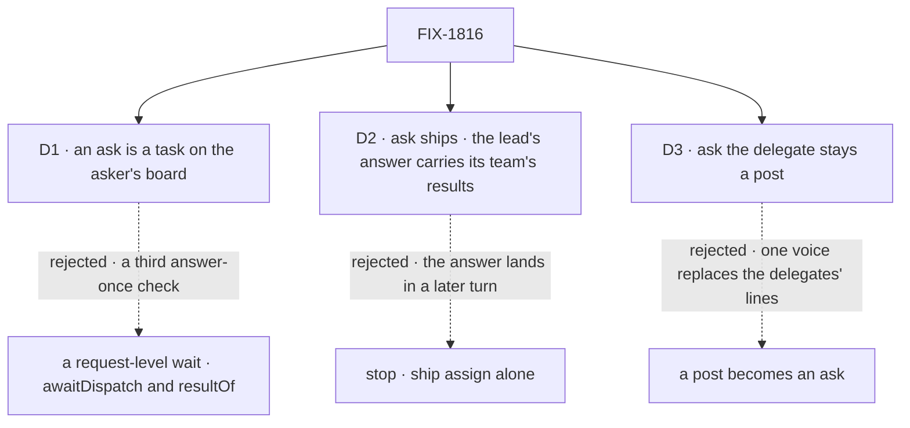

# FIX-1816 · Decisions

[Spec](SPEC.md) · **Decisions** · [Rules](BUSINESS-RULES.md) · [Plan](PLAN.md) · [Docs](DOCS.md) · [Evolution](EVOLUTION.md)

Three decisions are the sign-off surface. The epic's notes for this spec, given as answers on
2026-10-08, are applied here and not reopened: the L5 check (D1), the test runtime (PLAN), the
seam's shape to `fix-1786-pm` (PLAN), the kill line (D2), and FIX-1537 with "ask the delegate" (D3).

## The tree

Solid edges are what you are signing. Dashed edges lost, and the label says why.

## D1 · An ask is a task on the asker's own board, and its turn parks on that row

| | |
|---|---|
| **Instead of** | The epic's L5 as drafted: `awaitDispatch` on the block context, then a new engine read, `resultOf(requestId)`, with a waker on the asked request's own ending |
| **Because** | The implementer note asked whether existing reads plus `runOnce` meet leg a. They do, and on the board they meet it with what is already there: the row is the wait binding, its claim ticket is the answer-once check ([ER-6](../../epics/FIX-1815/BUSINESS-RULES.md#what-no-child-may-do)), and FIX-1794's notice carries the answer, so no `resultOf` is needed ([D2](../../epics/FIX-1815/DECISIONS.md#d2)). A request-level waker would be a second child-finished signal and a third answer-once check. And a verb on the block context breaks the dispatch protocol's rule that only a declared block dispatches (`core` `types/dispatch.ts`) |
| **Locks in** | Ask works where a conversation board and a task-taking assignee exist: every Workforce worker, and any flow that hosts a board. The public surface is one option, `waitForResponse`, on the existing `addTask`: it adds no tool, and no core export. The epic's L5 row changes, so this binds once the epic records it under ER-11 |
| **If FIX-1794 P2 slips** | The goal slips with it, one for one; nothing here is reworked. P1 and P2 land without it, and `waitForResponse` is offered to models only from P3, so nothing half-works in between. **I recommend waiting.** The fallback, a waker built here on the asked row's ending, is the second child-finished signal [ER-7](../../epics/FIX-1815/BUSINESS-RULES.md#what-no-child-may-do) forbids, and the lift would tear it out. Changes my mind: the product owner needs ask live before FIX-1794 P2 can land; then the stop-gap goes to the epic as an ER-7 amendment, not into this spec |

It comes down to the count: the request-level wait adds a second signal and a third check.

**What would change my mind:** a caller that must ask from a flow with no board and cannot host
one. None was found on `main`.

## D2 · Ask ships: the caller is a lead whose answer carries its team's results

| | |
|---|---|
| **Instead of** | Firing the kill line: stop after this spec and ship assign alone |
| **Because** | The kill line asks for a caller that needs the answer in the same turn, which assign-plus-park cannot serve. The research team does: `research-company`, `tech-brief` and `competitor-analysis` in the kitchen sink, the published research-team guide, and the delegation goal, which grades only the lead's own output. Each returns its team's results in the answer to the request that asked. FIX-1814 removes the private team they use. Assign's answer arrives in a later turn, so the asking request's own output never carries it. The support desk's `escalate` was not read, because FIX-1792 has not converted its board |
| **Locks in** | A second hand-off beside assign, with a timeout and a resume path to keep correct. A team that worked in parallel runs one ask at a time until parallel fan-in is built |

It comes down to the asking request's own output: under assign it never carries the answer.

**What would change my mind:** the product owner reads the research team's brief as fine to
arrive as a second message. Then the kill line fires, and assign alone is the set.

## D3 · "Ask the delegate" stays a post

| | |
|---|---|
| **Instead of** | Making a coordinator's hand-off of a post an ask, which removes the delivery ledger's answer token |
| **Because** | A post is answered by each delegate as its own line, by a routing policy, and with rounds ([FIX-1791](../FIX-1791/SPEC.md)). An ask gives one answer to one turn. The coordinator never needs a delegate's answer to finish its own turn, so an ask there changes what the person sees and gains nothing |
| **Locks in** | Two answer-once checks stay: the post's ledger token and the row's claim ticket. Each serves one kind, and no third is added |

It comes down to what the person sees: an ask folds each delegate's line into one reply.

## Cut before the gate

The epic coordinator cut these within the approved objective, before the product owner's gate.
Each is a smaller first version, not a reversal; each can come back as its own issue.

| Cut | Why |
|---|---|
| No ask from a task turn, by [FIX-1817](https://linear.app/fixpoint-labs/issue/FIX-1817) S1's single test (a turn the gate serves; BR-5a): `waitForResponse` is refused there | Depth is one by construction, so the epic's depth cap (ER-4) holds structurally, and mutual asks, a parked asker row and its lease rules all go with it |
| The goal's nesting leg | Leg 1 alone proves the restart, the filing once and the waker; with nesting cut there is nothing for a second leg to prove |
| A testing helper that answers an ask | Checks run on SQLite with a cold restart; no app has asked for the helper yet |
| A cancel reaching into a run under way through a failed lease renewal | Cancelling the row and dropping its later ending meets ER-4; stopping a run under way stays [FIX-1659](https://linear.app/fixpoint-labs/issue/FIX-1659)'s |
| A per-call timeout | Ten minutes, fixed. One bound to keep right, and no ceiling rule |
| Several asks in one step | One ask per step in v1: a second waiting `addTask` in the same step is refused before anything is filed. No flow on `main` asks twice before using an answer |

**For the epic to record**, under [ER-11](../../epics/FIX-1815/BUSINESS-RULES.md#what-no-child-may-do)
together with D1: L5 becomes a wait option on `addTask`, no new tool and no core export; L6 is
dropped; and L7's depth half is satisfied structurally. ER-5's "ask is a separate, opt-in call"
reads as an opt-in option on the call; D4's fire-and-forget default is unchanged.

## Decided, not asked

- **FIX-1537 closes as a duplicate of this issue**, and stays FIX-1312's child
  ([ER-18](../../epics/FIX-1815/BUSINESS-RULES.md#how-the-set-is-run)). Its framing, park until a
  reverse reply carrying a request id lands, is not needed: the board's notice wakes the ask.
- **The timeout fires from the durability sweeper.** Its expiry step gains an ask branch: a
  pending ask gate past its deadline is resumed with a timeout error, not marked `expired`.
  At a ten-minute deadline and the default ten-minute sweep, the error arrives between ten and
  twenty minutes after the ask. A faster sweep for asks alone would be a second timer per host
  for a bound whose job is "never forever". A host with no sweeper does not offer `waitForResponse`.
- **The resume-owed marker is stored, not derived.** "Row ended and gate pending" is derivable,
  but the gate lives in the engine's suspension store, so a derived check reads across stores on
  every touch. The marker is the index that lets a touch stop at once when nothing is owed, and
  it follows FIX-1802's settle-owed pattern, as ER-7 requires.
- Bounds, the resume verb and the durable-only tool: [PLAN](PLAN.md#surfaces) S1 to S7.

## Considered and dropped

| Alternative | Why not |
|---|---|
| A request-level wait: dispatch, park, and wake on the asked request's ending | D1's losing option. Simpler for a flow with no board, and adds a second signal and a third check |
| FIX-1537: park until the colleague dispatches a reply back | Every asked entry would need a reply its author writes. The board's ending needs none |
| A separate `askTask` tool beside the task tools | The draft's shape. The product owner, in review: both calls add a task, so a ninth tool is unnecessary and "ask" against "add" names a difference that isn't there. Waiting stays opt-in per call, so epic [D4](../../epics/FIX-1815/DECISIONS.md#d4)'s default holds |
| Hold the request open until the answer | [D1](../../epics/FIX-1815/DECISIONS.md#d1) of the epic |

## How it got here

- **Draft** — framed as park and resume on the asker's own board; the epic's L5 replaced by one
  tool beside the task tools (since folded into `addTask`, which adds no tool); three PRs, the last after FIX-1794 P2.
- **Review round 1** — the product owner folded `askTask` into `addTask` as `waitForResponse`; six cuts before the gate; the timeout given a real trigger, the sweeper;
  D1's dependency on FIX-1794 P2 priced; the stored marker justified.

## Cross-spec alignment

Decided by the epic coordinator after the cross-spec pass with [FIX-1817](https://linear.app/fixpoint-labs/issue/FIX-1817), after this spec merged ([#2900](https://github.com/fixpoint-labs/flow-state-dev/pull/2900)). Four alignments, and one direction change.

**Alignments** (no change of direction):

- **Asked rows get no `parkOnQuestion` in v1**: epic ER-22 ([#2904](https://github.com/fixpoint-labs/flow-state-dev/pull/2904)), owned by FIX-1817, whose S1 and S7 carve-out follows after its spec merges; here BR-5b. The gate's fence, which does not depend on it: BR-12, PLAN S3.
- **D1's tool-count check is "`waitForResponse` adds no tool"**, not "still eight": FIX-1817 adds `answerTask` and `parkOnQuestion` (PLAN S4, D1 check).
- **`waitForResponse` with `followUpOf` on one call is allowed**: the assignee check runs against the root task's worker, and FIX-1817's busy-follow-up, BR-21 and BR-25 refusals come before filing, so nothing parks (BR-4a).
- **BR-5a's "task turn" is FIX-1817 S1's single test**, a turn the gate serves, cited rather than defined again (BR-5a, PLAN S4, the cut above, DOCS).

**Direction change, for the product owner's sign-off on this PR:**

- **The ask gate binds to the row's identity and its terminal ending, not to the row's claim ticket** (BR-12, BR-12a, PLAN S3). As merged, the gate held the claim ticket. A board retry after a failed attempt gets a new per-attempt ticket, so a gate fenced on the old one would refuse the real ending and strand the asker until the timeout. The board's ticket already stops a stale attempt from settling the row (ER-6), so the gate needs only "this row ended", and it admits the ending of whichever attempt settles it, never an intermediate failure that was retried. If wrong: an ask whose colleague fails once and then succeeds times out instead of answering.

**Open: none.**
