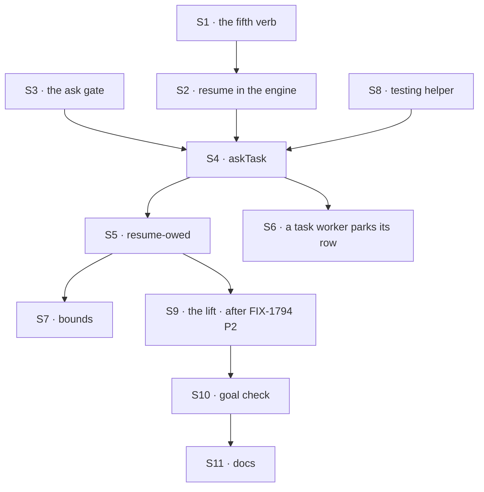

# FIX-1816 · Plan

[Spec](SPEC.md) · [Decisions](DECISIONS.md) · [Rules](BUSINESS-RULES.md) · **Plan** · [Docs](DOCS.md) · [Evolution](EVOLUTION.md)

Written for the implementing agent. IDs cross-reference [BUSINESS-RULES.md](BUSINESS-RULES.md)
(BR-n), [DECISIONS.md](DECISIONS.md) (D-n) and the epic's Layer 1 rows
([L1 to L9](../../epics/FIX-1815/DECISIONS.md#d5)). `tdd`. Three PRs; the third waits on
FIX-1794 P2.

## Surfaces

| ID | Package · role | Change | Epic row | Rules |
|---|---|---|---|---|
| S1 | `core` · the request host's type | A fifth verb: resume a turn parked on an ask **in this session**, with an answer or an error. Closed over the running session like the other four; takes the gate's id, never a session or request id from input | L1 | BR-13 |
| S2 | `engine` · the request host, beside `routes/resume-routes.ts` | Implement S1: load the gate, admit only an ask gate that is still pending, resolve it once under the request's lease, continue the same request. `public-reentry.ts` is unchanged | L1 | BR-2 BR-12 BR-13 |
| S3 | `core` · the ask gate | A suspension reason for an ask, whose data is the wait binding: the board, the row and its claim ticket. On resume the generator returns the answer as the tool's result (`generator-resume.ts`, as approvals do) | L2 | BR-2 BR-3 BR-8 BR-9 |
| S4 | `orchestration` · the task tools | `askTask` beside the eight, in the same capability instance (epic ER-32 of FIX-1786). Files under `runOnce`, keyed on the tool call, never on the attempt; writes the row marked asked, with the gate's id and a deadline, server-side; then parks. Returns at once when the row has already ended. Offered only with durable execution | L5, as D1 reshapes it | BR-1 BR-4 BR-5 BR-7 BR-10 BR-18 |
| S5 | `orchestration` · the board row | The resume-owed marker, on FIX-1802's settle-owed pattern (its BR-17): written in the write that records an asked row's ending; cleared only by an accepted S2 resume; replayed by any touch of the board, never inside a turn | L3 | BR-11 BR-12 |
| S6 | `orchestration` · a task worker that asks | When the asking turn is itself running a row, that row parks (the existing `parked` status, fenced unpark on resume). No notice to its filer for this park | L6 | BR-17 |
| S7 | `orchestration` · the bounds | Deadline on the gate and the row. Past it, the durability sweeper or a touch of the board resumes the turn with a timeout, and the resumed call cancels its row. A cancelled asking turn cancels its row; a cancelled row's lease renewal fails, which aborts a run under way. Depth is FIX-1802's chain limit, not a new counter | L7 | BR-14 BR-15 BR-16 |
| S8 | `testing` | One helper that answers an ask in a unit test, so an app tests its asking worker without running the colleague. No separate durable runtime: restarts are proved on the SQLite cold-restart shape (a fresh store registry on the same file), which expresses a restart mid-wait | L8, reshaped by the epic's note | — |
| S9 | `orchestration` · the child-finished signal (P3) | Lift FIX-1794 P2's notice module into `orchestration` and re-point its S6 and S7 at it, no copy. Extend it once: an asked row's ending resumes the parked turn (S2) and wakes no judgment turn | L4 | BR-2 BR-11 BR-12 |
| S10 | `goals` | `goals/hand-offs/ask-survives-a-restart/` with its two controls | — | goal |
| S11 | Docs | Publish [DOCS.md](DOCS.md) | — | — |

Nothing is removed. FIX-1814 removes the skills' private team; this issue builds nothing on it.

## Sequence



| PR | Delivers | depends_on |
|---|---|---|
| P1 · park and resume | S1, S2, S3, S8 | — |
| P2 · ask on the board | S4, S5, S6, S7 | P1 · FIX-1814 merged |
| P3 · the waker | S9, S10, S11 | P2 · FIX-1794 P2 merged |

P1 and P2 do not wait on FIX-1794 P2 (epic ER-15). P2 tests the resume by calling the waker
function directly; P3 is the first PR where an ending resumes a turn on its own.

## Checks

| ID | Runs after | Passes when |
|---|---|---|
| V1 | S2 | A task-source turn parked on an ask gate resumes with the answer through S1; the public route answers not-found for it; a second resume is refused (BR-12, BR-13) |
| V2 | S3 | A generator whose tool parks on an ask gate resumes with the answer as that tool's result; a SQLite cold restart between park and resume still resumes (BR-2, BR-9) |
| V3 | S4 | BR-1, BR-4, BR-5, BR-7, BR-8, BR-18. BR-10 by replaying the turn: one row. Its red state: remove `runOnce` and see two rows |
| V4 | S5 | BR-11: kill after the asked row's ending write and before resume, on SQLite; the next touch resumes once and clears the marker. Its red state: no marker, and the turn stays parked |
| V5 | S6 | BR-17: an asking task worker past its lease is not claimed again. Red: today a second worker claims it |
| V6 | S7 | BR-14, BR-16; BR-15 as a real mutual ask ending at the timeout, and at the sixth board once FIX-1802 P1 is on `main` |
| V7 | S9 | FIX-1794's V5 passes before and after the lift. An asked row's ending resumes and wakes no turn; an assigned row's still wakes one |
| D1 | S4 | The check that D1 holds: no new export on `core`'s block context, no new engine read, and the row is the only record of the ask |
| VG | S10 | [The goal](SPEC.md#the-goal-and-how-well-know-its-met): `run.mts` PASSES after both controls FAILED, the FAILs shown in P3's PR first |

D2 and D3 are product calls: D2 is proved by VG's leg 2, and D3 by FIX-1791's suite staying green.

## Pinned names

| Where | Name | Why pinned |
|---|---|---|
| Tool | `askTask` | A model calls it; it sits in the task-tool family |
| Goal | `goals/hand-offs/ask-survives-a-restart/` | The closure cites it |
| Controls | `no-run-once`, `no-waker` | The goal's two controls |

Everything else is yours to name.

## Guardrails

| Rule | Because |
|---|---|
| Every writer of an asked row's ending goes through the one ending write that writes the resume-owed marker: the task session's gate, the board's own abandonment or refusal, a timeout, a cancel, and FIX-1802's parent settle (tenet 5) | A writer that skips it strands a parked turn with no error |
| The resume verb closes over the running session and reads the gate's id only from the row (BP-031) | A gate id from input would let one conversation resume another's turn |
| `runOnce`'s key is the tool call's logical id, never the attempt | The replay after resume is a new attempt of the same call, and must find the first filing |
| No request is held open while it waits | Epic D1: serverless limits, held leases, and deadlocks |
| The only touch of FIX-1786 code is S9's re-pointing (epic ER-12) | Another session owns that epic |
| Nothing new builds on mailbox boards | FIX-1792 converts them |

## Docs

Reconcile and publish [DOCS.md](DOCS.md) in P3, after VG passes, with the shipped limits and
error names. The epic's shared section "Waiting for the answer" is this issue's to publish.

## Sketch · pseudocode, illustrative, react to the shape

```
askTask(goal, assignee, timeout?) in conversation C, inside A's turn:
    row ← runOnce(this call): file on C's board, marked asked, gate id, deadline   ← one row, ever
    if row has ended: return its answer                                            ← BR-7
    if this turn runs a task row above: park that row                              ← S6
    return suspend(ask gate: C's board, row, ticket)                               ← the turn parks
the asked row ends (B's task session, any flow):
    one write: the ending + notice-owed (FIX-1794) + resume-owed (this issue)
    notice → C                                                                     ← FIX-1794's path
in C, on the notice, or on any touch of C's board:
    for each row with resume-owed: resume(the row's gate, the row's ending)        ← the fifth verb
    an accepted resume clears the marker; a refused one (already resolved) clears it too
```

**POC: none.** The premises are on `main` and read, not assumed: a generator tool's suspend
resumes with its payload as the result (`generator-resume.ts`), and suspend needs only a
durability provider, not a durable action (`runAction.ts`). The waker's path runs through
FIX-1794 P2, which is not on `main`, so a POC could not run it. No counted fact carries the
design, so no checker.

## At implement time

- Before P3, read FIX-1794 P2 as merged. If its notice module is not layer-clean as agreed,
  the lift stops, and the gap goes to `fix-1786-pm` (epic ER-7), not into a copy here.
- The seam's shape was sent to `fix-1786-pm` before FIX-1794 P2 started (epic ER-21):
  [agent-mailbox#38](https://github.com/fixpoint-labs/agent-mailbox/pull/38#issuecomment-6069180618), five properties of the module. Read the thread
  for a reply before P2 and P3.
- `ctx.suspend`'s doc says "inside a durable sequencer"; the code checks only for a provider.
  Confirm on a Workforce turn in P1 before building S4 on it.
- If FIX-1814 has not merged, the skills' private team still installs the task tools; `askTask`
  joins the one set FIX-1786's ER-32 allows, never a second.
- After the gate: close FIX-1537 as a duplicate of this issue, under FIX-1312, with a comment
  naming D1.

## Follow-ups

- Asking several colleagues at once and resuming once on all of them (the epic's fan-in).
- A sweeper that touches idle boards, so an owed resume needs no next message (FIX-1794's
  follow-up names the same gap for notices).
