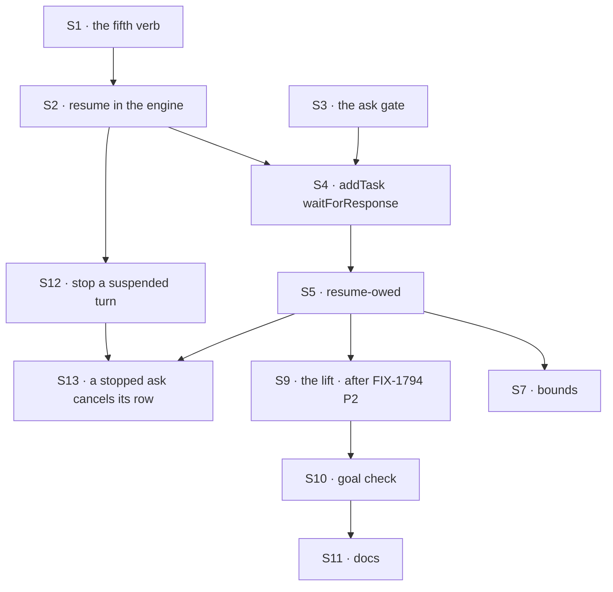

# FIX-1816 · Plan

[Spec](SPEC.md) · [Decisions](DECISIONS.md) · [Rules](BUSINESS-RULES.md) · **Plan** · [Docs](DOCS.md) · [Evolution](EVOLUTION.md)

Written for the implementing agent. IDs cross-reference [BUSINESS-RULES.md](BUSINESS-RULES.md)
(BR-n), [DECISIONS.md](DECISIONS.md) (D-n) and the epic's Layer 1 rows
([L1 to L9](../../epics/FIX-1815/DECISIONS.md#d5)). `tdd`. Four PRs; P3 waits on
FIX-1794 P2, and P2c, added by the [product owner's amendments](DECISIONS.md#product-owner-amendments-2026-10-09)
of 2026-10-09, does not.

## Surfaces

| ID | Package · role | Change | Epic row | Rules |
|---|---|---|---|---|
| S1 | `core` · the request host's type | A fifth verb: resume a turn parked on an ask **in this session**, with an answer or an error. Closed over the running session like the other four; takes the gate's id, never a session or request id from input | L1 | BR-13 |
| S2 | `engine` · the request host, beside `routes/resume-routes.ts` | Implement S1: load the gate, admit only an ask gate that is still pending, resolve it once under the request's lease, continue the same request. The same path serves S7's sweeper branch, which resolves the gate with `wait_timed_out` instead of an answer. `public-reentry.ts` is unchanged | L1 | BR-2 BR-12 BR-13 BR-14 |
| S3 | `core` · the ask gate | A suspension reason for an ask, whose data is the wait binding: the board and the row. The gate fences on the row's identity and its terminal ending, not on a per-attempt claim ticket: the board's ticket already stops a stale attempt from settling the row (ER-6), so the gate admits the ending of whichever attempt settles it, including after a board retry. The fence does not rely on BR-5b (an asked row has no `parkOnQuestion`, epic ER-22); it would hold for any re-claim. On resume the generator returns the answer as the tool's result (`generator-resume.ts`, as approvals do) | L2 | BR-2 BR-3 BR-9 BR-12a |
| S4 | `orchestration` · the task tools | A `waitForResponse` option on `addTask`, a flat optional field like `deps` and `priority`; it adds no tool (epic ER-32 of FIX-1786). Set, it files under `runOnce`, keyed on the tool call, never on the attempt; writes the row marked asked, with the gate's id and a deadline, server-side; then parks. A second flat field, `timeoutMs`, sets the deadline: filing time plus it, five minutes when unset. Outside 30 s to 60 min it is refused before filing as `wait_timeout_out_of_range`, never clamped; set without `waitForResponse` it is refused, never ignored. Returns at once when the row has already ended, clearing its marker. Refuses a second wait in the same step. The option is in the schema only with durable execution and a running durability sweeper, and is refused on a task turn, so depth is one. Without it, `addTask` is unchanged. See BR-4a, BR-5a, BR-5b; FIX-1817 owns BR-21, BR-25 and S1 | L5, as D1 reshapes it | BR-1 BR-4 BR-4a BR-5 BR-5a BR-5b BR-6 BR-7 BR-8 BR-10 BR-14a |
| S5 | `orchestration` · the board row | The resume-owed marker, on FIX-1802's settle-owed pattern (its BR-17): written in the write that records an asked row's ending; cleared by an accepted S2 resume, a refused one (already resolved), or BR-7's direct return; replayed by any touch of the board, never inside a turn. Stored rather than derived: see [DECISIONS](DECISIONS.md#decided-not-asked) | L3 | BR-7 BR-11 BR-12 |
| S7 | `engine` and `orchestration` · the bounds | A per-row deadline from S4's `timeoutMs` (default five minutes), as the gate's `expiresAt` and on the row: `parkOnAsk({ deadline })` already takes it (P2), so the change is the default and P3's wiring of the option. `durability-sweeper.ts`'s expiry step gains an ask branch, run before the generic one: a pending ask gate past its deadline is resumed through S2 with `wait_timed_out`, never marked `expired` (which S2 would refuse, stranding the turn). The resumed call cancels its row. The sweeper's next tick is scheduled at the earlier of its interval and the earliest pending ask deadline, floor about a second, never a busy loop: `setInterval` becomes a re-armed timeout. Parking an ask in this process re-arms it when the new deadline is earlier. The earliest-deadline read is bounded, as the expiry step's listing is, never a scan of all suspensions. Resolution: within seconds of the deadline on a long-lived host; an external-cron host's cadence otherwise. The dedicated ask timer stays rejected; this is the same sweeper Depth needs no counter (S4). Stopping the asking turn is S12 | L7 | BR-14 BR-14a |
| S9 | `orchestration` · the child-finished signal (P3) | Lift FIX-1794 P2's notice module into `orchestration` and re-point its S6 and S7 at it, no copy. Extend it once: an asked row's ending resumes the parked turn (S2) and wakes no judgment turn | L4 | BR-2 BR-11 BR-12 |
| S12 | `engine` · the stop | `record-request-stop.ts` and the abort route act on a suspended turn as well as a running one. On a suspended turn the stop resolves its pending gate through the gate's single pending state, the fence S2 and the sweeper already use, and the turn ends `aborted`. An ask gate is resolved with a stop outcome through S2's resume path, so the parked call runs only to cancel its row (S13) and the turn ends with no further model call; any other gate is resolved and the turn ends without continuing. A stop that loses the fence reports `already-resolved`; the route keeps today's answers for a running or finished turn. The stop is persisted as the gate's resolved outcome, `stopped` (a new terminal suspension status, read tolerantly under BP-030); that record is the obligation. **Crash safety:** nothing on `main` re-drives a request whose gate was resolved but which never left `suspended` (`resume-under-lease.ts` reverts only a setup failure it sees, not a process death), so P2c adds it to the durability sweep: a request still `suspended`, or `interrupted`, whose latest gate is resolved `stopped` is driven on under its lease, so a live resume holding the lease is never raced. On an ask it continues to the parked call (S13); on any other gate it ends the turn `aborted`. `ctx.session.stopRequest` shares `recordRequestStop`, so a block's stop reaches a suspended turn too. No new route | L7, stop half (ER-11) | BR-16 BR-16a BR-16b BR-16c |
| S13 | `orchestration` · the asked row on a stop | The parked `addTask`, resumed with the stop outcome, cancels its row through the board's cancel transition (`collection.cancel`, as the timeout already does) and ends the turn `aborted`. The cancel stamps the resume-owed marker as every ending does; its replay finds the gate resolved and clears it (S5). The cancel is idempotent: a replay after a crash cancels again harmlessly, and a row that already ended is left as it is (the board's cancel declines on a terminal row). If the process dies between the gate's stop and the row's cancel, S12's sweep re-drive replays the call and the row is cancelled then | L7, stop half | BR-16 BR-16b BR-16c |
| S10 | `goals` | `goals/hand-offs/ask-survives-a-restart/` with its two controls | — | goal |

S6 (a task worker parks its own row) and S8 (a testing helper) were
[cut before the gate](DECISIONS.md#cut-before-the-gate). Restarts are proved on the SQLite
cold-restart shape, a fresh store registry on the same file (epic L8, as the epic's note
reshaped it).
| S11 | Docs | Publish [DOCS.md](DOCS.md). P2c's own surfaces: `apps/docs/docs/advanced/durable-execution.md`, `apps/docs/docs/server/connection-resilience.md` (the `409` for a request no longer `in_progress`), `packages/client/README.md` (`abortRequest`), `packages/engine/README.md`, `docs/architecture/execution-and-errors.md` (the cancellation path) | — | — |

Nothing is removed. FIX-1814 removes the skills' private team; this issue builds nothing on it.

## Sequence



| PR | Delivers | depends_on |
|---|---|---|
| P1 · park and resume | S1, S2, S3 | — · merged, [#2912](https://github.com/fixpoint-labs/flow-state-dev/pull/2912) |
| P2 · ask on the board | S4, S5, S7 | P1 · FIX-1814 merged · merged in two, [#2920](https://github.com/fixpoint-labs/flow-state-dev/pull/2920) (engine) and [#2922](https://github.com/fixpoint-labs/flow-state-dev/pull/2922) (P2b, orchestration), with a fixed ten-minute deadline |
| P2c · stop a paused turn | S12, S13 | P2 and P2b, merged. Not FIX-1794 P2 |
| P3 · the waker | S9, S10, S11, and S4 and S7's `timeoutMs` and five-minute default | P2 · FIX-1794 P2 merged |

P1, P2 and P2c do not wait on FIX-1794 P2 (epic ER-15). P2c and P3 are independent of each
other; whichever lands second rebases. P2 tests the resume by calling the waker
function directly, and does not yet offer `waitForResponse` to models; P3 is the first PR where an ending
resumes a turn on its own, and turns the option on.

## Checks

| ID | Runs after | Passes when |
|---|---|---|
| V1 | S2 | A task-source turn parked on an ask gate resumes with the answer through S1; the public route answers not-found for it; a second resume is refused (BR-12, BR-13) |
| V2 | S3 | A generator whose tool parks on an ask gate resumes with the answer as that tool's result; a SQLite cold restart between park and resume still resumes (BR-2, BR-9). A row that fails once and is retried to completion resumes the turn once, with the final answer (BR-12a) |
| V3 | S4 | BR-1, BR-4, BR-4a, BR-5, BR-5a, BR-5b, BR-6, BR-7 (the row ended between filing and park: the answer returns and the marker clears), BR-8. BR-10 across a real replay: park, cold restart on SQLite, resume, and the replay reaches the waiting `addTask` again: one row. Its red state, on that same replay, not a same-process retry: remove `runOnce` and see two rows |
| V4 | S5 | BR-11: kill after the asked row's ending write and before resume, on SQLite; the next touch resumes once and clears the marker. Its red state: no marker, and the turn stays parked |
| V6 | S7 | BR-14 by a real sweep tick on a gate past its deadline, once with the default and once with a set `timeoutMs`. On a moved clock with the default ten-minute interval, a 30 s ask filed just after a tick times out within a few seconds of 30 s (red: today's fixed interval fires it at ten minutes); with no pending ask the next tick stays at the interval: the turn resumes with `wait_timed_out` and the row is cancelled. BR-14a at the exact bounds: `timeoutMs` 30_000 and 3_600_000 file; 29_999 and 3_600_001 are refused with nothing filed, never clamped. Red: a fixed deadline ignores the set `timeoutMs` |
| V8 | S12, S13 | The sweep's deadline-aware tick is checked in V6. BR-16 on SQLite: stop a turn parked on an ask; the row reads `cancelled`, the request `aborted`, no model call after the stop, and the row's marker clears. BR-16a: stop a turn parked on an approval; it ends `aborted` and a later approve is refused. BR-16b both orders: an answer then a stop, a stop then an answer; one wins, the other is `already-resolved`, and the turn resumes at most once. BR-16c on SQLite: kill between the stop and the row's cancel; after restart and one sweep, the row is `cancelled` and the request `aborted`; red: without the sweep's re-drive the request stays `suspended`. Red: today's stop refuses a suspended turn |
| V7 | S9 | FIX-1794's V5 passes before and after the lift. An asked row's ending resumes and wakes no turn; an assigned row's still wakes one |
| D1 | S4 | The check that D1 holds: `waitForResponse` adds no tool, no new export on `core`'s block context, no new engine read, and the row is the only record of the ask |
| VG | S10 | [The goal](SPEC.md#the-goal-and-how-well-know-its-met): `run.mts` PASSES after both controls FAILED, the FAILs shown in P3's PR first |

D2 and D3 are product calls: D2 is proved by VG, whose asking turn's own output carries B's word, and D3 by FIX-1791's suite staying green.

## Pinned names

| Where | Name | Why pinned |
|---|---|---|
| Option | `addTask`'s `waitForResponse` | A model sets it; the product owner chose an option over a ninth tool |
| Goal | `goals/hand-offs/ask-survives-a-restart/` | The closure cites it |
| Controls | `no-run-once`, `no-waker` | The goal's two controls |
| Option | `addTask`'s `timeoutMs` | A model sets it; the product owner chose it (2026-10-09) |
| Errors | `wait_timed_out`, `wait_task_failed`, `wait_task_cancelled`, `wait_already_pending`, `wait_unavailable`, `wait_timeout_out_of_range` | A model reads them, and the docs publish them |

Everything else is yours to name.

## Guardrails

| Rule | Because |
|---|---|
| Every writer of an asked row's ending goes through the one ending write that writes the resume-owed marker: the task session's gate, the board's own abandonment or refusal, a timeout, a cancel, and FIX-1802's parent settle (tenet 5) | A writer that skips it strands a parked turn with no error |
| The resume verb closes over the running session and reads the gate's id only from the row (BP-031) | A gate id from input would let one conversation resume another's turn |
| `runOnce`'s key is the tool call's logical id, never the attempt | The replay after resume is a new attempt of the same call, and must find the first filing |
| No request is held open while it waits | Epic D1: serverless limits, held leases, and deadlocks |
| The only touch of FIX-1786 code is S9's re-pointing (epic ER-12) | Another session owns that epic |
| Nothing new builds on mailbox boards | FIX-1792 converts them |
| A touch of the board stops at once when no row owes a resume: read the marker through an index or a count, never by scanning the board's rows | A touch runs on hot paths such as `listTasks`; a full scan per touch costs touches times rows |

## Docs

Reconcile and publish [DOCS.md](DOCS.md) in P3, after VG passes, with the shipped limits and
error names. P2c publishes its own section, stopping a suspended request, since it changes the
stop for every suspended turn, not only asks; the ask half of its wording lands with P3. The epic's shared section "Waiting for the answer" is this issue's to publish.

## Sketch · pseudocode, illustrative, react to the shape

```
addTask(goal, assignee, waitForResponse: true) in conversation C, inside A's turn:
    if this is a task turn (FIX-1817 S1): refuse wait_unavailable                  ← BR-5a
    if this step already waits: refuse wait_already_pending                        ← BR-8
    row ← runOnce(this call): file on C's board, marked asked, gate id, deadline   ← one row, ever
    if row has ended: clear its marker, return its answer                          ← BR-7
    return suspend(ask gate: C's board, row, expiresAt = deadline)                 ← the turn parks
the asked row ends (B's task session, any flow):
    one write: the ending + notice-owed (FIX-1794) + resume-owed (this issue)
    notice → C                                                                     ← FIX-1794's path
in C, on the notice, or on any touch of C's board:
    for each row with resume-owed: resume(the row's gate, the row's ending)        ← the fifth verb
    an accepted resume clears the marker; a refused one (already resolved) clears it too
    a marker whose gate does not exist yet is left for BR-7's replay to clear
the durability sweeper, each tick:
    for each pending ask gate past its deadline: resume it with wait_timed_out      ← S7
    the resumed call cancels its row; a later ending is dropped
the person stops C's turn while it is parked:                                       ← S12, P2c
    resolve the pending gate under its fence; lost → already-resolved              ← BR-16b
    an ask gate: resume with the stop outcome; the call cancels its row, ends aborted ← S13
    any other gate: end the turn aborted, nothing continued
```

**POC: none.** The premises are on `main` and read, not assumed: a generator tool's suspend
resumes with its payload as the result (`generator-resume.ts`), and suspend needs only a
durability provider, not a durable action (`runAction.ts`). The waker's path runs through
FIX-1794 P2, which is not on `main`, so a POC could not run it. No counted fact carries the
design, so no checker.

## At implement time

- Before P3, read FIX-1794 P2 as merged. If its notice module is not layer-clean as agreed,
  the lift stops, and the gap goes to `fix-1786-pm` (epic ER-7), not into a copy here.
- The seam's shape was sent to `fix-1786-pm` before FIX-1794 P2 started (epic ER-21):
  [agent-mailbox#38](https://github.com/fixpoint-labs/agent-mailbox/pull/38#issuecomment-6069180618), five properties of the module. Read the thread
  for a reply before P2 and P3.
- `ctx.suspend`'s doc says "inside a durable sequencer"; the code checks only for a provider.
  Confirm on a Workforce turn in P1 before building S4 on it.
- The sweeper is built in `createFlowApiRouter.ts`, which holds the flows, so S7's branch can
  continue a request there. Confirm in P1, and expose whether a sweeper runs, which S4 reads.
- If FIX-1814 has not merged, the skills' private team still installs the task tools; the option
  lives on the one set FIX-1786's ER-32 allows, never a second.
- After the gate: close FIX-1537 as a duplicate of this issue, under FIX-1312, with a comment
  naming D1.

## Follow-ups

- Asking several colleagues at once and resuming once on all of them (the epic's fan-in), and
  several asks in one step.
- An ask from a turn that is itself working a task, if a caller needs a lead that is itself asked.
- A stop that reaches a colleague's run already under way stays FIX-1659's; P2c cancels the row only.
- A sweeper that touches idle boards, so an owed resume needs no next message (FIX-1794's
  follow-up names the same gap for notices).
