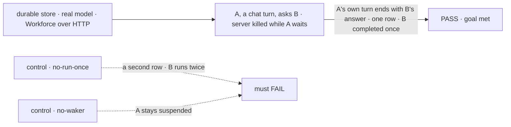
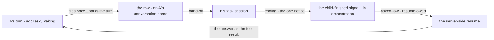

# FIX-1816 · Ask: a hand-off that waits for its answer

**Spec** · [Decisions](DECISIONS.md) · [Rules](BUSINESS-RULES.md) · [Plan](PLAN.md) · [Docs](DOCS.md) · [Evolution](EVOLUTION.md)

## Five people, before and after

| Someone who… | Today | After |
|---|---|---|
| **builds a worker that must check with a colleague before it acts** | Files a task and the turn ends. The answer comes back later, as a new turn that has to work out again what it was doing | Asks. The turn waits, and carries on with the colleague's real answer as the result of the call it made |
| **asks a worker for a brief its team writes** | Gets the brief in the same answer today, from a skill's private team that holds the request open. [FIX-1814](https://linear.app/fixpoint-labs/issue/FIX-1814) removes that team, and with it the only in-turn path | Gets the brief in the same answer: the lead asks the analyst, and the lead's answer carries the analyst's |
| **runs Workforce on a server that restarts** | n/a | A restart while a turn waits loses nothing. The turn resumes after it, and the colleague's work was filed once |
| **asks a colleague who never finishes** | n/a | Gets a timeout error within twenty minutes, instead of waiting forever |
| **watches the conversation's task list** | Sees filed tasks only | Also sees each ask as a task, marked as asked, from filing to answer |

Ask is the first of the two hand-offs epic [FIX-1815](../../epics/FIX-1815/SPEC.md) adds. Assign
staying open is [FIX-1817](https://linear.app/fixpoint-labs/issue/FIX-1817)'s.

## The goal, and how we'll know it's met

**A worker can ask a colleague on its roster and continue the same turn with the colleague's real
answer. A server restart during the wait loses nothing, and the colleague's work is filed once.**

| Is it the right goal? | |
|---|---|
| **The real need** | The epic's leg a: *"worker A asks worker B; the server restarts while A waits; A's turn resumes with B's real answer, and B ran once"* ([FIX-1815](../../epics/FIX-1815/SPEC.md#the-goal-and-how-well-know-its-met)). And the kill line: a caller that needs the answer inside the same turn, which assign-plus-park cannot serve ([ER-17](../../epics/FIX-1815/BUSINESS-RULES.md#how-the-set-is-run)) |
| **Smaller, and rejected** | "A turn can wait on a dispatch, in one process." It passes with no restart, so it proves the half that already works for human approval and none of the half this issue exists for |
| **Bigger, and not this issue's** | Asking several colleagues at once and resuming once on all of them · an answered park on an assigned task ([FIX-1817](https://linear.app/fixpoint-labs/issue/FIX-1817)) · an ask from a turn that is itself working a task, or several asks in one step ([cut](DECISIONS.md#cut-before-the-gate)) · stopping a colleague's run that is already under way ([FIX-1659](https://linear.app/fixpoint-labs/issue/FIX-1659)) |
| **Not done if** | The check ran on an in-memory store · the restart came before the ask was filed · the waker was called by the test · the asker resumed from a new turn, not its own |



The check reads the stores after the run: the asker's request, the rows and the attempts. Each
control removes one half of "survives a restart, filed once", and each must fail.

| How we verify | |
|---|---|
| **Goal check** | `goals/hand-offs/ask-survives-a-restart/` · `openai/gpt-5.4-mini` · SQLite, the server a real process · run by the implementer when P3 is done · verdict in P3's PR |
| **Signal** | A's request that asked, a chat turn, ends `completed`, and its output contains a held-out word only B knew. One row was filed for the ask. B completed it once. The server was killed with SIGKILL while A's request read `suspended` |
| **Input** | Two workers on the DevTeam standard install, one a delegate of the other. The word is held out at run time. A different word, or a kill at another moment while A waits, must pass too |
| **Anti-game** | No waker call, no row write and no resume from the runner. No kill before A's request reads `suspended` |
| **Control that must fail** | `GOAL_CONTROL=no-run-once`: FAILS on *one row* (a second row is filed on resume, and B runs twice). `GOAL_CONTROL=no-waker`: FAILS on *A's request ends completed*, which stays `suspended`. Today's `main`: FAILS, as there is no ask |

## What changes


Same board, same row, same notice. Only what the ending does is new: it resumes the turn that
parked, instead of waking a new one.

**What a worker's model calls**: the same `addTask` of the task tools it has
([FIX-1794](../FIX-1794/SPEC.md#what-changes)), with one new option and no new tool:

```diff
  addTask({ goal: "Audit our licenses", assignee: "researcher" })                      // files, returns at once
+ addTask({ goal: "Is ACME's SOC 2 current?", assignee: "researcher", waitForResponse: true })
+ // files, waits, returns { taskId, answer: "Yes, renewed 2026-08 …" } or an error: timed out, failed, cancelled
```

## How the answer reaches the turn



The row is the record of the ask from filing to answer. A restart anywhere on this path leaves the
row and the parked turn durable, and the next touch of the board finishes what is owed.

One gate, two triggers: the notice is the fast path, and the resume-owed marker replays any
answer still unpaid after a restart or a missed notice. A colleague that never finishes is
bounded by the durability sweeper, which resumes the turn with a timeout error.

## What stays as it is

- `addTask` without the option, and every dispatch, stay fire-and-forget
  ([D4](../../epics/FIX-1815/DECISIONS.md#d4)): waiting is opt-in, per call.
- The public resume, retry and continue routes still refuse task and internal sources.
- A coordinator's posts ([FIX-1791](../FIX-1791/SPEC.md)): a delegate's answer still lands as its
  own line ([D3](DECISIONS.md#d3)).
- FIX-1794's notices and FIX-1802's settle-owed marker, as specified; the lift moves the notice
  module and changes none of its behaviour.

## Sign off

**[The goal](#the-goal-and-how-well-know-its-met), at that size:** the same turn, across a real
restart, filed once. If wrong: an ask that works until the first deploy.

1. **[D1](DECISIONS.md#d1) · An ask is a task on the asker's own board, and its turn parks on
   that row.** **The one to weigh, and an epic-level change:** it replaces the epic's L5
   surface, so it binds once the epic records it under
   [ER-11](../../epics/FIX-1815/BUSINESS-RULES.md#what-no-child-may-do): a wait option on
   `addTask`, no new tool, no core export. Its price is a wait: if
   FIX-1794 P2 slips, the goal slips with it, one for one. I recommend waiting rather than
   building a stop-gap waker here, which would be the second signal the epic forbids (ER-7).
   If wrong: ask works only where a conversation board exists, and arrives late.
2. **[D2](DECISIONS.md#d2) · Ask ships: the caller is a lead whose answer carries its team's
   results.** If wrong: we carry a second hand-off for a need assign would have met.
3. **[D3](DECISIONS.md#d3) · "Ask the delegate" stays a post.** If wrong: a coordinator that
   should compose one reply keeps posting its delegates' lines.

**Cut before the gate**, within the approved objective: no ask from a turn already working a
task, one ask per step, no testing helper, no reaching into a run under way, a fixed ten-minute
timeout ([why](DECISIONS.md#cut-before-the-gate)).

**Open: none.** Reasoning and what lost: [DECISIONS.md](DECISIONS.md). The cases:
[BUSINESS-RULES.md](BUSINESS-RULES.md).

Feature · `core`, `engine`, `orchestration` · large · 3 PRs · epic [FIX-1815](../../epics/FIX-1815/SPEC.md)
