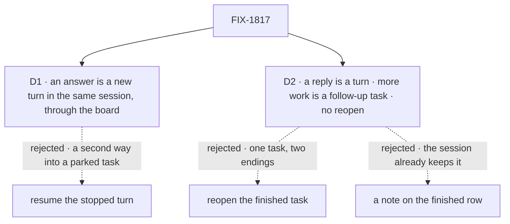

# FIX-1817 · Decisions

[Spec](SPEC.md) · **Decisions** · [Rules](BUSINESS-RULES.md) · [Plan](PLAN.md) · [Docs](DOCS.md) · [Evolution](EVOLUTION.md)

Two decisions are the sign-off surface. D2 is also the joint answer the epic owes epic
[FIX-1765](https://linear.app/fixpoint-labs/issue/FIX-1765) ([ER-14](../../epics/FIX-1815/BUSINESS-RULES.md#how-the-set-is-run)).
Everything else here is context for them.

## The tree

Solid edges are what you're signing. Dashed edges lost, and the label says why.

## D1 · An answered question continues the task as a new turn in its own session, through the board's own re-queue

| | |
|---|---|
| **Instead of** | Resuming the stopped turn where it called the tool, with ask's resume verb ([FIX-1816](https://linear.app/fixpoint-labs/issue/FIX-1816), the epic's L1) |
| **Because** | When a worker parks, its turn has already ended and its row is parked on the board. The board owns that row's life: lease, retries, cancel, reassign, and FIX-1794's start-owed marker that survives a crash. Re-queueing the row hands it to the same session today ([POC](poc/task-session-reentry/README.md) R1), so the answer needs no new path. A resumed turn would be a second waiter on the same task, and every board verb would have to learn about it. The epic's seam rule says one way into a parked session |
| **Locks in** | The worker picks up from its history, not from inside the call it made. Anything it held only in that turn and never said is gone. Each answer costs one fresh model turn over the history, and a long wait costs nothing |

![D1, how an answer reaches a parked task. Chosen: a new turn in the same session, through the board's re-queue. Instead of: resuming the stopped turn with ask's resume verb. It comes down to the first row: a cancel or reassign while the task waits; the board's verbs already handle a parked row, while a resumed turn is a second waiter they must learn about. The price is the second row: the worker restarts from its history, not from inside its call. Crash safety is a tie. Locks in: the worker resumes from what its session kept. Flips if: workers must park mid-step with state their history can't carry](figures/d1-same-session.svg)

It comes down to cancel and reassign: the board already handles a parked row, and a resumed turn is a second waiter.

**What would change my mind:** workers that need to park in the middle of a multi-step tool call
whose state isn't in the session. Then ask's resume is the right path for them, and this issue
adds it as a second mode rather than replacing the first.

## D2 · A reply to a finished task is a turn in its session; more work is a follow-up task in that session; nothing reopens

| | |
|---|---|
| **Instead of** | Reopening the finished task, or keeping a note on its closed row |
| **Because** | The conversation already heard the task end and may have acted on it. A reopen gives one task two endings: notices dedupe by ending (FIX-1794 BR-26), boards count it finished, and FIX-1794 declines writes to a finished task (its leg e). A note duplicates what the session's own log already keeps, and nobody reads it. A turn in the session keeps the line on the task, and the worker that did the work, the one that owns the next step, answers it |
| **Locks in** | A finished task stays finished. New work on it is a new row, with its own id, ending and notice, filed by whoever can file on that board. A message on a finished task never changes its status and wakes nothing upward. FIX-1764's composer sends to the session; whether it also raises the existing "needs you" signal stays FIX-1764's call |

![D2, what a reply to a finished task does. Chosen: a turn in the task's session, with more work as a follow-up task. Instead of: reopening the finished task. It comes down to the first row: the conversation already heard the task end; reopening gives it a second ending every notice, count and write rule must handle. The price: two rows for one piece of work. Keeping the context is a tie. Locks in: a finished task stays finished. Flips if: people need a finished task's status corrected more than they need new work tracked](figures/d2-reply.svg)

It comes down to the ending already heard: a reopen makes one task end twice.

**What would change my mind:** FIX-1765's owner finds people need a finished task's *status*
corrected (a "completed" that was wrong) more often than they need new work tracked. Then reopen
earns a place, as its own verb with its own notice.

**Joint answer.** FIX-1765 leaves this open and asks for one pick, cluster-wide, before its
children fork. This card is that pick, sent to FIX-1765 and FIX-1764 on Linear with the spec
PR. It binds FIX-1817's build at this gate. It binds FIX-1764 when that epic accepts it.

## Decided, not asked

- **Who answers is whoever may write the board that filed the task**: its conversation's model
  through the `answerTask` tool, or the app through `answerTask_tasks`. A pieces' question goes to
  the task session that filed them, one level up, by the same verb.
- **A message typed into a parked task's session doesn't answer it.** It is a conversation turn
  and the task stays parked. An app that wants one box wires its composer to `answerTask` while
  the row is parked.
- **An answer doesn't spend the task's retries.** Attempts price failures (FIX-1690 BR-9 does
  the same for a person's turn). Only `answerTask`'s re-entry is newly discounted, counted in
  the existing `turnReentries`; other `unpark` callers, Harness Manager's among them, are
  unchanged.
- **A question waits without limit.** No timeout. `cancelTask` ends it, silently, as today.
- **A follow-up task keeps the finished task's worker.** Another worker is another session
  (FIX-1788 BR-13), so `addTask` rejects an `assignee` beside `followUpOf`.
- **A park writes nothing new on the row**: `awaitReview`'s status and question, as today. So
  [ER-21](../../epics/FIX-1815/BUSINESS-RULES.md#how-the-set-is-run)'s notice to FIX-1786's
  coordinator is not owed.
- **The task's own prompt becomes part of its session's history.** Without it, every later turn
  answers without knowing what it was asked (POC F1).
- **No upward signal for a reply to a finished task.** That is FIX-1764's, through the existing
  "needs you" signal, if it wants one.

## Considered and dropped

| Alternative | Why not |
|---|---|
| Resume the stopped turn (FIX-1816's verb) | D1. A second waiter beside the board, for a wait that is usually hours |
| Reopen the finished task | D2. One task, two endings |
| A note on the finished row | D2. The session's log already keeps the line |
| A follow-up task in a new session, handed a summary of the old one | Lossy, and it costs a summary turn each time. The session already holds the real history |
| A message into a parked session counts as its answer | The row belongs to the board, and the session no longer holds its claim. It would also make every chat line into a parked session a possible answer |
| Build nothing for a follow-up question | The framework already runs the turn (POC F1), so "never locks" needs no new path. It still answers without its task prompt, which is the one change made |

## Cut before the gate

Restraint cuts the epic coordinator made inside the approved objective. Each removes a surface
the goal doesn't need.

- **No `findWorkerSession` aliasing.** The session is reached by the root task's id only. A
  caller holding a follow-up's id has its `followUpOf`, so a second key buys nothing.
- **~~No "session has no unfinished task" scan on a follow-up.~~ Reverted: BR-25's check
  stays.** The cut assumed the engine runs a session's turns one at a time. It doesn't: the
  default policy is `allow`, and `queue` refuses a turn after 30 s, shorter than a task turn
  runs. So `addTask` still refuses a follow-up while the session has an unfinished task. A
  person's message keeps the shipped `allow` (BR-27), and no concurrency policy changes.
- **BR-27 is existing behaviour, not a new promise.** A person's message into a busy task
  session follows the session's concurrency policy, and the existing suite covers it. "Never
  dropped" was not true under `reject`.
- **The answer's re-entry reuses `turnReentries`.** No new persisted field, so no new dual-read.
  The field now counts re-entries after a person's turn and after an answered question.
- **The assignee check is an input rule.** `addTask` rejects `assignee` beside `followUpOf`, and
  the follow-up takes the root task's worker. One check instead of a comparison.
- **A narrower goal check.** The two-question input is dropped (BR-14 covers a second question
  in CI), and so is the 5 s recount. Both controls and all three legs stay.

## Settled

From the [POC](poc/task-session-reentry/README.md), run on `main` at `b78c0ef58`:

- **A finished task's session takes a later turn** — **CONFIRMED** (F1). No lock at the framework.
- **A later turn is handed the task turn** — **REFUTED in part** (F1, R1). It gets the task's
  answer but not the task's own prompt. PLAN S5 fixes it.
- **A re-queued task re-enters the same session** — **CONFIRMED** (R1). D1 stands on it.
- **The answer reaches the re-entered turn** — **REFUTED** (R1). The `agent` kind's task message
  ignores it. PLAN S5.
- **A re-entry is free** — **REFUTED** (R1). It spent one attempt. PLAN S3.

## Cross-spec alignment

Decided by the epic coordinator after the cross-spec pass, after this spec merged
([#2899](https://github.com/fixpoint-labs/flow-state-dev/pull/2899)); aligned with FIX-1816 in
[#2905](https://github.com/fixpoint-labs/flow-state-dev/pull/2905). No change of direction; the
product owner may overrule ER-22.

- **An asked row gets no `parkOnQuestion` in v1**: epic [ER-22](../../epics/FIX-1815/BUSINESS-RULES.md#what-a-team-gets-and-what-it-doesnt)
  ([#2904](https://github.com/fixpoint-labs/flow-state-dev/pull/2904)), owned here: BR-1a, S1, S7.
  FIX-1816 BR-5b mirrors it.
- **`followUpOf` with `waitForResponse` on one call is allowed**, mirroring FIX-1816 BR-4a: BR-22a, S4.
- **S1 owns the one "task turn" test**; FIX-1816 BR-5a cites it. PLAN's check on the dropped L6 is gone.
- **BR-26 covers any task write** on a finished row, with its decline codes named there.
- **One set of task tools per turn, not a count**, as the epic says (S2, S7, V5).

## How it got here

- **Draft** — framed as the answer path FIX-1794 BR-25 lacks, plus a finished session that keeps
  its context; the board's own re-queue into the same session over ask's resume; D2 as the joint
  answer for FIX-1765; a POC on `main` before drafting, which found three gaps (S3, S5); one PR.
- **Restraint pass** — the cuts above (one later reverted, BR-25's check), made by the epic
  coordinator before the gate, and
  two clarifications from Cursor's review: what is built for ER-2 versus an existing door, and
  S5, S1 and S2 strictly before S4.
- **Cross-spec alignment** — after merge, a follow-up PR from `main` aligned this spec with
  FIX-1816 and epic ER-22, [above](#cross-spec-alignment).

**Open: none.**
