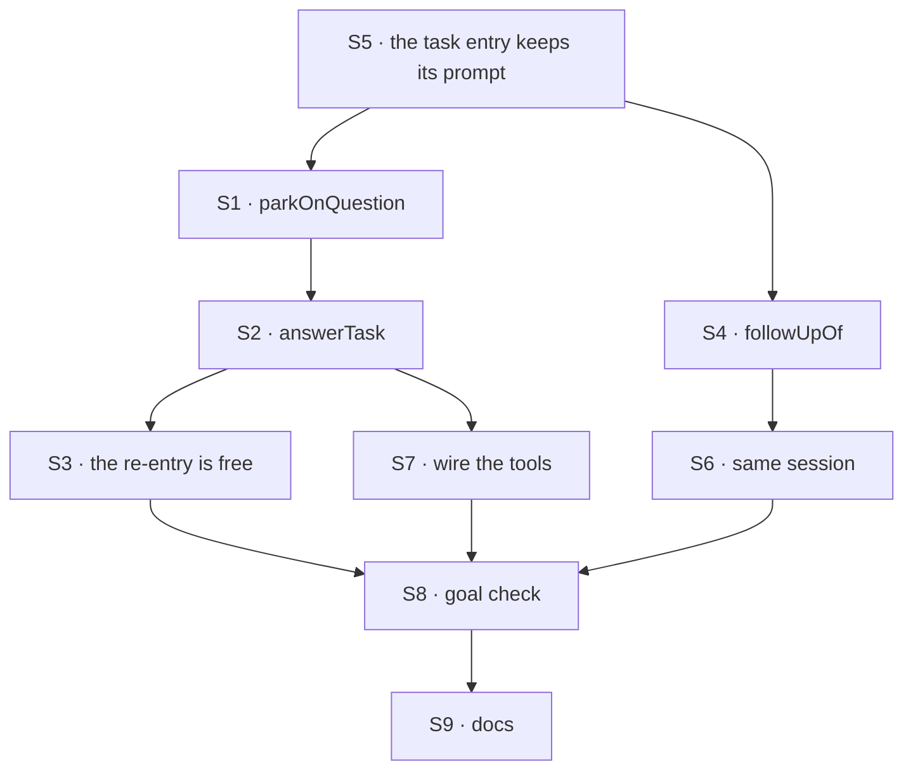

# FIX-1817 · Plan

[Spec](SPEC.md) · [Decisions](DECISIONS.md) · [Rules](BUSINESS-RULES.md) · **Plan** · [Docs](DOCS.md) · [Evolution](EVOLUTION.md)

Written for the implementing agent. IDs cross-reference [BUSINESS-RULES.md](BUSINESS-RULES.md)
(BR-n) and [DECISIONS.md](DECISIONS.md) (D-n). `tdd`. One PR. **Starts only after FIX-1802 P1
merges on `main`** (epic [ER-15](../../epics/FIX-1815/BUSINESS-RULES.md#how-the-set-is-run)),
which lands after FIX-1794 P2. All of it is the epic's Layer 1 row
[L9](../../epics/FIX-1815/DECISIONS.md#d5); a change outside the rows below goes to the epic
first (ER-11).

## Surfaces

| ID | Package · role | Change | Rules |
|---|---|---|---|
| S1 | `orchestration` · the receiving gate's turn (FIX-1794 S2) | A `parkOnQuestion({ question })` tool on a turn the gate serves: `awaitReview` on the row that turn's hand-off claimed, fenced by its claim ticket, never a task id from input. Once per turn. Declined when the claim is displaced, or when the turn already parked for its pieces (FIX-1802 S4) | BR-1–BR-5 |
| S2 | `orchestration` · task tools | `answerTask({ taskId, answer })`, the ninth tool beside the eight, and its action through `taskToolActions` (`answerTask_<board>`). Through the resolver's ref, so it reaches only this session's partition. Runs the fenced `unpark` with the answer; the ref writes FIX-1794 S5's start-owed marker in the same write, as a reassign does. Declines a row not parked on a question: a binding from FIX-1802 means pieces, `parkedForTurn` means a person's turn | BR-6 BR-9–BR-12 BR-16 |
| S3 | `orchestration` · the claim charge | `answerTask`'s unpark marks the re-entry, and `shouldRetryOnFail` discounts it beside `abandonments` and `turnReentries`. Top level, never `metadata` (BP-031); absent reads as zero (BP-030). Other `unpark` callers unchanged | BR-8 |
| S4 | `orchestration` · `addTask` | Optional `followUpOf`. Checked in the same partition: the task exists, is terminal, and its session has no unfinished task; the assignee is empty or the same worker. Stored top level on the new row, server-checked, resolved to the root when it names a follow-up | BR-20–BR-25 |
| S5 | `workforce` · the task entry (`work`, FIX-1794 S6) | Declare `userMessage`, so the task as filed is the turn's user item and part of history. On a re-entry after `answerTask`, the turn's message is the answer, labelled as the answer to its question, not the task again. A retry after a failure is not labelled an answer | BR-7 BR-17 |
| S6 | `workforce` · the hand-off's session key (FIX-1794 S3, S9) | A row with `followUpOf` hands off under its root task's session criteria, so it opens no session. `findWorkerSession` with a follow-up's id resolves to the root's session | BR-20 BR-24 |
| S7 | `workforce` · the turns that carry the tools | The `agent` kind's task turn carries S1's tool. Every flow that carries the eight task tools (FIX-1794 S4, FIX-1802 S2) carries S2's with them, in the same capability, so no flow gets one without the other | BR-1 BR-2 BR-6 |
| S8 | `goals/coordinators/task-session-stays-open/` | The goal check and its two controls, per [SPEC.md](SPEC.md#the-goal-and-how-well-know-its-met). Reuses FIX-1794's goal tree; adds a goal-local ticket tool | goal |
| S9 | Docs | [DOCS.md](DOCS.md); `orchestration` and `workforce` READMEs; `minor` changesets for both | — |

**Removed here: nothing.** `unparkAndDrain` (FIX-1244) stays; S2 is the same fenced `unpark`
reached as a task tool, where `unparkAndDrain` runs the board in the caller's request.

S1 and S2 are one invariant: a question park is written only through the claim that runs the
task, and answered only through the board that filed it. Build and check them together.

## Sequence



S5 first: its red state is on `main` today (the POC's F1), and every later check reads history.

## Checks

| ID | Runs after | Passes when |
|---|---|---|
| V1 | S5 | The POC's F1 and R1, made into specs: a later turn's model is handed the task prompt, and a re-entered turn is handed the answer as its message. Both red on `main` first |
| V2 | S1 | BR-1–BR-5. A turn that isn't a task turn has no tool; a forged task id on input reaches nothing |
| V3 | S2, S3 | BR-6, BR-8–BR-12, BR-14: re-entry in the same session id; a task with `maxAttempts: 1` answered twice and then failing once ends `errored` after that one failure, not before; a crash between the answer's write and the board's run is recovered on the next touch |
| V4 | S4, S6 | BR-20–BR-25. Two conversations of Alice's each follow up their own task with the same id, and each lands in its own session |
| V5 | S7 | **Must-test**, as FIX-1794 V3: on `agent` and the coordinator, each of the nine task tools appears exactly once on a turn, and `parkOnQuestion` only on a task turn |
| V6 | S1–S7 | The second path (BP-035): FIX-1802's split, with one piece parked on a question and answered by the task session above, then both pieces end and the parent settles once (BR-16). FIX-1690's turn park still re-enters through its door, and `answerTask` declines it |
| VG | S8 | [The goal](SPEC.md#the-goal-and-how-well-know-its-met): `goals/coordinators/task-session-stays-open/run.mts` PASSES on `openai/gpt-5.4-mini`, after FAILING under `GOAL_CONTROL=new-session` (legs a and c, *names the ticket*) and `GOAL_CONTROL=drop-answer` (leg a, *names `eu-west`*) |

## Pinned names

| Where | Name | Why pinned |
|---|---|---|
| Task tool and action | `answerTask`, `answerTask_<board>`, input `{ taskId, answer }` | Public. An app sends it; the docs teach it |
| Worker tool | `parkOnQuestion`, input `{ question }` | A model reads it. "Ask" is FIX-1816's word for a hand-off that waits, so it is not used here |
| `addTask` input | `followUpOf` | Public, on an existing tool |

Everything else is yours to name, the re-entry counter included.

## Guardrails

| Rule | Because |
|---|---|
| One way into a parked task: the board's re-queue. Never ask's resume verb, never a write from the task session | D1, and the epic's seam rule. Two waiters on one task disagree at the edges |
| Every row coordinate comes from the claim or the resolver, never from input (BP-031) | `answerTask` and `parkOnQuestion` reach a row a caller names; the partition and the ticket are what stop Bob |
| Every writer of a question park goes through S1, and every answer through S2 (tenet 5) | A park written elsewhere is one `answerTask` can't tell from a pieces' park, and BR-10 breaks |
| A finished row is never written; a follow-up is always a new row | D2, and FIX-1794 leg e. Notices dedupe by ending |
| Change no FIX-1786 spec (ER-12). The code it shipped is changed only at L9's rows above | Another session owns those specs; L9 is the agreed exception |

## Docs

Reconcile [DOCS.md](DOCS.md) with the shipped names and refusal wording after V3 and V4 pass,
then publish it with the implementation. The epic's "Which session a task runs in" paragraph is
FIX-1817's to publish (epic [DOCS.md](../../epics/FIX-1815/DOCS.md#ownership)), in its final form
from this issue's `DOCS.md`.

## Sketch · pseudocode, illustrative, react to the shape

```
task turn (the gate serves it, with its claim):
    parkOnQuestion(question):  awaitReview(claimed row, question) fenced by the claim ticket
the conversation, on the parked notice:
    answerTask(taskId, answer):
        row ← this session's partition only
        refuse unless parked on a question
        unpark(row, answer) + start owed + mark re-entry          ← one write
        dispatch the board's run (as on add)
the board's run:  claim (not charged) → hand-off → same task session
the task entry:   message = answer ? "Answer to your question: …" : the task
addTask(goal, followUpOf):  root ← resolve followUpOf; refuse unless finished and alone
the hand-off:     session criteria ← root's, when followUpOf is set
```

**POC:** [`poc/task-session-reentry/`](poc/task-session-reentry/README.md), on `main` at
`b78c0ef58`. A re-queued row re-enters the same session, which D1 rests on: the premise held. It
also showed the task prompt missing from history, the answer dropped, and the re-entry charged,
which are S5 and S3.

## At implement time

- Re-read FIX-1794 S2–S9 and FIX-1802 S2, S4 as merged: names, the start-owed marker, the
  binding that marks a pieces' park. This plan names them as specified.
- If FIX-1816 has merged, confirm its resume verb is untouched here, and that a board worker
  that *asks* (its L6) parks under a reason `answerTask` declines.
- Harness Manager parks on questions with `awaitReview` too. Confirm its answer path keeps its
  own charge (S3 marks only `answerTask`'s re-entry).
- FIX-1764's state: if its composer has shipped, check its finished-task send matches D2.

## Follow-ups

- Tell FIX-1764 and FIX-1765 the D2 answer (done on Linear with the spec PR).
- A cap on questions per task, if live use shows a worker that asks in a loop. Not filed.
