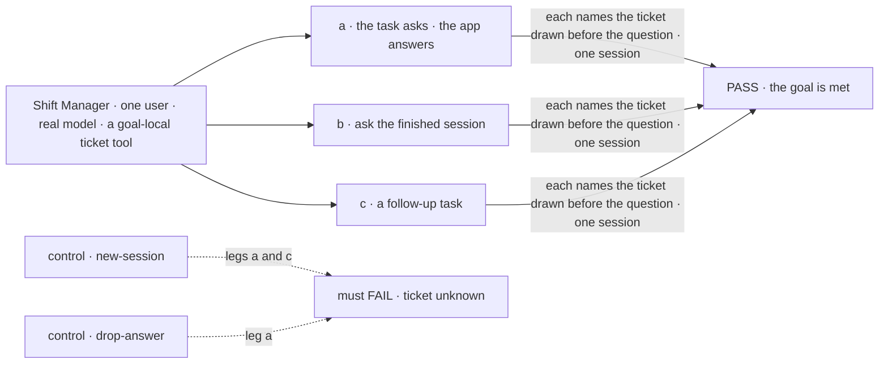
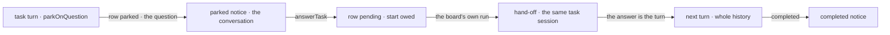

# FIX-1817 · Assigned work keeps its session open until it's done, and never locks

**Spec** · [Decisions](DECISIONS.md) · [Rules](BUSINESS-RULES.md) · [Plan](PLAN.md) · [Docs](DOCS.md) · [Evolution](EVOLUTION.md)

## Five people, before and after

| Someone who… | Today | After |
|---|---|---|
| **assigns a job the worker can't finish without asking** | An `agent` worker has no way to stop on a question. It guesses, or ends with the question as its answer and the task closes. Where a worker can park, the answer has no path back ([FIX-1794](../FIX-1794/BUSINESS-RULES.md#how-it-ended) BR-25) | The worker parks the task on its question, and the conversation that filed it hears the question. Answering it carries on the **same** session, which finishes from there |
| **answers that question hours later** | n/a | Nothing runs or holds a lease while it waits. The answer doesn't spend the task's retries. A second answer, or one after a cancel, is declined, naming the task's status |
| **asks a finished task what it did** | The framework runs the turn, but the session has lost what it was asked: the task's own prompt isn't in its history ([POC](poc/task-session-reentry/README.md) F1). Shift Manager refuses before that | The session answers from its whole history: what it was asked, what it did, what it was told |
| **wants more work built on a finished task** | Files a new task, which starts in a new session that knows nothing | Files a follow-up task naming the finished one. It runs in the same session with that history. The finished task stays as it ended |
| **builds the finished-task composer** ([FIX-1764](https://linear.app/fixpoint-labs/issue/FIX-1764)) | It doesn't know what a reply to a finished task does: a note, a follow-up task, or a reopen ([FIX-1765](https://linear.app/fixpoint-labs/issue/FIX-1765)) | A reply is a turn in the task's session. More work is a follow-up task. Nothing reopens ([D2](DECISIONS.md#d2)) |

Leg b of the epic [FIX-1815](../../epics/FIX-1815/SPEC.md) (ER-2, ER-3, L9). The *sub-tasks
finished* wake is [FIX-1802](../FIX-1802/BUSINESS-RULES.md#the-split)'s (its BR-15) and is consumed,
not built.

## The goal, and how we'll know it's met

**A task that stops on a question carries on in its own session once answered, and finishes
from there. Once finished, that session still answers a question about what it did, and takes a
follow-up task that runs in it.**

| Is it the right goal? | |
|---|---|
| **The real need** | [The issue](https://linear.app/fixpoint-labs/issue/FIX-1817): "a worker that stops on a question carries on in the same session when answered … a finished task's session still answers a question about what it did. A follow-up task can still be assigned to it." The epic's leg b |
| **Smaller, and rejected** | "The answer reaches the worker." Met by a new session handed the answer, which forgets everything the worker did before it asked. Or "a finished session isn't refused", already true at the framework, and useless while it has forgotten its own task |
| **Bigger, and not this issue's** | Surviving a restart mid-hand-off (FIX-1820, the closure) · ask, the wait inside one turn ([FIX-1816](https://linear.app/fixpoint-labs/issue/FIX-1816)) · the Shift Manager composer and any upward signal for a finished task's reply (FIX-1764) |
| **Not done if** | The answer re-entry ran in a new session · the follow-up was answered from the task prompt rather than from what the session did · the answer spent an attempt · the check filed or settled rows itself · a control passed |



The ticket is drawn once, in the task's first turn, so only that session can name it. The two
controls move the work to a fresh session, or drop the answer, and must fail.

| How we verify | |
|---|---|
| **Goal check** | `goals/coordinators/task-session-stays-open/` · `openai/gpt-5.4-mini` · Shift Manager over HTTP, one user, FIX-1794's goal tree plus a ticket tool · run by the implementer at completion · verdict in the implementation PR |
| **Signal** | **a**: a task whose brief says to draw a ticket and then ask which region to use parks with one `parked` notice. The app answers `eu-west` with `answerTask_tasks`. Within 90 s the task is `completed` in the session that parked, its output names the ticket and `eu-west`, one `completed` notice follows, and a task filed with one attempt still has it unspent. **b**: the door into that session, "Which ticket did you draw?", is answered with the ticket. **c**: a follow-up task naming it runs in the same session, names the ticket, and the ticket tool ran once in total |
| **Input** | The region and the follow-up's wording are held out at run time. A different region must pass too. A task that asks twice is BR-14's, in CI |
| **Anti-game** | No row, notice or session written by the check. The ticket never appears in any prompt the check sends |
| **Control that must fail** | `GOAL_CONTROL=new-session`: legs a and c FAIL on *names the ticket*. `GOAL_CONTROL=drop-answer`: leg a FAILS on *names `eu-west`*. Today's `main`: every leg FAILS |

## What changes


Read each lane left to right as one session's life. Today it ends at the first turn. After, it
keeps taking turns, and the row above it changes only through the board.

**What an app writes to answer, ask and follow up**, beside FIX-1794's `addTask_tasks`:

```diff
  await coordinator.sendAction("addTask_tasks", { goal, assignee: "researcher" }, { sessionId })
+ // the conversation hears: parked, with the worker's question
+ await coordinator.sendAction("answerTask_tasks", { taskId, answer: "Use eu-west." }, { sessionId })
+ // later, after it completed:
+ const run = await workforce.findWorkerSession({ worker: "researcher", taskId, filingSessionId: sessionId })
+ await researcher.sendAction("run", { message: "Which ticket did you draw?" }, { sessionId: run.id })
+ await coordinator.sendAction("addTask_tasks", { goal: "Now open the PR", followUpOf: taskId }, { sessionId })
```

The coordinator's model gets `answerTask` in its one set of task tools, and `addTask` takes
`followUpOf`. A worker in a task session gets one tool, `parkOnQuestion`, unless the task was
asked (filed with `waitForResponse`, [FIX-1816](../FIX-1816/BUSINESS-RULES.md#asking)): in v1 an asked colleague
answers with what it has, or fails ([ER-22](../../epics/FIX-1815/BUSINESS-RULES.md#what-a-team-gets-and-what-it-doesnt)).

## How an answer gets back



The answer takes the path a task already takes: the board re-queues the row and hands it to the
session it ran in. No second way into a parked task.

## What stays as it is

- FIX-1794's notices: `parked`, then `completed` (BR-25), and their dedup. A park writes nothing
  new on the row.
- A finished task declines writes (FIX-1794 leg e). A follow-up is a new row.
- Ask's resume verb (FIX-1816) is not used here ([D1](DECISIONS.md#d1)).
- Shift Manager's composer. FIX-1764 owns it.

## Sign off

**[The goal](#the-goal-and-how-well-know-its-met), at that size:** answered in the same session,
and the finished session still answers and takes follow-ups, proved by a ticket only that
session drew. If wrong: we ship an answer path that forgets the work, or hold the issue for the
restart, which is FIX-1820's.

1. **[D2](DECISIONS.md#d2) · A reply to a finished task is a turn in its session; more work is a
   follow-up task in that session; nothing reopens.** The joint answer for FIX-1765 and FIX-1764.
   If wrong: a person who needs a finished task's status changed has to file new work instead.
   **The one to weigh.**
2. **[D1](DECISIONS.md#d1) · An answer continues the task as a new turn in the same session,
   through the board, not by resuming the stopped turn.** If wrong: a worker that parked mid-step
   restarts that step from its history.

**Open: none.** Reasoning and what lost: [DECISIONS.md](DECISIONS.md). The cases:
[BUSINESS-RULES.md](BUSINESS-RULES.md).

Feature · `orchestration`, `workforce` · medium · 1 PR · epic [FIX-1815](../../epics/FIX-1815/SPEC.md) · builds after FIX-1802 merges (ER-15)
