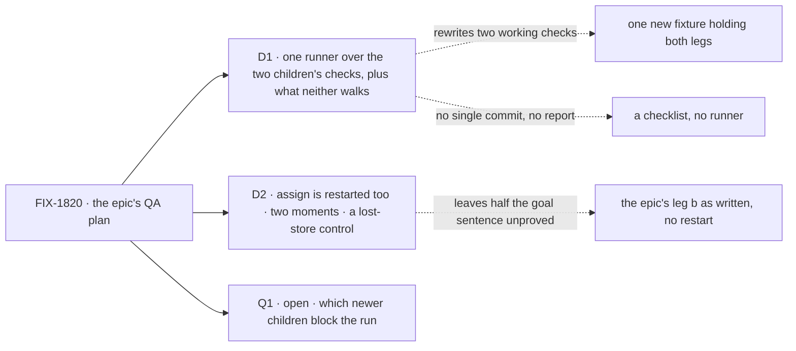

# FIX-1820 · Decisions

[Spec](SPEC.md) · **Decisions** · [Rules](BUSINESS-RULES.md) · [Plan](PLAN.md) · [Docs](DOCS.md)

Two calls shape this closure, and one is open: which of the epic's newer children the run waits
for. Everything else is the closure rule applied.

Solid edges are what you sign. Dashed edges are what lost, and why.

## D1 · One closure check that runs the two children's checks as they are, and adds only what neither walks

| | |
|---|---|
| **Instead of** | One new fixture that walks legs a and b itself, on one install, in one server life. Or no runner at all: a list of commands and a hand-written report |
| **Because** | The two children's checks already walk the epic's legs on the real path: leg a on the DevTeam install with a SIGKILL while the asker waits and both of the epic's controls, leg b on Shift Manager over HTTP with a ticket only the task's session can name. Each already ran PASS with its controls FAILing. A merged fixture would re-prove both from scratch and leave two checks that drift apart. A thin runner adds what a list cannot: it refuses a dirty tree, runs every part against the one checked-out commit, and writes the report with that SHA |
| **Locks in** | The epic's "one goal fixture under `goals/`" is met by one directory whose runner composes three: the two children's and its own. A later change to either child's check changes the closure's leg a or b too, which is wanted. Those checks become shared, so a rename in either breaks the runner loudly, never silently |

![D1: how the epic's goal check is built. Chosen: one runner over the two children's checks as they are, plus the journeys neither walks. Instead of: one new fixture with both legs, or a list of commands. It comes down to the first row, proof already earned: the chosen runner reuses two checks that passed with their controls failing; a new fixture re-earns it. Second row, one commit: the runner and the new fixture both pin it, the list does not. Third row, the price: the runner depends on two directories it does not own](figures/d1-one-runner.svg)

It comes down to proof already earned: two checks that passed with their controls failing are
worth more than one that has not run yet.

**What is new, and why.** Only three things: J4, the parked-task restart (no check restarts a
server while an assigned task waits, and FIX-1817's spec named it this issue's); the stalled-ask
journeys of [ER-4](../../epics/FIX-1815/BUSINESS-RULES.md#what-a-team-gets-and-what-it-doesnt)
(timeout and stop are proved only in package tests); and the sweep's scripted seam assertions.

## D2 · Assign is restarted too, at two moments, with a lost-store control

| | |
|---|---|
| **Instead of** | The epic's leg b as its signal reads: park, answer, follow up, no restart |
| **Because** | The epic's goal sentence says both kinds "survive a restart without doing the work twice", and its fourth team runs Workforce on a server that restarts. Leg b's signal never says restart, and FIX-1817 listed "surviving a restart mid-hand-off" as this issue's. Two moments, because they fail differently: killed while parked, the wait itself must be durable; killed just after the answer is accepted, the restart must start the task once, in the same session, without drawing a second ticket |
| **Locks in** | Two more real-model runs per closure run, a few cents and a few minutes. A `fresh-store` control that restarts on an empty store, so a pass cannot come from a server that never really lost its memory |

It comes down to the goal sentence: without a restart, the closure proves assign works, not that
it survives one.

## Open

### Q1 · Does the closure run wait for the epic's nine open newer children, or only for the one that breaks a rule this epic owns?

Eleven issues were filed under FIX-1815 during the children's reviews, after the set was written.
Two are Done (FIX-1845, FIX-1846); nine are open in Backlog, and none blocks this issue yet. The closure rule says every child blocks the closure, including late
ones, so either they all wait, or the ones outside the epic's goal leave the epic.

- **In plain terms.** Most of the nine are rare corners: an answer that arrives up to five minutes
  late but is never lost, a retry that never stops trying, a follow-up after someone deleted the
  session, a worker moved to another flow mid-task, a sweep that gets slower as history grows. One
  breaks a promise this epic makes: if cancelling a stopped or timed-out ask fails on a passing
  store error, the asked task stays open and its worker may keep going with nobody waiting
  (FIX-1844, against [ER-4](../../epics/FIX-1815/BUSINESS-RULES.md#what-a-team-gets-and-what-it-doesnt)).
- **The trade-off.** Waiting for all nine holds the epic open for several new engine surfaces, and
  one (FIX-1851) cannot start until another epic's FIX-1802 P2 lands. Letting eight go closes the
  epic on its goal, with those eight tracked on their own, not under it.
- **My recommendation.** FIX-1844 stays under the epic and blocks this run. The other eight leave
  the epic, linked to it with `relates-to`, and keep their priorities: FIX-1843, FIX-1850,
  FIX-1851, FIX-1860, FIX-1861, FIX-1862, FIX-1864, FIX-1865. FIX-1850 is about approvals, not hand-offs, and FIX-1851 belongs with FIX-1802.
- **What would change my mind.** If a customer is about to run hand-offs on a box that restarts
  often, FIX-1862 (late answers) and FIX-1861 (endless retries) are felt in normal use, and I would
  keep them in.
- **If wrong.** Low and reversible: a dropped issue is still filed with its priority, and can be
  pulled back under the epic before the closure PR merges. Keeping all nine costs weeks of wrap.

It comes down to whether a promise the epic makes is broken. Only FIX-1844's is.

## Decided, not asked

- **#3032 is a child's work, so the run waits for it.** FIX-1816's review follow-ups change the
  ask under leg a; a run before it merges proves a commit that will not ship.
- **The ask's time limit is the default five minutes**, not one the asking model is told to set.
  The check then cannot pass or fail on whether the model obeyed an instruction.
- **The stalled-ask journeys run in the sweep**, as ER-4's *checked at* says, not as a team
  journey.
- **The neighbouring coordinator checks re-run.** ER-12 let both children change FIX-1794's code,
  so FIX-1794's own check, and the two others on the same board, run on the commit.
- **No `goals/lib` helper is promoted.** The kill helper has two users after J4; the library waits
  for a third ([`goals/README.md`](../../../goals/README.md)).
- **Ask's shipped caller.** FIX-1816's [D2](../FIX-1816/DECISIONS.md#d2) named the research team
  as the caller that needs the answer in the same turn. On `main` today no shipped app or guide
  asks: FIX-1814 made `tech-brief` write its brief alone, and the research-team guide uses a static
  board. Every Workforce worker with a delegate can ask, which leg a proves. The sweep records the
  state (G8); it is not a finding, because the epic's goal names a worker, not an example.

## Considered and dropped

| Option | Why it lost |
|---|---|
| Legs a and b in one server life on one install | Proves nothing the seams sweep doesn't, and needs a new install that holds both the DevTeam's asker and the goal-local ticket tool |
| A browser leg | Neither hand-off has a screen in this epic; the composer is FIX-1765's. The person's surface is the HTTP clients the docs show |
| A 30-second ask the model is told to set | Faster, but the check would grade the model's obedience, not the timeout |
| Restarting leg b inside FIX-1817's own check | Changes a child's acceptance after merge; the closure re-runs children's checks, it doesn't rewrite them |

## How it got here

- 2026-10-10 · drafted after FIX-1816 (#2964, #2999, #3015) and FIX-1817 (#3014) merged, with
  #3032 open.
