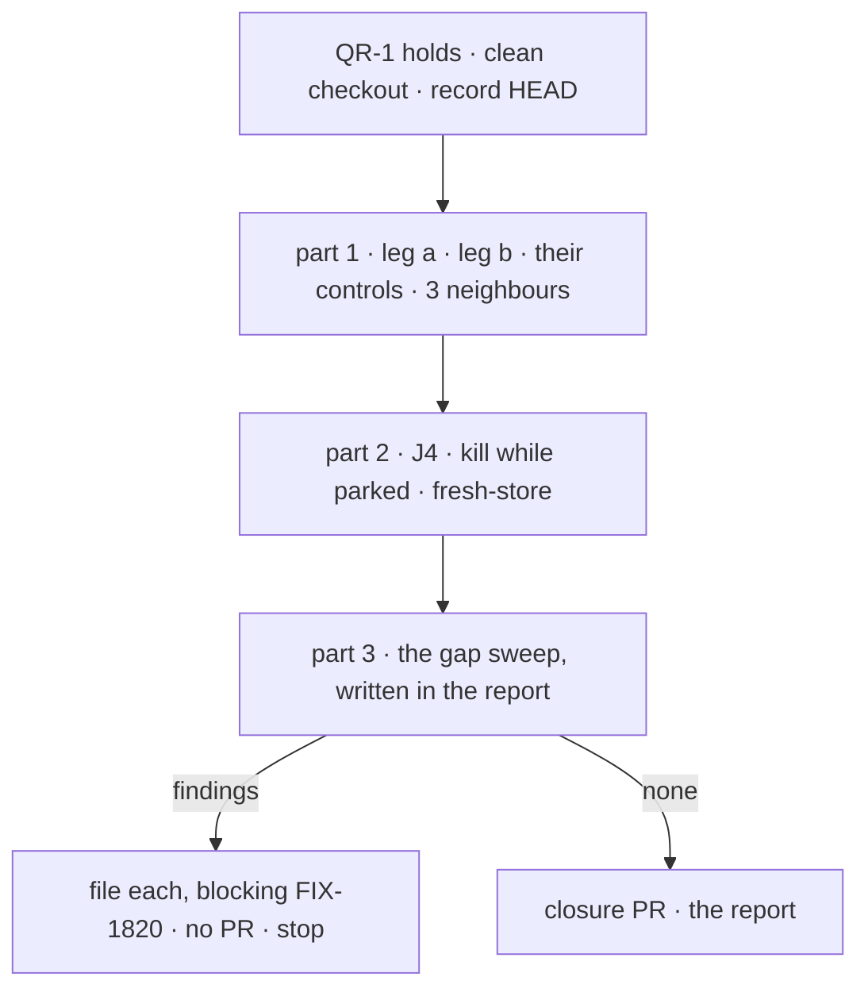

# FIX-1820 · Plan

[Spec](SPEC.md) · [Decisions](DECISIONS.md) · [Rules](BUSINESS-RULES.md) · **Plan** · [Docs](DOCS.md)

Written for the closure worker. Discipline: run, then file; no product code. One PR, opened only
after a run that files nothing (QR-19). It starts when [QR-1](BUSINESS-RULES.md#when-a-run-may-start)
holds: **every other child merged on `main`, FIX-1816's follow-up #3032 included**, and whichever
children [Q1](DECISIONS.md#q1) keeps. Names below are read off the merged FIX-1816 and FIX-1817
specs and code; where the shipped code says otherwise, the code wins and the report says so.

## Surfaces

| ID | Where | Change |
|---|---|---|
| S1 | `goals/hand-offs/survives-a-restart-and-runs-once/goal.md` | From [SPEC's goal](SPEC.md#the-goal-and-how-well-know-its-met), in the `goals/README.md` format, on-demand posture (QR-5) |
| S2 | `…/run.mts` | The thin runner. Refuses a dirty tree, records `HEAD`, runs part 1's checks each as its own subprocess with its own `GOAL_CONTROL`, then J4; re-checks `HEAD` before each; prints each verdict with the SHA. Stops at the first check that cannot start (blocked) |
| S3 | `…/legs/parked.mts` | J4. Imports leg b's Lab (`goals/coordinators/task-session-stays-open/lab/`, `fixtures/`) and its brief, never copies them. Kills with leg a's kill-the-tree approach (copied or imported, not promoted: two users) |
| S4 | The closure PR | Only after a clean run: S1 to S3, with the report (part 3 included) as its body |

Removed: nothing. Leg a's and leg b's runners, Labs, fixtures and `goal.md` files are not edited (D1).

## Sequence

Checks run one after another on purpose: real model, shared keys, readable output.

## Part 1 · the epic's goal check, and its neighbours

Each runs unchanged; its signals are its own `goal.md`'s and are not restated here. Both
children's own checks are P1.a and P1.b, so the closure rule's item 3 needs nothing more.

| ID | Runs | Passes when |
|---|---|---|
| P1.a | `goals/hand-offs/ask-survives-a-restart/run.mts`, then under `no-run-once` and `no-waker` | Plain PASS; `no-run-once` FAILS `one-row`; `no-waker` FAILS `a:completed` |
| P1.b | `goals/coordinators/task-session-stays-open/run.mts`, then under `new-session` and `drop-answer` | Plain PASS; `new-session` FAILS `a:names-ticket` and `c:names-ticket`; `drop-answer` FAILS `a:names-region` |
| P1.c | FIX-1794's `goals/coordinators/files-tasks-down-the-owners-chain/run.mts` | PASS. ER-12 let both children change its S5 to S7 code |
| P1.d | `goals/coordinators/hands-each-post-to-its-delegates/run.mts` and `routes-a-follow-up-by-its-conversation/run.mts` | PASS. FIX-1817 changed the per-task session key on the same board |

## Part 2 · J4, the journey no check walks

The epic's teams table: *checks with a colleague* is P1.a; *assigns a job that may need a
question answered* and *follows up on finished work* are P1.b; *runs Workforce on a server that
restarts* is P1.a for ask, and J4 for assign.

| Tag | Passes when |
|---|---|
| `kill:parked` | The task read `parked`, with one `parked` notice, when SIGKILL went to the server and everything under it |
| `j:answered` | After the restart on the same store, `answerTask_tasks` answers `{ ok: true }` |
| `j:completed` | The task is `completed` within 90 s of the answer; the person's only other touch is listing tasks (QR-8) |
| `j:same-session` | It completed in the session that parked |
| `j:names-ticket` · `j:names-region` | Its output names the ticket drawn before the kill, and the answered region |
| `j:one-draw` · `j:one-completed` | `drawTicket` ran once in total; one `completed` notice |
| `j:second-answer` | A second `answerTask_tasks` is declined and writes nothing |
| `j:still-answers` | The finished session's door answers "Which ticket did you draw?" with the ticket |
| `j:row-unchanged` | After `j:still-answers`, the task row is still `completed` with the same output (ER-3, "the finished task itself never changes") |

**Control.** `fresh-store`: the server restarts on a new empty store file, as an in-memory store
would. Must FAIL `j:answered`; `kill:parked` stays green. Leg b's own `new-session` control
already fails on the session mechanism J4 relies on, so J4 does not repeat it.

## Part 3 · gap sweep, in the report

No code. The report carries one line per row below, naming the check or package test that covers
it and its result on this commit. A row nothing covers is QR-14.

**The coordination seams** ([epic PLAN](../../epics/FIX-1815/PLAN.md#coordination-seams-to-watch)):

| Seam | Covered by |
|---|---|
| The resume verb · the row's markers · the child-finished signal | P1.a and P1.b passing, plus FIX-1816's lift test (its V7) |
| FIX-1794's S6 task entry | P1.a, P1.b and P1.c on one commit |
| An asked task's question (ER-22) | FIX-1817's test that an asked row's turn is offered no `parkOnQuestion` |
| The `parked` notice | P1.b `a:parked`, `a:one-completed` |
| The finished task's session | J4 `j:still-answers`, `j:row-unchanged` |
| `escalate.ts` and the kill line | One observe line: whether any shipped app or guide asks (FIX-1816 [D2](../FIX-1816/DECISIONS.md#d2)). On `main` today, none does |

**The published promises:**

| Page · section | Promise | Covered by |
|---|---|---|
| `server/background-work.md` · Waiting for the answer | A restart while the turn waits loses nothing; filed once | P1.a |
| same | Five-minute default; timeout error; task cancelled | FIX-1816's timeout tests (its V6) |
| same | Stopping the conversation cancels the task and ends the turn | FIX-1816's stop tests (its V8) |
| same | A worker working a task can't wait: `wait_unavailable`, nothing filed | FIX-1816's test for it |
| `orchestration/task-board.md` · Which session a task runs in | The answer returns to the same session; a follow-up runs there; the finished task never changes | P1.b, J4 |
| same · `answerTask` | A second answer is declined, writing nothing | J4 `j:second-answer` |
| `workforce/coordinators.md` · When a task stops on a question | An answer doesn't use up the task's retries | P1.b `a:unspent` |
| same · After a task finishes | `findWorkerSession` with `taskId` finds the task's session; `followUpOf` runs in it | P1.b legs b and c |

Each code sample in those sections is a call P1.b or J4 makes, by name and shape; one that differs
is QR-14.

**Not done if.** One sentence per row of SPEC's list, citing the evidence already in the report:
the one SHA, the SQLite store paths, each kill's timing, each control's FAIL, the same-session
tags, the runner's call list, a diff with no product file, and Linear showing no open finding.

## Pinned names

| Name | Why |
|---|---|
| `goals/hand-offs/survives-a-restart-and-runs-once/` | The epic's one goal fixture; next to leg a, named for the goal |
| `kill:parked`, `j:*` | Mirror leg a's and leg b's tags, so the report reads as one vocabulary |
| `fresh-store` | Names what the control breaks |

## Guardrails

| Rule | Because |
|---|---|
| No edit to any child's or neighbour's check | D1: their proof is earned; a red one is a finding against its owner |
| No `goals/lib` helper unless a third goal needs it | `goals/README.md` |
| Nothing written to a store by a runner; the post-restart touch is a person's list call | Anti-game: otherwise the runner is the waker |
| One commit for every check | Checks on different commits prove nothing about the set |
| Say "hand-off", "ask", "assign"; never "mailbox" for these | The epic's vocabulary; "mailbox" is reserved |

## Docs

None to publish. [DOCS.md](DOCS.md) says why; part 3 follows the pages the children published.

## At implement time

- Read #3032's merged form: it changes `wait-for-response.ts` and leg a's runner, which P1.a's
  controls patch.
- Re-read the Linear children of FIX-1815 against Q1's answer; each kept one must be merged.
- Find the test files behind FIX-1816's V6, V7, V8 and `wait_unavailable`, and FIX-1817's ER-22
  test, and name them in the report.

## Follow-ups

- Q1's eight, if the owner lets them leave the epic: relinked by the coordinator.
