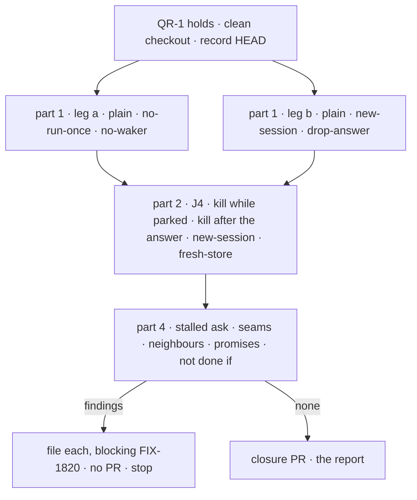

# FIX-1820 · Plan

[Spec](SPEC.md) · [Decisions](DECISIONS.md) · [Rules](BUSINESS-RULES.md) · **Plan** · [Docs](DOCS.md)

Written for the closure worker. Discipline: run, then file; no product code. One PR, opened only
after a run that files nothing (QR-19). It starts when [QR-1](BUSINESS-RULES.md#when-a-run-may-start)
holds: **every other child merged on `main`, FIX-1816's follow-up #3032 included**, and whichever
children [Q1](DECISIONS.md#q1) keeps. Names below are read off the merged FIX-1816 and FIX-1817
specs and code; where the shipped code says otherwise, the code wins and the report says so.

## Surfaces

| ID | Where | Change |
|---|---|---|
| S1 | `goals/hand-offs/survives-a-restart-and-runs-once/goal.md` | From [SPEC's goal](SPEC.md#the-goal-and-how-well-know-its-met), in the `goals/README.md` format, on-demand posture (QR-5) |
| S2 | `…/run.mts` | The thin runner. Refuses a dirty tree, records `HEAD`, runs parts 1 to 4 in order, each child check as its own subprocess with its own `GOAL_CONTROL`, each re-checking `HEAD`; writes the report. Stops at the first part that cannot start (blocked) |
| S3 | `…/legs/parked.mts` | J4. Imports leg b's Lab (`goals/coordinators/task-session-stays-open/lab/`, `fixtures/`) and its brief, never copies them. Kills with leg a's kill-the-tree approach (copied or imported, not promoted: two users) |
| S4 | `…/legs/stalled.mts` | P4.S, ER-4's two journeys on the DevTeam install, as leg a sets it up |
| S5 | `…/sweep.mts` | Part 4's scripted rows: seams, promises, *not done if* |
| S6 | Both children's `goal.md` | A verdict row for the run's commit, nothing else |
| S7 | The closure PR | Only after a clean run: S1 to S6, the report as its body |

Removed: nothing. Leg a's and leg b's runners are not edited (D1).

## Sequence

Parts run one after another on purpose: real model, shared keys, readable output.

## Part 1 · the epic's goal check

Run each child's check unchanged. Its signals are its own `goal.md`'s; they are not restated here.

| ID | Runs | Passes when |
|---|---|---|
| P1.a | `pnpm tsx goals/hand-offs/ask-survives-a-restart/run.mts` | PASS: `kill:suspended`, `a:completed`, `a:same-turn`, `a:word`, `one-row`, `b:once` |
| P1.b | `pnpm tsx goals/coordinators/task-session-stays-open/run.mts` | PASS: every `a:*`, `b:names-ticket`, every `c:*` |

## Part 2 · the journey no check walks

The epic's teams table: *checks with a colleague* is P1.a; *assigns a job that may need a
question answered* is P1.b's leg a; *follows up on finished work* is P1.b's legs b and c; *runs
Workforce on a server that restarts* is P1.a for ask, and J4 for assign.

| ID | Moment | Passes when |
|---|---|---|
| J4.1 | Kill while parked | `kill:parked` the task read `parked` with one `parked` notice when SIGKILL went. After the restart on the same store: `j:answered` `answerTask_tasks` answers `{ ok: true }`; `j:completed` the task is `completed` within 90 s of the answer; `j:same-session` in the session that parked; `j:names-ticket` its output names the ticket drawn before the kill; `j:names-region`; `j:one-draw` `drawTicket` ran once; `j:one-completed` one `completed` notice; `j:still-answers` the finished session's door answers "Which ticket did you draw?" with the ticket |
| J4.2 | Kill just after the answer | On a fresh store: the task parks, `answerTask_tasks` answers `{ ok: true }`, SIGKILL at once (`kill:answered`: the row read `pending` or `running`, never `completed`). After the restart, the person lists tasks every five seconds (QR-8). `j:completed`, `j:same-session`, `j:names-ticket`, `j:names-region`, `j:one-draw`, `j:one-completed` as J4.1. Attempts are not graded: a run the kill interrupted is a charged attempt, as in leg a |

## Part 3 · every child's check

Both children's checks are part 1, with their own controls. Nothing is left for part 3, and the
report says so in one line.

## Part 4 · gap sweep

**P4.S, ER-4's stalled ask** (required, real model, the DevTeam install as leg a sets it up):

| ID | Passes when |
|---|---|
| S.1 | The colleague's task entry is held by a scratch patch so it never ends. The asker asks with the default limit. Its request ends `completed` with a timeout error as the tool's result between 5:00 and 5:30 after the ask; the asked row reads `cancelled`. The published page says "within seconds of the limit" |
| S.2 | Alice calls `abortRequest` on the asker's waiting request. The asked row reads `cancelled`, the request ends stopped, and no model call follows the stop |

**P4.M, the coordination seams** ([epic PLAN](../../epics/FIX-1815/PLAN.md#coordination-seams-to-watch)):

| ID | Seam | Passes when | |
|---|---|---|---|
| M1 | The resume verb | The engine's ask resume is called from orchestration's waker only; an answered park reaches its session through the board's hand-off, never the resume verb (a call-site scan) | required |
| M2 | The row's markers | The task schema carries one resume-owed marker and FIX-1802 P1's settle pattern; no third answer-once field (ER-6, ER-7) | required |
| M3 | The child-finished signal | One module in `orchestration` exports it, FIX-1794's S6 and S7 import it, and no copy exists in `workforce` | required |
| M4 | FIX-1794's S6 task entry | P1.a and P1.b both pass on this commit, and FIX-1794's own check, `goals/coordinators/files-tasks-down-the-owners-chain/`, passes | required |
| M5 | An asked task's question | P1.a's colleague turn was offered no `parkOnQuestion`, read from what the store records of its offered tools; if it records none, FIX-1817's test for it passes on the commit, and the report says which | required |
| M6 | The `parked` notice | P1.b's `a:parked` and `a:one-completed`: `parked`, then `completed`, unchanged | required |
| M7 | The finished task's session | After P1.b's legs b and c, the original row is still `completed` with its output unchanged (ER-3, the published "never changes") | required |
| M8 | Ask's shipped caller | Record whether any shipped app or published guide asks (FIX-1816 [D2](../FIX-1816/DECISIONS.md#d2)) | observe |
| M9 | Neighbours on the same board | `goals/coordinators/hands-each-post-to-its-delegates/` and `routes-a-follow-up-by-its-conversation/` pass: FIX-1817 changed the per-task session key | required |

**P4.D, the published promises** (required). Each sentence below is on `main`; each maps to the
check that reached it on this commit, or is QR-14.

| Page · section | Promise | Reached by |
|---|---|---|
| `server/background-work.md` · Waiting for the answer | A restart while the turn waits loses nothing; filed once | P1.a |
| same | Five-minute default; timeout error; task cancelled | S.1 |
| same | Stopping the conversation cancels the task and ends the turn | S.2 |
| same | A worker working a task can't wait: `wait_unavailable`, nothing filed | FIX-1816's test, named in the report |
| `orchestration/task-board.md` · Which session a task runs in | The answer returns to the same session; a follow-up runs there; the finished task never changes | P1.b, J4, M7 |
| same · `answerTask` | A second answer, or one to a task not waiting, is declined, writing nothing | J4.1 sends a second answer after `j:answered`: declined, row unchanged |
| `workforce/coordinators.md` · When a task stops on a question | An answer doesn't use up the task's retries | P1.b `a:unspent` |
| same · After a task finishes | `findWorkerSession` with `taskId` finds the task's session; `followUpOf` runs in it | P1.b legs b and c |

Each code sample in those sections is the call P1.b, J4 or S.2 makes, by name and shape; a sample
that differs is QR-14.

**P4.N, *not done if*** (required): every row of SPEC's list is shown absent, one report line each
citing the evidence: one SHA (QR-3); SQLite store paths; kill timing after the hand-off; each
control's FAIL; same-session signals; the runner's call list (QR-8); no product file in the diff;
Linear shows no open finding.

## Controls

| Control | Changes | Must fail | Stays green |
|---|---|---|---|
| `no-run-once` | Leg a's own patch | P1.a `one-row` | — |
| `no-waker` | Leg a's own patch | P1.a `a:completed` | — |
| `new-session` | Leg b's own patch | P1.b `a:names-ticket`, `c:names-ticket`; J4.1 `j:names-ticket` | `kill:parked` |
| `drop-answer` | Leg b's own patch | P1.b `a:names-region` | — |
| `fresh-store` | J4.1 restarts on a new empty store file, as an in-memory store would | J4.1 `j:answered` | `kill:parked` |
| today's `main` | not run | Both children's PRs already showed it | — |

## Pinned names

| Name | Why |
|---|---|
| `goals/hand-offs/survives-a-restart-and-runs-once/` | The epic's one goal fixture; next to leg a, named for the goal |
| `kill:parked`, `kill:answered`, `j:*` | Mirror leg a's and leg b's tags, so the report reads as one vocabulary |
| `fresh-store` | Names what the control breaks |

## Guardrails

| Rule | Because |
|---|---|
| No edit to either child's runner, Lab or fixtures | D1: their proof is earned; a red one is a finding against its child |
| No `goals/lib` helper unless a third goal needs it | `goals/README.md` |
| Nothing written to a store by a runner; the post-restart touch is a person's list call | Anti-game: otherwise the runner is the waker |
| One commit for every part | Checks on different commits prove nothing about the set |
| Say "hand-off", "ask", "assign"; never "mailbox" for these | The epic's vocabulary; "mailbox" is reserved |

## Docs

None to publish. [DOCS.md](DOCS.md) says why; P4.D follows the pages the children published.

## At implement time

- Read #3032's merged form: it changes `wait-for-response.ts` and leg a's runner, which P1.a's
  controls patch.
- Re-read the Linear children of FIX-1815 against Q1's answer; each kept one must be merged.
- Confirm how the Lab's store records a turn's offered tools before writing M5.
- FIX-1802 P2 may have landed: if it adds a marker on the row, M2 checks it too.

## Follow-ups

- Q1's eight, if the owner lets them leave the epic: relinked by the coordinator.
