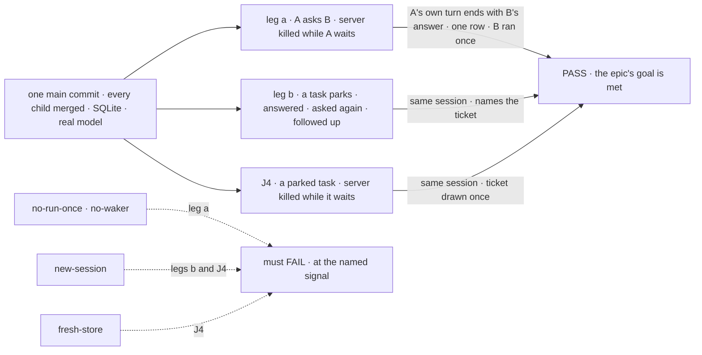

# FIX-1820 · Closure: a hand-off survives a restart and the work runs once

**Spec** · [Decisions](DECISIONS.md) · [Rules](BUSINESS-RULES.md) · [Plan](PLAN.md) · [Docs](DOCS.md)

## Four people, before and after

| Someone who… | Today | After this closes |
|---|---|---|
| **decides whether the epic is done** | Two children, each green on its own commit and its own fixture. Ask was proved on the DevTeam install, assign on a goal-local Lab, never on the same commit | One report on one `main` commit: both legs of the epic's goal, each control's FAIL, the restart journey assign never had, the seam sweep, each finding and its retest |
| **assigns a job that parks on a question, on a server that restarts** | Nothing has restarted a server while an assigned task waits for its answer. FIX-1817 left that to this issue | Proven with a real model: the server dies while the task waits, the answer still resumes the same session, and the ticket the task drew before it parked is drawn once |
| **asks a colleague who never answers, or stops the conversation** | Proven only in package tests, against a moved clock | Proven on a real server: the turn gets a timeout error within the published limit, and a stop cancels the asked task |
| **reads the docs to use ask or assign** | Five pages changed across three PRs. Nobody has followed them end to end | Each promise those pages make is mapped to a check that ran on the commit, or is a finding |

## The goal, and how we'll know it's met

**On one `main` commit, with every other child of FIX-1815 merged, a worker can ask a colleague
and continue the same turn with its real answer, or assign a task whose own session parks on a
question, carries on when answered, and still answers and takes a follow-up once finished. A
server restart during either wait loses nothing, and the work runs once.**

| Is it the right goal? | |
|---|---|
| **The real need** | The [epic's goal](../../epics/FIX-1815/SPEC.md#the-goal-and-how-well-know-its-met) on the assembled set, as [ER-16 and ER-19](../../epics/FIX-1815/BUSINESS-RULES.md#the-closure) and the [closure rule](../../../docs/contributing/orchestration.md#the-closure-issue-every-epic-ends-in-qa) ask: "Both survive a restart without doing the work twice" |
| **Smaller, and rejected** | "Re-run the two children's checks on one commit." It meets the epic's two legs as written, but leg b never restarts, so the half of the goal sentence about assign surviving a restart stays unproved. FIX-1817 named it this issue's job |
| **Bigger, and not this issue's** | Fixing anything (a gap becomes a child of FIX-1815) · parallel fan-in · the Shift Manager composer for finished tasks (FIX-1765) · FIX-1786's own closure (FIX-1797) |
| **Not done if** | Checks ran on different commits · any check ran on an in-memory store · a restart came before the hand-off instead of during the wait · a control passed, or failed at setup · the follow-up was answered by a new session · the runner wrote a row, called the waker or resumed a request · a finding was fixed in the closure PR, or is open |

Every check reads the store the dead server left and what the person's own calls returned. Each
control breaks one half of "survives a restart, runs once" and must fail at its own signal.

| How we verify | |
|---|---|
| **Goal check** | `goals/hand-offs/survives-a-restart-and-runs-once/`: one runner over the commit that runs leg a (`goals/hand-offs/ask-survives-a-restart/`, unchanged), leg b (`goals/coordinators/task-session-stays-open/`, unchanged), J4 and the stalled-ask journeys (new, in this directory), and the sweep. On demand, not a CI gate. Committed by the closure PR, whose body is the report |
| **Signal** | Leg a: its six signals, `kill:suspended` to `b:once`. Leg b: its signals `a:*` to `c:*`. J4: the server is killed while the task reads parked, and again, on a second store, just after the answer is accepted; after each restart the task completes in the session that parked, names the ticket and the region, `drawTicket` ran once, and the finished session still answers "Which ticket did you draw?" |
| **Input** | Real workers on `openai/gpt-5.4-mini`, SQLite, the server a real process killed with SIGKILL. The word, the ticket, the region and the follow-up wording are held out at run time |
| **Anti-game** | No assertion on a child's own tests. No restart before the hand-off is filed. Nothing in a runner writes a row, calls the waker or resumes a request; the only post-restart touch is the person listing tasks, as in leg a |
| **Control that must fail** | `no-run-once`: leg a FAILS *one-row*. `no-waker`: leg a FAILS *a:completed*. `new-session`: leg b FAILS *a:names-ticket*, J4 FAILS *names the ticket*. `fresh-store` (the server restarts on an empty store, as an in-memory one would): J4 FAILS *the answer is accepted*, which proves the restart is real and the store carries the wait |

## What changes

![Today: leg a on the DevTeam install and leg b on a goal-local Lab, each green on its own commit, leg b with no restart. After: one main commit and one runner. Part 1 runs both legs unchanged with the epic's controls. Part 2 is the one new journey, a parked task killed mid-wait. Part 3 has nothing left to run, because part 1 is both children's checks. Part 4 sweeps the eight seams with three neighbouring checks, the published promises and the stalled ask. A finding becomes a child of FIX-1815, blocks this issue, and sends the whole plan round again](figures/what-changes.svg)

Read the commit line: everything right of it runs together, and only the two dashed boxes are new.

## What stays as it is

- **No product work.** A gap becomes a child of FIX-1815 that blocks this issue.
- **The two children's checks** run as they are on `main`, with their own controls. A failure in
  either is a finding, never a rewrite.
- **No control switch in product code.** Every control is a scratch patch, printed in the report.

## Sign off

**[The goal](#the-goal-and-how-well-know-its-met), at that size:** both kinds, both across a
restart, one commit. If wrong: the epic wraps with assign never restarted, or waits on a journey
nobody asked for.

1. **[D1](DECISIONS.md#d1) · One closure check that runs the two children's checks as they are,
   and adds only what neither walks.** If wrong: the epic's "one goal fixture" reads as one new
   script, and we rewrite two working checks to get it.
2. **[D2](DECISIONS.md#d2) · Assign is restarted too, at two moments, with a lost-store control.**
   If wrong: a real model run per moment for a half of the goal the epic's leg b did not spell out.

**Open: [Q1](DECISIONS.md#q1)**, which of the epic's nine open newer children must be fixed before this
run. It is the one to weigh. Reasoning and what lost: [DECISIONS.md](DECISIONS.md). The cases:
[BUSINESS-RULES.md](BUSINESS-RULES.md).

Improvement · closure (QA) · `goals/` only · medium, repeats per finding · one PR after a clean
run · epic [FIX-1815](../../epics/FIX-1815/SPEC.md), closure · required · runs after every other
child merges, FIX-1816's follow-up [#3032](https://github.com/fixpoint-labs/flow-state-dev/pull/3032)
included · Linear [FIX-1820](https://linear.app/fixpoint-labs/issue/FIX-1820)
