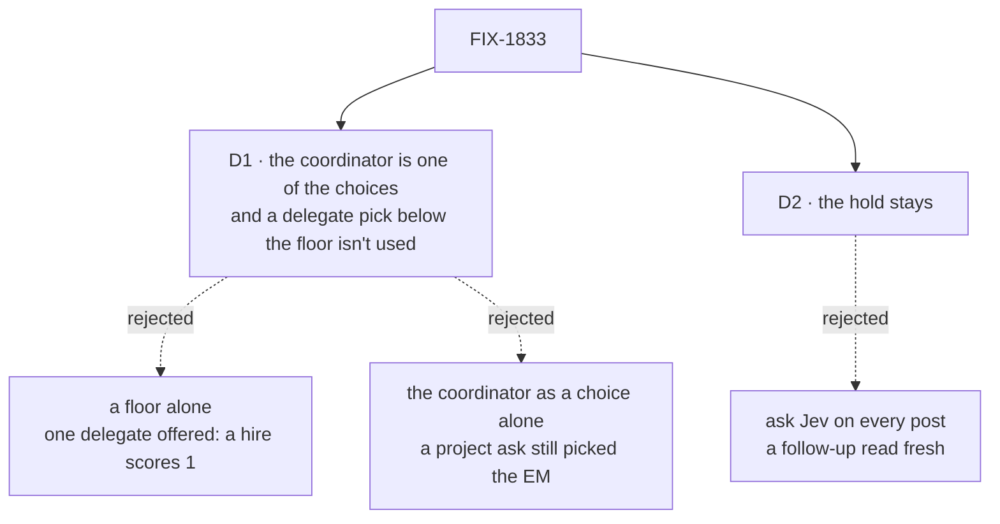

# FIX-1833 · Decisions

[Spec](SPEC.md) · **Decisions** · [Rules](BUSINESS-RULES.md) · [Plan](PLAN.md) · [Docs](DOCS.md) · [Evolution](EVOLUTION.md)

What was considered, what was chosen, why, and what each choice locks in. Two decisions are the
sign-off surface. Everything else here is context for them.

## The tree

Solid edges are what you're signing. Dashed edges lost, and the label says why.

## D1 · Best fit offers the coordinator itself as a choice, and a delegate pick below the coordinator's `minConfidence:` isn't used

| | |
|---|---|
| **Instead of** | A confidence floor alone, which is what the issue named first |
| **Because** | A floor alone can't separate the asks on the DevTeam. Best fit offers one delegate there (`eng.coder` takes tasks, not posts), and a one-option choice came back at 1 for all 16 calls, the hire included. With both delegates offered, the chief of staff's asks landed on a delegate at 0.14 to 0.68 and plain asks at 0.38 to 0.98, so they overlap ([POC](poc/jev-confidence/README.md), sets B and A). With the coordinator as a choice, Jev picked it for every one of its own asks in sets C, D and S1 (0.76 to 1), and for all but the project ask in E and F, where the floor stops the EM pick. Over 64 calls in C to F, every delegate pick on its asks was at most 0.20 and every clear plain ask at least 0.76, so 0.7 sits in the gap (sets C to F). The word and the rule are `cascadingRouter`'s `minConfidence` (tenet 1), and the shape is the epic's D8: classify first, run the agent only when no path is obvious |
| **Locks in** | Every best-fit coordinator with a description can keep a post for its own turn, which costs a model turn per kept post. A floor works only on a model that reports confidence, which today is Jev: on any other, every pick misses and goes down the ladder. The DevTeam's routing depends on the AI Gateway serving Jev; when the call fails, the post goes to the turn, which is today's behaviour, not silence |

It comes down to a hire on today's DevTeam: a floor alone delivers it to the EM at confidence 1.

No description means the coordinator is not offered ([BR-2](BUSINESS-RULES.md#who-best-fit-can-pick)).

**Ratified by the product owner on 2026-10-09:** the coordinator as a choice on every best-fit
coordinator, plus a confidence floor, on the shared ladder.

**What would change my mind:** the goal's runs showing Jev put a delegate above 0.7 for one of the
chief of staff's own asks. Then the floor isn't what keeps them apart, and the description is.

## D2 · The hold stays: a post sent while a delegate still works the person's last post goes to it, with no Jev call

| | |
|---|---|
| **Instead of** | Asking Jev about every post once the coordinator is a choice, held or not |
| **Because** | A post sent while the EM works is most often about that work, and it belongs with the EM ([FIX-1610 D1](../FIX-1610/DECISIONS.md#d1)). The hold costs no call. The window lasts while the delegate's turn runs, and it closes when the delegate answers |
| **Locks in** | In that window, an ask meant for the chief of staff goes to the delegate. The EM answers that nothing was filed, and the person asks again. The rule is the same for every best-fit coordinator |

It comes down to a follow-up about the EM's work: asking Jev again reads it fresh and can move it.

**What would change my mind:** people sending the chief of staff's own asks inside that window
often enough to notice.

## Decided, not asked

- **The floor is `minConfidence:`, a coordinator `WORKER.md` key from 0 to 1, with no default**,
  as `cascadingRouter`'s edge has none. A coordinator without it uses any delegate pick, as today.
  The DevTeam's chief of staff sets 0.7.
- **Under a floor, a pick with no reported confidence is a miss**, as `cascadingRouter` sends one
  to `ambiguous`. Unlike `cascadingRouter`, best fit does this only under a floor, so a
  coordinator without one routes as today on any model. A confidence is never defaulted (the
  evaluation seam's contract).
- **A doubtful pick goes down the ladder like any miss**: the fallback delegate first, then the
  coordinator's turn ([FIX-1791 D2](../FIX-1791/DECISIONS.md#d2)). **A pick of the coordinator
  skips the fallback**: it is an answer, not a miss.
- **Every best-fit coordinator with a description offers itself, with no opt-in key.** In the
  check, the support desk sent each of its posts to the same specialist with and without its own
  coordinator as a choice (sets K and L). It is cheap to undo: Workforce has no consumers outside
  this repo yet (epic [D9](../../epics/FIX-1786/DECISIONS.md#d9)).
- **The coordinator is offered only on a person's post.** Answers going back out between rounds
  keep today's choices; the floor applies to every round.
- **It is keyed by its worker id and picked by its description**, the way a delegate is picked by
  its note or description. A coordinator with no description isn't offered, and neither is one
  with no delegate to choose: then there is no choice to make, and today's misses apply.
- **Best fit's question asks "Who should take the post?"** *(Amended 2026-10-10, in
  implementation; this spec first kept #2955's wording.)* #2955's question asks which delegate
  should answer, which no longer fits once the coordinator is one of the choices. The POC's
  objection was to a question that *names* the coordinator: that lowered Jev's confidence on both
  kinds of ask (set S2 against S1). The new wording names nobody. On the goal it held: the chief
  of staff picked itself for its own asks at 0.8 to 1, plain asks still went to the EM, and legs
  a, c, g and h each passed 6 of 6 (#2997, `goal.md`).
- **The DevTeam's `routeModel` is `typesafe-ai/jev`.** It is the gateway's evaluation model that
  reports confidence; `openai/gpt-5.4-mini` can't evaluate through the gateway
  ([Evaluation models](../../../apps/docs/docs/fundamentals/models.md#evaluation-models)).
- **The chief of staff's description names its jobs.** With today's description the project ask
  picked the EM at 0.08 and 0; with its jobs named it picked the chief of staff at 0.96 or more
  (sets E and D). The floor covers the first case; the description makes it not happen.
- **The routing record says why best fit handed a post to the turn**, so a person reading it, and
  leg h, can tell a kept post from a miss.
- **The chief of staff's instructions keep "hand work to your delegates"**: vague asks still reach
  its turn, which still hands them on.

## Considered and dropped

| Alternative | Why not |
|---|---|
| A confidence floor alone | Can't separate on the DevTeam: one delegate scores 1 for every ask, and two delegates overlap (sets B and A) |
| The coordinator as a choice, with no floor | The project ask picked the EM at 0.08 and 0 with today's description (set E). Cheap insurance against a description that misses |
| A fixed "none of these" choice | It has nothing to pick it by. What draws a hire to the chief of staff is a description of its jobs. Not run, because the coordinator's own description is the same mechanism, with words |
| `cascadingRouter` in place of best fit's ladder | Loses the hold, the fallback and the routing record, and makes two routes to one job (tenet 3) |
| A generator, `intentRouter` | A model turn per post: the cost this removes |
| Keyword rules for hire and fire in the flow | One app's knowledge in the framework (tenet 4) |
| Keep judgment on a smaller model | Still a turn, and a line, before every delegate's answer |

## Settled

- **A floor alone can't keep a hire off the EM on today's DevTeam**, and **0.7 separates the asks
  once the chief of staff is a choice**: **CONFIRMED** by 112 Jev calls through the gateway on
  2026-10-09 ([POC](poc/jev-confidence/README.md), `results.jsonl`).
- **The shipped description holds under #2955's question**: **CONFIRMED** by 44 more calls. All
  eight asks meant for the chief of staff picked it at 0.90 to 1, and the clear plain asks picked
  the EM at 0.78 to 0.96 (`results-shipped.jsonl`).
- **Offering the coordinator itself doesn't pull posts from a desk's specialists**: **CONFIRMED**
  on the kitchen-sink support desk's descriptions, 8 of 8 posts per set to the same specialist.

## How it got here

- **Draft** — framed as best fit's misses lacking a "this is mine" and a "not sure"; a Jev check
  over the DevTeam's asks showed a floor alone can't work there, so best fit gets both: the
  coordinator as a choice, and a floor read from the confidence Jev reports. One PR, after #2955.

**Open: none.**
