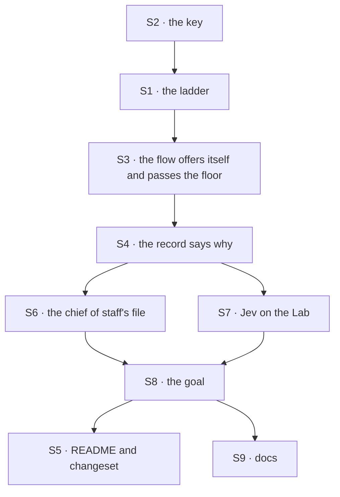

# FIX-1833 · Plan

[Spec](SPEC.md) · [Decisions](DECISIONS.md) · [Rules](BUSINESS-RULES.md) · **Plan** · [Docs](DOCS.md) · [Evolution](EVOLUTION.md)

Written for the implementing agent. IDs cross-reference [BUSINESS-RULES.md](BUSINESS-RULES.md)
(BR-n) and [DECISIONS.md](DECISIONS.md) (Dn). `tdd`. One PR, on `main` after #2955 (FIX-1828)
and #2959 (FIX-1826) merge.

## Surfaces

| ID | Package · role | Change | Rules |
|---|---|---|---|
| S1 | `workforce` · best fit's ladder (`best-fit.ts`) | The case takes two optional inputs: the coordinator's own label and a floor. The answer's `confidence` is read beside its choice (today's answer schema strips it, so widen it). A pick of the coordinator is a new placement that skips the fallback. Two new misses, `below-floor` and `no-confidence`, go down the ladder as today's do. A caller that passes neither input, the mailbox's route, places exactly as today | BR-6 – BR-12 |
| S2 | `workforce` · coordinator configuration (`coordinator-config.ts`) | `minConfidence`, optional, 0 to 1. A cross-key problem when it's set and `routing` isn't `best-fit` | BR-15 BR-16 |
| S3 | `workforce` · the coordinator flow's best-fit case and evaluator (`coordinator-flow.ts`) | On a person's post, add the coordinator to the options under its worker id, with its description, when it has one and at least one delegate is an option. Pass the floor from the worker's configuration. A coordinator pick clears the hold and goes to the judgment turn. Carry best fit's reason in the post's request state, since the judgment turn's record reads only that. #2955's question stays as it is (POC S1, S2). The recent lines and every other policy unchanged | BR-1 – BR-5 BR-7 BR-13 BR-14 |
| S4 | `workforce` · the routing record (`coordinator-route.ts`) | One optional field, `fit`, on a `by: fallback` or `by: judgment` record from best fit: the reason, and the pick, its confidence and the floor where they exist. The record schema strips unknown keys, so declare it. `missReason`'s words for the new kinds | BR-22 BR-23 |
| S5 | `workforce` · README and changeset | The coordinator section per [DOCS.md](DOCS.md). One `minor` fragment: a new configuration key and a record field | — |
| S6 | `shift-manager` · DevTeam chief of staff (`teams/devteam/workforce/org/workers/chief-of-staff/WORKER.md`) | `routing: best-fit`, `minConfidence: 0.7`, a description that names its jobs, as `SPEC.md`'s diff. The body is unchanged | BR-17 – BR-21 |
| S7 | `shift-manager` · DevTeam host (`teams/devteam/host.mts`) and README | `routeModel: "typesafe-ai/jev"`. **Remove** the comment that says the chief of staff routes by judgment. The README's DevTeam example. No changeset: `teams/devteam` isn't published | BR-17 BR-20 |
| S8 | goal · `goals/coordinators/hands-each-post-to-its-delegates/` | Legs a, b, g: **remove** `*:judgment-record`; add `*:evaluated` and `*:no-turn` (no chief-of-staff message and no tool output on the post, read the way `talk()` reads them). New leg h, four asks in one fresh conversation: a hire worded without "hire", a fire of the worker it hired, "who works here?", and a project. Leg e: a second best-fit coordinator, `desk.floor`, with `minConfidence` and a fallback, for `e:below-floor`, `e:no-confidence` and `e:self`; `desk.fit` stays without a floor so `e:evaluated` keeps proving BR-10. Controls `no-self-choice`, `no-floor`, `turn-after-route`. The `Model:` line names Jev for routing. A before-state row | All |
| S9 | Docs | Publish [DOCS.md](DOCS.md) | — |

## Sequence



## Checks

| ID | Runs after | Passes when |
|---|---|---|
| V1 | S1 | A table over the ladder: each placement and miss for BR-6 – BR-12, a coordinator pick with a fallback set goes to the coordinator, and the mailbox's existing route tests pass unchanged |
| V2 | S2 | BR-15 and BR-16 refuse with the key named; a best-fit file without the key loads |
| V3 | S3 | Scripted: the options hold the coordinator on round 0 only, and not without a description (BR-1 – BR-3); one delegate plus the coordinator still calls (BR-5); a held post makes no call (BR-13) |
| V4 | S4 | Each reason lands on the record; a judgment policy's record has no `fit` (BR-22, BR-23) |
| VE | S8 | Leg e alone (`GOAL_LEGS=e`, model-free): every assertion PASSES, then FAILS `e:below-floor` under `GOAL_CONTROL=no-floor`, and nothing else (D1) |
| VG | S8 | [The goal](SPEC.md#the-goal-and-how-well-know-its-met): every leg PASSES on Jev and the chief of staff's model, after `no-self-choice` FAILED `h:hire-turn`, `turn-after-route` FAILED `a:no-turn`, and the three existing controls failed at their legs. Legs a, c, g and h run six times with one attempt each: a, g and h pass at least 5 of 6, recorded beside FIX-1826's counts with the median Jev latency per post (D1, D2) |
| V5 | S8 | The second path: the goals that talk to this chief of staff, or run a described best-fit coordinator, PASS on the new routing: `goals/shift-manager/it-groups-workstreams-under-their-projects` (`GOAL_LEG=cos`), `goals/shift-manager/one-person-runs-a-labs-projects-and-people` (`GOAL_ONLY=legs`), `goals/shift-manager/it-briefs-and-talks-with-the-chief-of-staff` (with memory capture on, settle BR-24), and #2955's `goals/coordinators/routes-a-follow-up-by-its-conversation` |
| V6 | S8 | If FIX-1792 P1 (#2938) has merged: the kitchen-sink support desk goals PASS with `support.help` now a choice (the POC's sets K and L, on the real path) |

## Pinned names

| Where | Name | Why pinned |
|---|---|---|
| `WORKER.md` key | `minConfidence` | Public, and `cascadingRouter`'s word for the same floor |
| Record field | `fit`, with `reason` one of `coordinator`, `below-floor`, `no-confidence`, `failed`, `not-a-choice`, `no-delegates` | Public: `DOCS.md` publishes it, and leg h grades it. `below-floor` and `no-confidence` are `cascadingRouter`'s trace reasons |
| Goal | leg `h`; tags `a:evaluated`, `a:no-turn`, `h:hire-turn`, `h:fire-turn`, `h:who-turn`, `h:project-turn`, `e:below-floor`, `e:no-confidence`, `e:self`; coordinator `desk.floor`; controls `no-self-choice`, `no-floor`, `turn-after-route` | The spec's goal and the PR verdict cite them |
| Model | `typesafe-ai/jev` | The string that resolves through the gateway ([Evaluation models](../../../apps/docs/docs/fundamentals/models.md#evaluation-models)) |

Everything else is yours to name, including the coordinator pick's placement value inside the
ladder.

## Guardrails

| Rule | Because |
|---|---|
| The floor and the coordinator choice are decided in the ladder, not beside it (tenet 5) | The ladder is the one place best fit decides, shared with the mailbox's route; a check in the flow only is a second place that drifts |
| Read `confidence` from FSD's answer type, and never default it | Jev is chosen by configuration only; the evaluation seam promises no number is invented, and `no-confidence` depends on that |
| A coordinator pick never reaches the fallback delegate | The call answered that the post is the coordinator's. A fallback there would undo the answer |
| The turn gets the person's post exactly as under judgment | The issue promises "its own turn, unchanged" |
| The choices and the floor come from the worker's configuration and the roster, never from the post (BP-031) | The post is caller-controlled text |
| The legs grade the routing record and the conversation's lines, not the evaluator's trace | That is what a person sees, and what a hollow pass would have to fake |

## Docs

Reconcile and publish [DOCS.md](DOCS.md) after VG passes, through `docs-writer` and then
`docs-editor`. Its operations own the prose; this plan only sequences it.

## Sketch · pseudocode, illustrative, react to the shape

```
best fit's ladder, given the case (options, held, fallback, + the coordinator's label, + the floor):
    held                          → that delegate, no call                 (as today, D2)
    call failed / not a choice    → miss                                   (as today)
    chose the coordinator         → the coordinator's turn, no fallback    (D1)
    chose a delegate:
        floor set, no confidence  → miss "no-confidence"
        confidence < floor        → miss "below-floor"
        otherwise                 → that delegate                          (as today)
    miss → the fallback delegate if reachable, else the coordinator's turn (as today)
```

**POC:** [`poc/jev-confidence/`](poc/jev-confidence/README.md), 156 calls to Jev through the
gateway. It refuted a floor alone on the DevTeam, confirmed 0.7 with the coordinator as a
choice, and held on the shipped description under #2955's question. D1 rests on it.

## At implement time

- **#2955 (FIX-1828)** changes best fit's evaluation state to `{ recent, post }`. Build on it.
  The POC asked with an empty `recent`; a follow-up with lines may score differently, which VG's
  leg b exercises.
- **#2959 (FIX-1826)** moves the chief of staff to Claude Haiku 5.5. Build on whichever `model:`
  `main` holds, and say which in the verdict.
- **Checked at spec time:** `eng.coder` is never a best-fit choice (its flow isn't a delegate
  flow, so the post check skips it), and a coordinator named in its own `delegates:` is skipped
  the same way. Re-check if either changes.
- **#2938 (FIX-1792 P1)** puts the kitchen-sink desk on best fit; V6 applies once it merges.
- Compare [Evolution](EVOLUTION.md)'s predecessor rules with the code before changing them.

## Follow-ups

- If D2 flips: ask Jev about a held post when the coordinator is a choice. Not filed.
- FIX-1792 removes the mailbox's caller of the ladder; the two optional inputs then have one caller.
