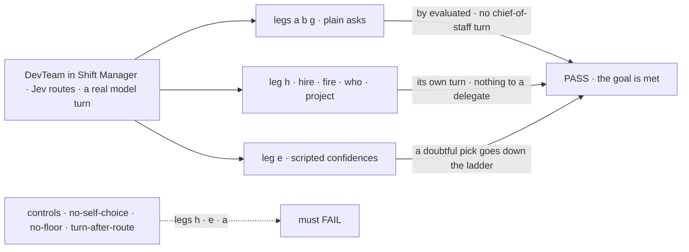
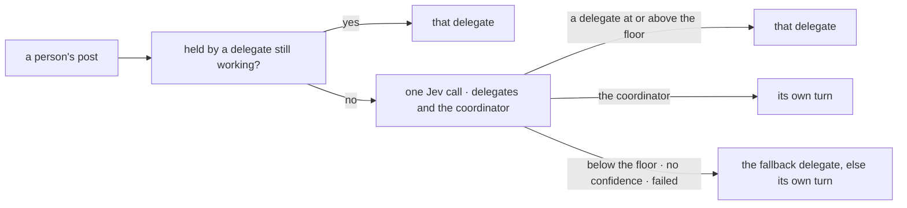

# FIX-1833 · Chief of staff routes plain asks through Jev, falling back to its own turn when unsure

**Spec** · [Decisions](DECISIONS.md) · [Rules](BUSINESS-RULES.md) · [Plan](PLAN.md) · [Docs](DOCS.md) · [Evolution](EVOLUTION.md)

## Five people, before and after

| Someone who… | Today | After |
|---|---|---|
| **asks the DevTeam chief of staff to file a feature** | Its model turn reads its delegates, hands the post to the EM and writes a line. Then the EM answers | One Jev call puts the post on the EM, whose answer is the first line after it |
| **asks it to hire, fire, start a project, or say who works here** | Its model turn does it | The same turn does it: Jev picks the chief of staff itself (0.90 to 1 in the [check](poc/jev-confidence/README.md), with the description it ships) |
| **asks something vague** ("can engineering pick this up?") | Its turn decides | Jev's pick is below the 0.7 floor, so its turn decides |
| **runs another best-fit coordinator**, such as a support desk | Any pick is used, at any confidence | The coordinator is one of the choices. With `minConfidence:` set, a doubtful pick goes to the fallback or the turn |
| **reads the routing record** | `by: judgment` on every post | `by: evaluated` when routed; `by: judgment` with best fit's reason otherwise |

Asked for on 2026-10-09 under epic [FIX-1786](../../epics/FIX-1786/SPEC.md), whose
[D8](../../epics/FIX-1786/DECISIONS.md#d8) has a coordinator classify first.

## The goal, and how we'll know it's met

**A plain ask to the DevTeam chief of staff reaches the delegate that does it with no
chief-of-staff turn in between, and every ask meant for the chief of staff (hire, fire, start a
project, change or list its delegates) still reaches its own turn.**

| Is it the right goal? | |
|---|---|
| **The real need** | [The issue](https://linear.app/fixpoint-labs/issue/FIX-1833): a plain ask Jev is confident about goes straight to the delegate; "anything else … reaches the chief of staff's own turn, unchanged" |
| **Smaller, and rejected** | "Best fit honours a floor", a floor alone. On the DevTeam it never fires: one delegate is offered, and Jev scores every ask 1, a hire included ([POC](poc/jev-confidence/README.md), set B) |
| **Bigger, and not this issue's** | Asking Jev about a held post ([D2](DECISIONS.md#d2)) · the chief of staff's own jobs without a model turn |
| **Not done if** | Legs a, b or g pass by the judgment turn · a hire, fire, project or "who works here?" ask reaches a delegate · leg h passes only on asks that name their job · the routing ran on anything but Jev · a control passed · legs a, g or h pass fewer than 5 of 6 single attempts |



The legs read the routing records and the lines, so a turn in between shows. Each control
removes one half of the change and must fail at its leg.

| How we verify | |
|---|---|
| **Goal check** | `goals/coordinators/hands-each-post-to-its-delegates/`, extended · `typesafe-ai/jev` routes through the AI Gateway (`AI_GATEWAY_API_KEY`), floor 0.7 from the shipped `WORKER.md`; the chief of staff's own model takes the turn · up to 3 attempts per leg, as today · the implementer, at completion · verdict in the implementation PR, naming the model the route evaluation's trace reports |
| **Signal** | **a, b, g**: `a:evaluated`, one record `by: evaluated` to `eng.em`; `a:no-turn`, no chief-of-staff line and no tool call on the post; every other assertion as today. **c, d, f**: unchanged, now reached through best fit. **h** (new, a fresh conversation): `h:hire-turn` one hire and no delivery, the record `by: judgment` with a `fit` reason; `h:fire-turn`, `h:who-turn`, `h:project-turn` the same for a fire, "who works here?" and a project. **e**, on a second coordinator `desk.floor`: `e:below-floor`, `e:no-confidence`, `e:self`. The rate of legs a, g and h over six single attempts is recorded beside FIX-1826's |
| **Input** | Wording and slugs held out, as today; leg h's job, worker and project title too. Leg h's hire ask doesn't use the word "hire" ("bring someone on to…"). Another wording must pass |
| **Anti-game** | No scripted evaluator outside leg e, and no routing on keywords. The floor and the choices come from the shipped `WORKER.md`. Grades read the store through the install's routes, as today |
| **Control that must fail** | `no-self-choice`: leg h FAILS `h:hire-turn`, the hire delivered to `eng.em` (one delegate offered scores 1). `no-floor`: leg e FAILS `e:below-floor`. `turn-after-route`: the turn also runs after a delivery, and leg a FAILS `a:no-turn`. The three existing controls as before. Today's `main`: a, b, g FAIL `a:evaluated` |

## What changes


Read the second column. Today the chief of staff's own turn decides every post; after, one Jev
call decides, and the turn runs only for what is its own or what Jev is unsure of.

**The chief of staff's file, and the Lab's one line:**

```diff
  ---
- description: The person's one point of contact, and the one seat that hires workers of their own.
+ description: The person's one point of contact. Hires and fires workers, starts projects, and answers questions about the team, its workers and its delegates.
  flow: coordinator
- routing: judgment
+ routing: best-fit
+ minConfidence: 0.7
  delegates: [eng.em, eng.coder]
```

```diff
  defineCoordinatorFlow({
    installation,
    delegateFlows: [agentKind, emKind as never],
-   routeModel: "openai/gpt-5.4-mini",
+   routeModel: "typesafe-ai/jev",
```


Position is confidence. Only the bottom panel puts every misroute left of the floor and every
clear plain ask right of it.

## How a post is placed



The new parts are the coordinator as a choice and the floor; the rest is best fit as it ships.

## What stays as it is

- **The chief of staff's turn**: instructions, tools and model. It still hands on a vague ask.
- **The hold.** A post sent while a delegate still works the last one goes to it, with no call
  ([D2](DECISIONS.md#d2)). That is the one window where a hire can land with the EM.
- **The fallback ladder** ([FIX-1791 D2](../FIX-1791/DECISIONS.md#d2)), the other policies, and
  the mailbox's route.
- **A coordinator with no `minConfidence:`** uses any delegate pick, as today.
- **The recent lines** a post carries ([FIX-1828](https://linear.app/fixpoint-labs/issue/FIX-1828)), and best fit's question.
- **Not the same: memory.** With memory capture on, a post routed straight to a delegate runs no
  chief-of-staff turn, so the chief of staff likely records nothing of it (BR-24).

## Sign off

**[The goal](#the-goal-and-how-well-know-its-met), at that size:** plain asks skip the turn, and
its own asks still reach it, on Jev and a real turn. If wrong: we drop hires, or ship a floor
that never trips.

1. **[D1](DECISIONS.md#d1) · Best fit offers the coordinator itself as a choice, and a delegate
   pick below the coordinator's floor (0.7 here) isn't used.** If wrong: every best-fit
   coordinator can keep posts for its own turn, and a floor works only on a model that reports
   confidence.
2. **[D2](DECISIONS.md#d2) · The hold stays: a post sent while a delegate still works goes to it,
   with no Jev call.** If wrong: a hire sent in that window lands with the EM, and the person asks
   again.

**Open: none.** D1 is the one to weigh: [DECISIONS.md](DECISIONS.md).

Feature · `workforce` + `shift-manager` + one goal · medium: 9 surfaces, 8 checks, 3 docs pages and 2 READMEs · 1 PR · epic FIX-1786 · after #2955 and #2959
