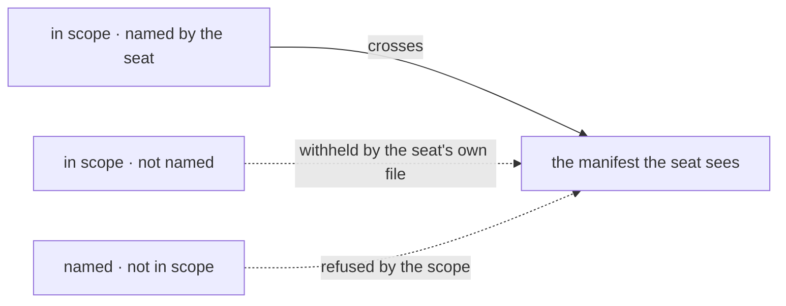

# FIX-817 · Business rules

[Spec](SPEC.md) · [Decisions](DECISIONS.md) · **Rules** · [Plan](PLAN.md) · [Docs](DOCS.md) · [Evolution](EVOLUTION.md)

The cases, written as rules. Each says what a person or the system does and what happens. The
*proved by* column is the check the plan runs. A human reviews this page; the plan turns it into
work.

## Asking what is in scope

| # | When | Then | Proved by |
|---|---|---|---|
| BR-1 | A seat asks with no domain named | Every domain it is scoped to, thin entries, in a stable order | CI |
| BR-2 | A seat asks for one domain | Only that domain's entries | CI |
| BR-3 | A seat asks for a domain that has no source registered | An empty result for that domain, not an error. A workforce with no channels is an ordinary state | CI |
| BR-4 | A seat asks for a domain name that does not exist | The known domain names are returned in the error text, so the next call can succeed. Never a throw that ends the turn | CI |
| BR-5 | A domain's underlying reader throws | That domain reports a problem and the other domains still answer. One broken reader does not make the whole door useless | CI |
| BR-6 | Two sources register the same domain name | Refused where they are registered, naming both, not at first call | CI |

## What a seat is allowed to see

| # | When | Then | Proved by |
|---|---|---|---|
| BR-7 | A skill is `disable-model-invocation` | Absent from the skills manifest. Not present-and-flagged | CI |
| BR-7a | A skill is enabled, but the generator's binding has an `allowed` set that excludes it, or its mode is not `inline` | Absent from the skills manifest. Discovery must match what `loadSkill` will actually accept — `buildLoadCatalogContext` already filters the ambient catalog on both, and a door built on `listEnabledSkills` alone would advertise a skill the binding refuses | CI · the refused case is the one to assert |
| BR-8 | A resource collection is not `llmReadable` | Absent from the resources manifest, and the collection is never enumerated to find that out | CI |
| BR-8a | A collection is externally backed and **is** `llmReadable` | Present in the resources manifest. `collectReadableResources` reaches only static resources and `collectCollections`, and `collectCollections` drops external refs (`isExternalRef`) — so a manifest built on that helper alone would report an in-scope resource as absent. A manifest that lies by omission is worse than none; the external collections are reached too (`collectExternalCollections`) | CI · assert an external `llmReadable` collection appears |
| BR-9 | A seat's own file names a `discover:` list | It sees those domains and no others. A domain it did not name is absent, not empty-with-a-reason | CI |
| BR-10 | A seat's file names no `discover:` key | It sees every domain its scope carries — today's reach, unchanged | CI |
| BR-11 | A seat names a domain in `discover:` that its scope does not carry | It still sees nothing for that domain. A seat file adds selection, never reach (the `seat-capabilities` rule) | CI |
| BR-12 | Any manifest is read | It is computed from the domain's reader at call time. No row is written anywhere | CI |
| BR-12a | A channel was opened and has since closed, or a seat was registered and is no longer declared | Absent from the manifest, or present and explicitly marked not-current. **Found in review:** inventory rows are append-only — `open-inventory.ts` says "Nothing is ever deleted. A row means *was registered in this org*, not *still declared*", and the docs confirm there is no reconcile pass — so `openedAt` with no `closedAt` cannot by itself mean live. An orchestrator must never be handed a closed channel as somewhere to send work | CI · the closed-channel case is the one to assert |

The fence is the scope. A seat's `discover:` list narrows what crosses it and can never widen it
— that is BR-11, and it is the same rule seat capabilities already follow. The mermaid below is
the same three paths by name.

## Living beside what already ships

| # | When | Then | Proved by |
|---|---|---|---|
| BR-13 | An app that installs the skills capability today upgrades | The catalog still reaches the prompt exactly as before. Nothing about turn 1 changes | CI, against the existing skills suite |
| BR-14 | That app turns the catalog preset off | The catalog leaves the prompt, and the door is how the model finds skills | CI |
| BR-15 | An inventory row was written before this change | It reads and projects normally. Missing optional fields `== null`-guard rather than failing the entry (BP-030) | CI |
| BR-16 | An app calls `createWorkforceCapability({ agents })` | It fails to type-check with a message naming the replacement. A removed key is refused loudly, never silently ignored (BP-030) | CI |
| BR-17 | Anything in the repo called `resourceTools().listResources` | Nothing does. Its removal breaks no caller | CI · the census asserts the count is zero |
| BR-18 | A model calls `globResources` with a null pattern, or one matching a non-`llmReadable` collection | Only `llmReadable` resources come back. **Found in review:** this is a *second* ungated enumerator — its own header says "no `llmReadable` gate" and it calls `collectAllResources` — and unlike `listResources` it has a live caller (`examples/knowledge-base`). So it is **gated, not removed**: closing the leak means closing both, or the door ships beside an open path | CI · the non-readable collection must be absent from the glob result |

## Failure taxonomy

Nothing here is fatal to a turn. An unknown domain, an empty domain and a reader that throws all
degrade to a partial answer the model can act on — that is BR-3 through BR-5, and it is
deliberate: a planner that loses its turn because one collection was misconfigured is worse than
one that plans with three domains out of four. The two loud failures are both at **declaration**
time, not call time: a duplicate domain name (BR-6) and a removed capability option (BR-16).
Nothing retries; a manifest read is cheap enough to simply be made again.

## Acceptance criteria this issue owns

An orchestrator seat, given a workforce it did not write and a task naming no assignee, asks the
door what is in scope, and assigns the task to the seat whose manifest entry answers for that
work — on a real model, without the roster ever appearing in its system prompt. That is the goal
check the plan runs last, and the control is the same run with the manifest entries' purpose
fields blanked, which must fail to route.
