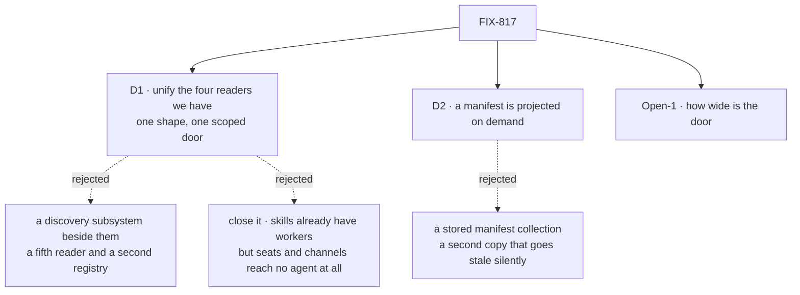

# FIX-817 · Decisions

[Spec](SPEC.md) · **Decisions** · [Rules](BUSINESS-RULES.md) · [Plan](PLAN.md) · [Docs](DOCS.md) · [Evolution](EVOLUTION.md)

Two decisions and one open fork are the sign-off surface. Everything else is context for them.

## The tree

Solid edges are what you're signing. Dashed edges lost, and the label says why. `Open-1` is not
settled and is asked in full below.

## D1 · This ships as a unification of the four readers that already exist — one manifest shape and one scoped door — not as a new discovery system

| | |
|---|---|
| **Instead of** | Building the ticket as written: manifests *and* introspection tools as a new concept over the domains, with `AgentRegistry` / `materializeAgent` as the roster path |
| **Because** | Every domain the ticket names already has a working reader. A census of the repository ([`poc/manifest-surface-census/`](poc/manifest-surface-census/census.mjs)) finds all four, finds **zero** scoped on-demand doors, and finds that what reaches a model today is either an ambient prompt dump or one ungated full-state enumerator with **no caller anywhere in the repo**. The gap is a missing *shape*, not a missing capability — which is what locked distinction 1 asks for |
| **Locks in** | One door for every domain, forever. A domain that later wants a different discovery contract must widen a shape four domains share, which is slower than adding a fifth bespoke reader would have been. That is the price of not shipping a second system per domain, and we are paying it deliberately |

This answers the ticket's own question from 2026-07-20 — *"skills already have workers; is this
a new concept or an improvement of the existing?"* Against the code it is an improvement. Skills
do have workers, and skills are also the **only** domain whose catalog reaches a model at all —
by being pasted into the prompt on every generator step, the first thing the invent-kill bans.
Seats and channels reach no agent by any path. Resources reach one through a tool that ignores
its own module's readable gate and that nothing calls. So the honest scope is smaller than the
ticket: four existing readers get one shape and one door, and the surface that does it wrongly
is deleted.

**What would change my mind:** evidence that an orchestrator needs materially different contract
per domain — that choosing between seats and between skills are different enough that one entry
shape makes both worse. Then this is two surfaces and the unification is the wrong frame.

## D2 · A manifest is projected from its domain's existing reader when asked, never stored as a second copy

| | |
|---|---|
| **Instead of** | A manifest collection each domain writes into, so a read is a plain row lookup |
| **Because** | A stored manifest is a cache with no invalidation story. Seats are hired at boot, channels open and close mid-flow, skills are enabled and disabled at runtime — a copy would be wrong in exactly the cases an orchestrator plans against. FIX-1405 already learned this, shipping a declared layer *and* a live layer because a file-time answer wearing a live name is worse than no answer |
| **Locks in** | Read cost tracks the underlying reader, so a domain with an expensive reader makes discovery expensive and the fix has to be in that reader, not in a cache we control. It also settles that **FIX-1405's inventory feeds the seats/channels manifest rather than being it** |

The second half closes an open wall. The inventory rows carry `{id, kind}` for a seat and
`{id, kind, members, openedAt}` for a channel — **join keys**, nothing an orchestrator could plan
*against*. A manifest entry must carry purpose. So 817's shape generalizes the **declared** layer
across domains, and takes its join keys from 1405's rows.

**What a manifest entry therefore means: registered or declared — never "currently open."** The
inventory is append-only. `open-inventory.ts` states "Nothing is ever deleted. A row means *was
registered in this org*, not *still declared*", and the workforce docs confirm there is no
reconcile pass and no removal call: there is an `openedAt` and no `closedAt`. So a row's
existence cannot carry liveness, and this spec does not pretend otherwise — the projection says
what was registered, and neither the entries nor the docs claim a thing is open, live or still
there ([BR-12a](BUSINESS-RULES.md)). **True liveness — a tombstone on close, or a
session-existence filter at projection time — is a follow-on and deliberately outside this
ship:** it means mutating the inventory, which is the one thing D2 promises not to do.

> **Confirmed, then partly retracted — see [Settled](#settled).** The *feeds-not-is* reading was
> stamped by the FSD Architect; the liveness half of that same stamp was withdrawn by the
> Architect ten minutes later, on the evidence above.

## Decided, not asked

- **"Manifest" already means two things here and this adds a third — keep the word, disambiguate
  it.** `ResourceManifest` is **client-facing and flow-static**; `WorkerManifest` /
  `ChannelManifest` are **on-disk records**; this one is **model-facing and runtime**. Three
  readers, one noun. The Architect's vocabulary fence pins *manifest* here and a fence is not
  ours to re-open, so the new surface never uses the bare word: a source produces **manifest
  entries**, `ResourceManifest` is untouched, and the docs pages cross-link. Flagged to the
  Architect as a coherence finding (tenet 1).
- **Door B's boundary is already drawn.** Locked distinction 2 settles it: FIX-1388 installs and
  selects at author/boot; this answers *what is in scope for me now*. An open wall on the
  ticket, but the fence answers it, so it is not a fork for the owner.
- **The refreshed `createWorkforceCapability` stays in `workforce`** — the other open wall, and
  the code closes it: the function is already exported, as a **dead stub** with a `TODO`.
  Refreshing the door that exists beats minting a second beside a stub.
- **Its `agents: Agent[] | AgentRegistry` option is removed.** `AgentRegistry` is in the
  invent-kill, and a parameter whose only behaviour is a duplicate-name check over dying
  vocabulary is the dead path under a new name (tenet 3). Narrow: the skills delegation path
  still uses the type and is untouched — see [EVOLUTION.md](EVOLUTION.md).
- **Capabilities and tools get no domain of their own.** A generator already receives its tool
  list from the provider; what another seat can do belongs on that seat's entry. Four, not six.
- **Boards and tasks are not a fifth domain.** FIX-1482's deterministic board/task work-query
  stays its own surface: it answers *what work is queued for me*, which is a query over rows an
  orchestrator acts on, not a catalog of what exists to plan against. Folding it into this door
  would put a work queue behind a discovery enum and make both harder to change. The door stays
  at four domains.
- **The skills catalog context stays on by default** — otherwise every app that upgrades gets a
  model that does not know its skills exist (BP-030).

## Considered and dropped

| Alternative | Why not |
|---|---|
| **Close the issue — skills already have workers** | The strongest form of the owner's question. It fails on two domains: seats and channels reach no agent by any path, and the census proves it |
| **Ship it as written — a new manifest/introspection concept** | Adds a registry beside four working readers: the "second discovery system per domain" the invent-kill names, reached by another road |
| **Just fix `listResources`** — gate it, trim the payload | Cheapest by far, and it covers one domain of four. Seats, channels and skills still have nothing |
| **A `listX` family with no shared shape** | Open-1's losing half. As the *default* it fails locked distinction 1 outright |
| **Store manifests in a collection per domain** | D2's rejected branch. A stale roster is worse for a planner than a slow one |

## Open

### How wide is the door — one tool that takes a domain, or one tool per domain, and how much does each entry carry?

**In plain terms.** When a seat asks what it can work with, does it call one tool and name the
kind of thing (`discover({ domain: "seats" })`), or a family of separate tools (`listSeats`,
`listChannels`, …)? And either way, how much does an entry say — a one-line purpose, or a
fuller contract?

**The trade-off.** One tool keeps the surface at one slot and makes the shared shape real, but
models pick the right tool more reliably than the right enum value, so discovery may get used
less. A family is easier to use well and self-documents in the tool list, but it is four slots
in every prompt, four payloads that can drift, and it reads like the per-domain system the
fences ban even when it isn't one. On depth, a thin entry risks a second round-trip; a fat one
costs tokens on every call.

**My recommendation: one tool, with a `detail` argument defaulting to thin.** It is the only
option that makes locked distinction 1 true in the surface a user sees rather than only in our
types, and `detail` turns the depth question from a design fork into a per-call choice.

**What would change my mind.** A run showing a model reliably failing to reach the right domain
through the enum — asking for skills when it wanted seats, or not calling at all where a named
`listSeats` would have been called. That is measurable, and [PLAN → VO](PLAN.md#checks) measures
it before this ships rather than arguing it.

**What being wrong costs.** Small one way, expensive the other. Going one tool → four is
additive and the entries keep their shape, so nothing a caller stored becomes wrong. Going four
→ one is a breaking change to a model-facing surface apps have written prompts against. The
cheap mistake is to start narrow, which is what the recommendation does.

## Settled

- **FIX-1405's inventory feeds the seats/channels manifest; it is not the manifest.** D2's second
  half, confirmed by the FSD Architect in the coherence review on the spec PR
  ([#1981, 2026-09-20](https://github.com/fixpoint-labs/flow-state-dev/pull/1981#issuecomment-5753626408)).
  Inventory rows supply **join keys** — `{id, kind}` for a seat, members and `openedAt` for a
  channel — while the purpose / plan-against contract is this ticket's. The reading matches
  FIX-1916's D3 / ER-3 contrast and the shipped FIX-1405. This half stands; the *liveness* half
  of the same stamp does not, and its retraction is recorded immediately below. Resolved with
  evidence: do not reopen.
  - **The liveness half of that stamp was retracted by the Architect, and D2 was rewritten to
    match.** Review found the rows are **append-only** — `open-inventory.ts`: "Nothing is ever
    deleted. A row means *was registered in this org*, not *still declared*"; the workforce docs:
    "There is no reconcile pass, no removal call" — so `openedAt` with no `closedAt` cannot mean
    live, and a closed channel would have projected as somewhere to send work. Put back to the
    Architect, who withdrew that half in the same review
    ([#1981, 2026-09-20](https://github.com/fixpoint-labs/flow-state-dev/pull/1981#issuecomment-5753672402)):
    *"Prior stamp that 1405 supplies the liveness half is wrong given `open-inventory` never
    deletes ("was registered" ≠ still open). Closed channels must not project as present."* The
    ruling takes the **narrow contract**: a manifest entry is a *registered / declared*
    projection, entry and doc copy never claim open or live from inventory alone
    ([BR-12a](BUSINESS-RULES.md)), and true liveness is a follow-on rather than a widening of
    this PR into inventory mutation. Recorded rather than quietly amended: the reading was
    stamped, then withdrawn, and a future reader should see both.
- **The census re-derives D1's factual base — after a review round found it aborting, and fixed
  it.** Review reported that the walk followed symlinks into `node_modules`, so on any checkout
  that had actually installed it died with an uncaught `ELOOP` before printing a verdict. That
  was real: a bare checkout hid it, and it reproduced the moment a pnpm-style symlink loop was
  planted. `PLAN.md → V7` makes this script the ongoing factual gate, and a gate that aborts is
  not a gate (BP-003). The walk now refuses symlinks and skips `node_modules`, and the fix was
  proved against the planted loop rather than the bare tree: green end to end (0 doors, 1 ungated
  enumerator — `listResources` — 0 callers of `resourceTools()`), with `--plant` still going red
  on the totality assertion. **The counts D1 rests on did not move.** Resolved with evidence.
- **The census's totality assertion was structurally broken, and is now repaired.** Three defects,
  all found in review and all fixed on this branch. (a) **Claim 3a was false.** `globResources` is
  a *second* ungated enumerator — its own header says a null pattern lists everything with "no
  `llmReadable` gate", and it calls `collectAllResources` — but `census.mjs` hand-labelled it
  `"content"`, which is the only reason the claim ever read "exactly one". Unlike `listResources`
  it has a live caller, so the spec now **gates** it rather than removing it ([BR-18](BUSINESS-RULES.md)),
  and Claim 3a asserts both. (b) **The scan could not see computed names.** Twelve tools are built
  as `name: named("…")` in `task-tools-capability.ts` — `listTasks`, a real enumerator, among them
  — and the regex never found them; the scan now covers both construction forms, and the tool
  count moves 24 → 32. (c) **The negative control did not test the scanner.** `--plant` wrote
  straight into the results map, downstream of the regex, so it could go red while a genuinely
  unfindable tool stayed invisible — the exact failure the control exists to prevent, inside the
  control (BP-003). It now plants a real source file into a scan root and is removed in a
  `finally`. **D1's direction is unchanged and arguably stronger:** two ungated enumerators is a
  better argument for one gated door than one was.
- **The census's totality claim is narrowed to what it proves.** The scan matches
  `name: "identifier"` and cannot match a hyphen, so it rested on an unstated convention:
  model-facing tools are camelCase, kebab-case `name:` values are block names. The excluded
  kebab names are `handler({...})` blocks, not doors, so Claim 2's "zero doors" is not falsified
  — but the header claimed more width than the scan had. The claim and its dependency are now
  stated in the header. Scope unchanged. Resolved with evidence.

## How it got here

- **Draft** — framed from the code rather than the ticket: a census found all four domain readers
  already shipping and zero scoped doors, so the problem is a missing shape and the spec is
  scoped as a unification plus one removal, not as a new discovery concept.
