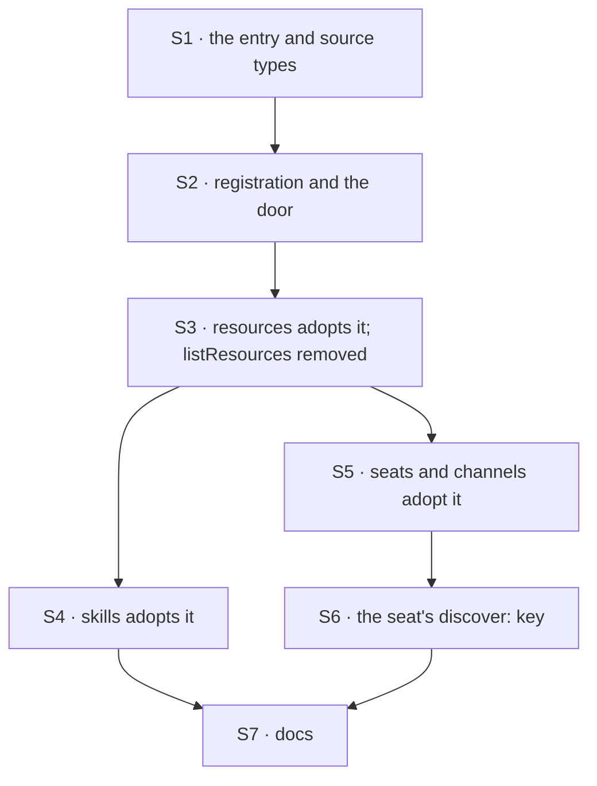

# FIX-817 · Plan

[Spec](SPEC.md) · [Decisions](DECISIONS.md) · [Rules](BUSINESS-RULES.md) · **Plan** · [Docs](DOCS.md) · [Evolution](EVOLUTION.md)

Written for the implementing agent. IDs cross-reference [BUSINESS-RULES.md](BUSINESS-RULES.md)
(BR-n) and [DECISIONS.md](DECISIONS.md) (D-n). `tdd`. **Two PRs**, seam at S3 → S4: the shape,
the door and its first adopter ship and are usable before any other domain adopts it.

## Surfaces

| ID | Package · role | Change | Rules |
|---|---|---|---|
| S1 | `contracts` · the shared record | The manifest entry shape — identity, kind, purpose, optional contract hints — and the type of a source producing entries for one domain. Zero-dep, node-free, re-exported by `core` | BR-12 |
| S2 | `core` · the scope's resource registry and the tool surface beside it | Register a **source** per domain the way a resource registers today; build the door over what the registry carries. Gated at the registry, not filtered in the tool | BR-1 BR-2 BR-3 BR-4 BR-5 BR-6 BR-12 |
| S3 | `core` · `resourceTools()` | **Remove `listResources`** — the ungated full-state enumerator the door replaces, called by nothing (BR-17). Add the resources source in its place, over the existing `collectReadableResources`, which already gates | BR-8 BR-17 |
| S4 | `orchestration` · the skills capability | Add the skills source over the existing `listEnabledSkills` — no new reader. Move the ambient catalog formatters behind a preset defaulting **on**, so today's apps are unchanged | BR-7 BR-13 BR-14 |
| S5 | `workforce` · `createWorkforceCapability` | **Refresh the stub.** Install the seats and channels sources, projecting the declared roster and FIX-1405's live inventory rows (D2). **Remove** its `agents: Agent[] \| AgentRegistry` option, the dead duplicate-name check, the unused `catalog` field and the `TODO` | BR-15 BR-16 |
| S6 | `workforce` · the worker file | A `discover:` key selecting which domains this seat sees. Adds selection, never reach — reuse the path `seat-capabilities.ts` already enforces rather than writing a second one | BR-9 BR-10 BR-11 |
| S7 | Docs | [DOCS.md](DOCS.md)'s operations. One `minor` changeset for `core`, `orchestration`, `workforce`; `contracts` too if it publishes | — |

## Sequence



### PR plan

| id | deliverables | depends_on |
|---|---|---|
| PR-1 | S1 · S2 · S3 | — |
| PR-2 | S4 · S5 · S6 · S7 | PR-1 |

PR-1 is independently shippable: it lands the shape, the door and one working domain, and it
removes a public export — the change most worth reviewing on its own.

## Checks

| ID | Runs after | Passes when |
|---|---|---|
| V1 | S2 | BR-1 BR-2 BR-3 BR-4. An unknown domain names the known ones; an empty domain is empty, not an error |
| V2 | S2 | BR-5 BR-6. A throwing reader leaves the other domains answering; a duplicate domain is refused at registration, naming both sites |
| V3 | S3 | BR-8 BR-17. A non-`llmReadable` collection is absent **and never enumerated** — assert the collection's `list` was not called, not merely that its rows are missing. `listResources` is gone and nothing imports it |
| V4 | S4 | BR-7 BR-13 BR-14. The existing skills suite passes untouched with the preset on (the second path, BP-035: run the off state too) |
| V5 | S5 | BR-15 BR-16. A row written without the newer optional fields still projects; the removed `agents` key fails to type-check with a message naming the replacement |
| V6 | S6 | BR-9 BR-10 BR-11. The add-never-widen case is the one to get right: a seat naming a domain its scope lacks still sees nothing |
| V7 | S2, re-run at S5 | The census under `poc/manifest-surface-census/` re-run with the classification updated: the door count goes **0 → 1** and totality still holds. This is the spec's own factual base, kept honest against the change that invalidates it |
| VG | S6 | **Goal, real model.** An orchestrator seat, a workforce it did not author, a task naming no assignee: it calls the door and assigns to the seat whose entry answers for that work, with no roster in its prompt. **Control:** the same run with purpose blanked must fail to route — a goal check whose red state was never produced is not evidence (tenet 7) |
| VO | VG | **Open-1's measurement.** Run VG both ways — one tool with a domain argument, and a `listX` family — and record whether the model reaches the right domain. Feeds the fork; does not gate the merge |

## Pinned names

| Where | Name | Why pinned |
|---|---|---|
| Domain keys | `seats` · `channels` · `skills` · `resources` | Model-facing. They appear in a tool argument or a tool name either way, and in a seat's file |
| Worker file key | `discover:` | Authored by a human in `WORKER.md`; renaming it later breaks files on disk |

**Deliberately not pinned: the door's tool name and argument shape** — that is
[Open-1](DECISIONS.md#open-1), the owner's call. Build S2 so one registry and one entry shape
serve either answer: a source must not know how many tools sit in front of it. Everything else
is yours to name.

## Guardrails

| Rule | Because |
|---|---|
| The gate lives at the registry, never in the tool (BP-031) | A domain argument is model-supplied. If the tool filters, a seat that names something out of scope reaches it; if the registry does, it cannot. BR-11 is the case |
| A non-readable collection is skipped **before** it is listed | Not tidiness: a lazy or broken collection must not be bulk-loaded to discover it was never allowed. `collectReadableResources` already does this; V3 asserts the call did not happen |
| Every source registers through the one registration point (tenet 5) | BR-6 is an invariant, and an invariant enumerated at one entry point while a second writer exists is our most expensive defect class. Name every registration site, including ones capabilities do internally |
| The four readers are not modified | D1's whole claim is that the capability exists and the shape does not. A change that edits a reader has stopped being a unification |
| A removed key fails loudly; a missing optional field does not (BP-030) | BR-16 and BR-15 are the two halves. `agents` was public, so its removal must be a type error with a pointer, not a silent ignore |
| The catalog preset ships **on** | BR-13. An app that upgrades and finds its model no longer knows its skills exist has been broken by a refactor it did not ask for |

## Docs

Reconcile and publish [DOCS.md](DOCS.md) after V6 passes and the door's final shape is known —
its prose names the tool, so it cannot be finished before [Open-1](DECISIONS.md#open-1) is
answered. This plan only sequences publication.

## Sketch · pseudocode, illustrative, react to the shape

```
a manifest source, per domain:
    domain:  "seats"
    entries: (ctx) -> for each row the domain's EXISTING reader returns:
                          { id, kind, purpose, contract? }        ← no new reader

registration, beside how a resource registers today:
    the scope declares which sources it carries          ← the fence (BR-11)

the door, on demand:
    asked with no domain   -> every source the scope carries        (BR-1)
    asked with a domain    -> that source, if the scope carries it  (BR-2, BR-11)
    a source that is absent -> empty                                (BR-3)
    a source that throws    -> that domain reports; others answer   (BR-5)
    a source is never asked for a collection the gate excluded      (BR-8)
```

**POC:** [`poc/manifest-surface-census/`](poc/manifest-surface-census/census.mjs) — not a
prototype, a census of the premise. It asserts all four readers ship, **zero** scoped doors
exist, the one ungated enumerator bypasses its own module's gate and has no caller, and skills
discovery is ambient. Run `node specs/issues/FIX-817/poc/manifest-surface-census/census.mjs`.
**It went green, and its negative control (`--plant`) went red on the totality assertion** —
the assertion D1 rests on. The premise held; nothing in the design changed because of it.

## At implement time

- **Re-read `packages/workforce/src/inventory/collections.ts` before projecting.** Its storage
  keys are public, with persisted rows behind them. Read them; do not move them.
- **Check whether [FIX-1388](https://linear.app/fixpoint-labs/issue/FIX-1388) (Door B) landed.**
  In review when this was written. It installs at author/boot time and this is the runtime read,
  so they should not collide — but if it introduced its own entry-shaped record, converge on one
  rather than shipping two (locked distinction 2).
- **Check whether the skills capability's preset surface moved.** S4 adds a preset there, and
  that file is actively edited.

## Follow-ups

- `resourceTools()` loses `listResources` here and keeps four ungated CRUD tools with **no
  caller in the repo**. Whether that factory still earns its export is a real question and a
  different one. Not in scope; `improve-codebase-architecture`.
- `resource-tools.ts` carries two path-matching loops that predate collection URIs. Untouched
  here. Same route.
