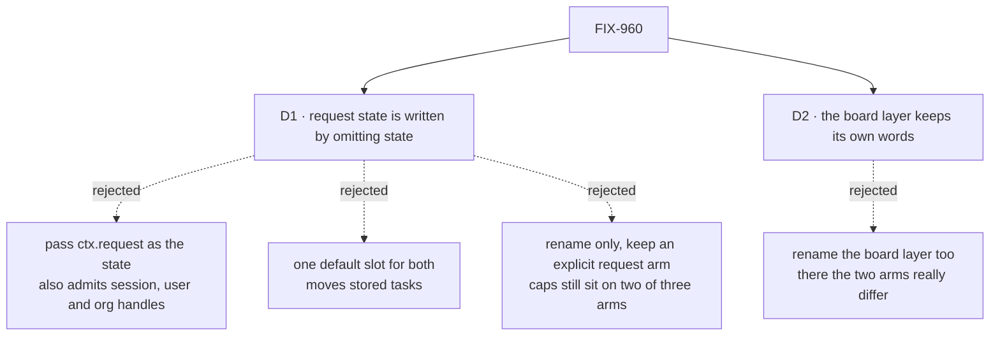

# FIX-960 · Decisions

[Spec](SPEC.md) · **Decisions** · [Rules](BUSINESS-RULES.md) · [Plan](PLAN.md) · [Docs](DOCS.md)

What was considered, what was chosen, why, and what each choice locks in. Two decisions are the
sign-off surface. Everything else is context for them.

## The tree

Solid edges are what you're signing. Dashed edges lost, and the label says why.

## D1 · A request-backed collection is written by leaving `state` out; its default slot stays the `collectionId`

| | |
|---|---|
| **Instead of** | Passing `state: ctx.request` explicitly |
| **Because** | The issue asks for a rename with the same defaults. The two arms default to different slots (`tasks` for a passed ref, the `collectionId` for the request), and stored tasks live at those slots. Keying the request default on an omitted `state` keeps both exactly, with no runtime sniffing of what was passed. Accepting any scope handle would type-check `ctx.session`, `ctx.user` and `ctx.org` too, a new storage option nobody asked for. A field narrowed to the request handle avoids that (it is a distinct type), but the constructor would then have to tell a request handle from a state ref at runtime to pick the default slot, which is the sniffing this avoids, and it adds a second spelling of the request to a PR whose claim is equivalence |
| **Locks in** | One default a reader must learn: `backing: "state"` with no `state` means the request. Adding an explicit `state: ctx.request` spelling later is additive; removing the omitted form would be a second breaking change |

It comes down to the stored slot: omitting `state` keeps both defaults exactly, while an explicit handle also admits session state.

**What would change my mind:** evidence that readers misread the omitted form as "no state".
Then add `state: ctx.request` as an accepted spelling, restricted to the request handle's type,
which is additive.

**The smaller alternative, priced:** rename only, keeping two arms (`backing: "state"` with a
required ref, and an explicit `backing: "request"`). It avoids this decision's implicit default
entirely and is the smaller API change. It loses because the issue's second complaint survives
it: caps still sit on two of three arms with a paragraph explaining why, and the two arms still
present one constructor as two mechanisms. If the implicit default is the product risk you weigh
most, this is the alternative to pick instead, and it keeps every stored slot just as D1 does.

## D2 · The task-board layer keeps `"sequencer"` and `"request"`; only the collection factory's options are renamed

| | |
|---|---|
| **Instead of** | Renaming the board's `collection: { backing }`, `TaskBoardBacking` and the board capability options in the same PR |
| **Because** | At the board layer the two arms are genuinely different, so there is nothing to fold: the sequencer spec is scoped to the board's own drain subtree and declares its state schema, while the request spec is reachable from sibling blocks and survives re-draining, and `goalSeekLoop` refuses one and accepts the other. The board layer's `"sequencer"` also names the board's real sequencer, so it does not lie. The issue scopes the rename to the collection factory |
| **Locks in** | Two neighbouring vocabularies: a board says `"sequencer"`, the collection under it says `"state"`. Renaming the board's later is its own breaking change, with its own changeset |

It comes down to the board's own arms: they really differ, so a fold there would change behaviour.

## Decided, not asked

- **Hard rename, no alias** — the issue decides it (tenet 3: old and new side by side is how incoherence starts).
- **The removed spelling is rejected loudly:** a type error for typed callers, and a runtime throw
  naming `backing: "state"` for an untyped caller that still sends `"sequencer"` or `"request"`
  (BP-030). Today such a value would fall through to the resource branch and fail obscurely.
- **One `minor` changeset for `@flow-state-dev/orchestration`** (BP-022, pre-1.0): four exported
  names and two option literals change. `@flow-state-dev/patterns` changes internal call sites
  only and gets none. Historical `CHANGELOG.md` entries and archived changesets are not edited.
- **The request adapter stays internal** and keeps its `name: "request"`.
- **Prose that describes a real sequencer's state stays** ("per-turn records land in a
  sequencer's state"); prose that uses "sequencer-backed" as the name of the backing kind is renamed.

## Considered and dropped

| Alternative | Why not |
|---|---|
| One default slot for the folded arm | Moves stored tasks for every caller on the other default: request boards would collide on `tasks`, or checkpointed sequencer boards would look under `collectionId` and find nothing |
| A `state: "request"` sentinel | Explicit, but mixes a string and a ref in one field and still needs a branch on the value |
| Keep `sequencer` as a deprecated alias | The issue rules it out, and an alias keeps the misleading word teachable |
| Only rename the discriminant, keep two arms (explicit `backing: "request"`) | The smaller API change, and no implicit default. Leaves the paragraph explaining why caps sit on two of three arms, which is the issue's second complaint. Priced under [D1](#d1) |
| Accept `state: ctx.request`, narrowed to the request handle's type | Keeps session, user and org out, but the default slot then depends on which kind of object was passed (runtime sniffing), and it adds a second spelling of the request. Additive later if the omitted form misreads (D1) |

## Settled

- **The discriminant is never persisted** (the architect's fence) — **CONFIRMED** on `main`
  `67a3bb9b`. The collection factory reads `backing` only to pick a constructor
  (`get-or-create.ts`, two comparisons); what it writes is `{ [stateKey]: Record<id, Task> }`,
  and the task schema, the `task-change` payload and the devtool carry no backing field. The
  board layer's `backing` lives on the in-memory handle and in error text. **The one persisted
  thing a fold could move is the default slot**, which is why D1 keeps both. No BP-030 dual-read.
- **Call-site count** — the issue's "~22" is exact for `packages/`: 22 collection-factory source
  sites (patterns 14, orchestration 8). The whole tree has 28 source sites (plus kitchen-sink 1,
  examples 4, goals 1), 40 test sites, 2 interface declarations, and 76 code references to the
  direct constructor. The board layer has 32 literals, out of scope. Re-derive with
  `node specs/issues/FIX-960/poc/call-site-census/census.mjs --list`.

## How it got here

- **Review round 1** — Cursor and a second-look pass both asked for the rename-only alternative
  and a request-narrowed ref to be priced at sign-off. Both added under D1 and in the dropped
  table; D1's rationale corrected (the request handle is a distinct type, so narrowing is
  possible; the cost is the runtime branch, not the type). D1 unchanged.
- **Draft** — framed as a naming lie over one shared mechanism; fold the two state arms into
  `backing: "state"` keyed on an optional ref so both default slots survive; one PR, collection
  factory only, board layer untouched.

**Open: none.**
