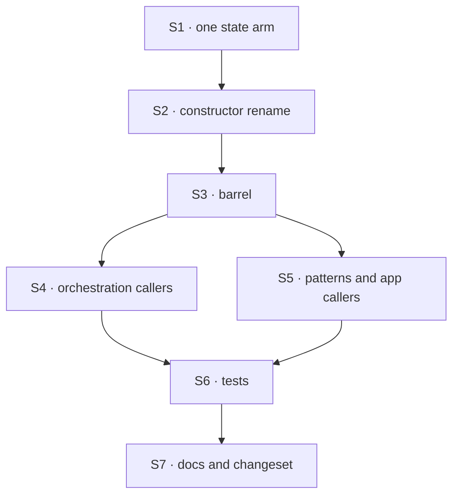

# FIX-960 · Plan

[Spec](SPEC.md) · [Decisions](DECISIONS.md) · [Rules](BUSINESS-RULES.md) · **Plan** · [Docs](DOCS.md)

Written for the implementing agent. IDs cross-reference [BUSINESS-RULES.md](BUSINESS-RULES.md)
(BR-n) and [DECISIONS.md](DECISIONS.md) (D-n). `tdd` for the two new checks; the rest is a
mechanical rename verified by the existing suite. One PR.

## Surfaces

| ID | Package · role | Change | Rules |
|---|---|---|---|
| S1 | `orchestration` · the collection factory's option union | Replace the sequencer and request arms with one `state` arm: `backing: "state"`, optional `state` ref, optional `stateKey`, caps. Branch on `state` presence for the ref and the default slot (D1). Add the loud rejection of the removed literals. **Remove** the two old interfaces and the comment paragraph justifying caps on two of three arms | BR-1–BR-4 BR-6 BR-7 |
| S2 | `orchestration` · the state-backed constructor | File and export renamed; its options' `sequencer` field becomes `state`. Header comment reworded: durability follows the ref you pass, and only a sequencer's checkpoints | BR-1 BR-3 |
| S3 | `orchestration` · the `tasks` barrel | Export the new names; **remove** the four old ones. No alias | BR-4 |
| S4 | `orchestration` · internal callers | Delegation surface, own-state resolver, board capability, board resolver, apply-replan, cascade-skip: 8 sites. Board-layer literals untouched (D2) | BR-5 BR-10 |
| S5 | `patterns`, kitchen-sink, `examples/guides`, `goals/task-board` · callers | 14 + 1 + 4 + 1 sites, spelling only. Comments that name the backing kind reworded | BR-9 |
| S6 | Tests | 40 collection-factory test sites and the direct-constructor call sites in `packages/orchestration/test` (census `references`), plus the type-test rewritten to the `state` arm | BR-7 |
| S7 | Docs + changeset | Publish [DOCS.md](DOCS.md); one `minor` changeset for `@flow-state-dev/orchestration` | — |

## Sequence

Run V0 on the base commit before S1, so "before" is a recorded result rather than an assumption.

## Checks

| ID | Runs after | Passes when |
|---|---|---|
| V0 | before S1 | `pnpm typecheck` and `pnpm test` recorded green on the base commit; census output saved |
| V1 | S6 | `pnpm typecheck` and `pnpm test` green across the workspace, including `integration-tests`, `examples/guides`, kitchen-sink and the task-board goal's typecheck. Same test count as V0 plus the new ones |
| V2 | S1 | New test: one collection with a passed ref writes `tasks` on that ref; two with no `state` in one request write their own `collectionId` slots and don't see each other (BR-1, BR-2). **Control:** swap either default and it fails, shown once in the PR |
| V3 | S1 | `@ts-expect-error` on `backing: "sequencer"` and `backing: "request"` compiles only because they are errors; an untyped call with either throws naming `backing: "state"` (BR-4). **Control:** re-admit a literal and typecheck fails on the unused directive |
| V4 | S7 | Census: `collection.source` and `collection.test` count `backing: "state"` sites only, zero old literals, `references` all zero, board count unchanged at 32, and no unclassified sites. The census needs one edit to match `"state"`; commit it with the PR |
| V5 | S7 | `rg -n 'SequencerBackingSpec|RequestBackingSpec|createSequencerBackedTaskCollection|SequencerBackedOptions'` finds only `CHANGELOG.md`, archived changesets and this spec |

Second path (BP-035): the delegation board's two resolvers (BR-5) and a resumed checkpointed
sequencer board (existing sequencer-integration suite) are the paths where a moved slot would
show. Both must stay green without edits beyond spelling.

## Pinned names

| Where | Name | Why pinned |
|---|---|---|
| Discriminant | `backing: "state"` | Public; the issue proposes it |
| Ref field | `state` | Public; mirrors the discriminant |
| Exports | `createStateBackedTaskCollection`, `StateBackedOptions`, `StateBackingSpec` | Public; the changeset names them |

File name `state-backed.ts` is the issue's proposal; everything else is yours.

## Guardrails

| Rule | Because |
|---|---|
| Neither default slot changes (BP-030) | Stored tasks live there; a moved default is a silent data move for every running app |
| The board layer is not renamed (D2) | Its arms differ in behaviour; renaming it here widens a rename into a reshape |
| Finish the rename: headers, `@link`s, doc anchors, barrel (BP-034) | A stale `SequencerBackingSpec` in a doc comment re-teaches the lie |
| No alias, no dual export | Tenet 3, and the issue |
| If any step needs a behaviour change beyond BR-4, stop and raise it | This PR's claim is equivalence; one change breaks the before/after proof |

## Docs

Reconcile and publish [DOCS.md](DOCS.md) after V1. The changeset text is drafted there too.

## POC

`poc/call-site-census/census.mjs` re-derives every count in this spec with a totality assertion:
any `backing: "sequencer" | "request"` literal it cannot classify as collection factory or board
layer fails the run. A planted unclassified literal made it exit 1, as it should; removed, it
exits 0. It confirmed the issue's 22 and found 6 more source sites outside `packages/`.

## At implement time

- FIX-957 (cap enforcement across backings) may land first and touch the same union. Rebase onto
  it; its caps attach to the single `state` arm.
- Re-run the census; counts drift as tests are added.

## Notes from review

Recorded for the implementer to weigh against real code; not folded into the design.

- **Cursor (PR #2483, census):** "census needs manual updates for new syntactic shapes
  (`OVERRIDES`). Peers (FIX-817, FIX-1503) ship in-script `--plant` — optional alignment, not a
  blocker." Also: "Count duplication (22/28/40/76/32 in prose + JSON) — consider one baseline
  artifact or 'run census' as single source."
- **Second look (PR #2483, point 1):** "the 'what would change my mind' trigger should be pinned,
  not left open. If the `StateBackedOptions` doc comment can't explain the omitted case in one
  sentence, add the explicit `state: ctx.request` spelling in the same PR." (D1 is unchanged;
  adding that spelling is additive and would be restricted to the request handle's type.)
- **Second look (point 2, BR-4):** "the runtime throw should sit at the top of
  `getOrCreateTaskCollection` ... before the `ctx.request` and `claimIdentity` reads ... It should
  also list the valid literals (`state`, `resource`) in the message", and point out the `sequencer`
  field's replacement is `state`, so an untyped caller doesn't fail one step later.
- **Second look (point 3):** "`requestStateRef` becomes a single-use adapter ... Check whether the
  constructor could take the narrow set of mutators it actually calls, instead of a full
  `StateRef`. If it can, the adapter and its `input: undefined` stub disappear. If that widens the
  PR, leave it as a follow-up."
- **Second look (point 4):** "V4's census must run against the PR's final tree, not the base",
  with the board-layer count held at 32 (already in V4).

## Follow-ups

- Whether the board layer's `"request"`/`"sequencer"` should be renamed for symmetry. Flagged, not filed (D2).
